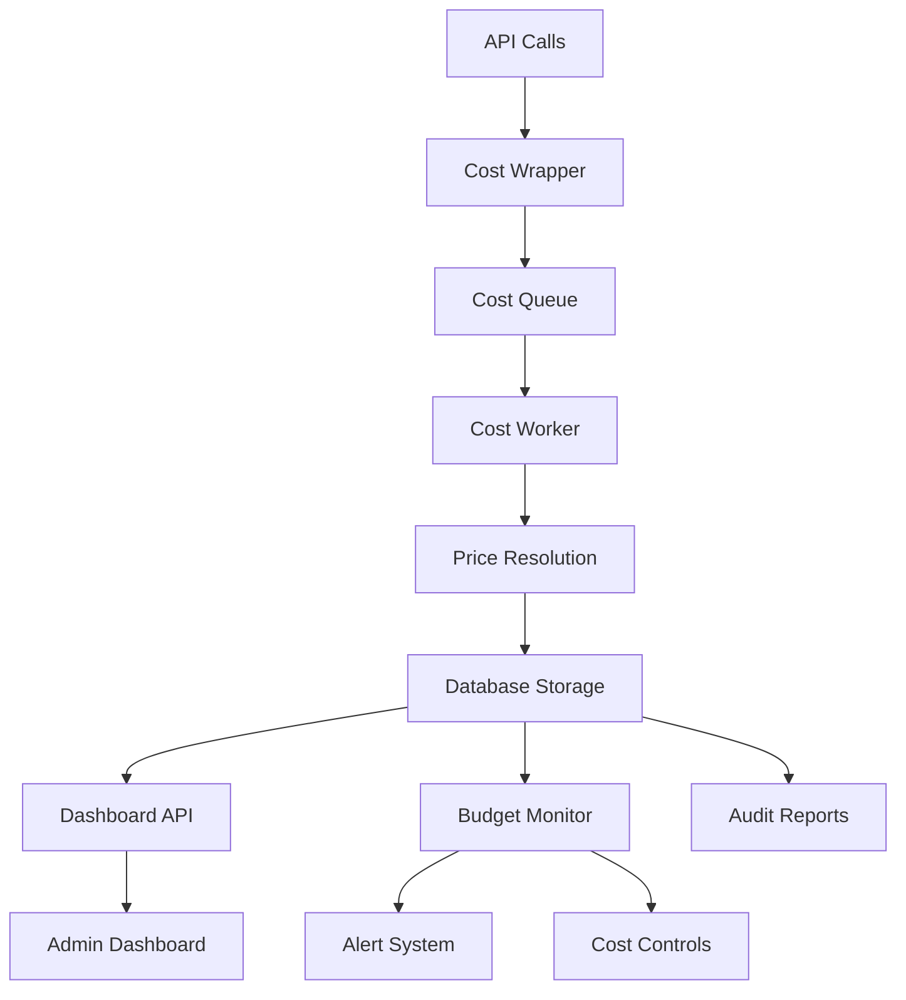

# Design Document

## Overview

O sistema de monitoramento de custos de IA será implementado como uma extensão do Socialwise Chatwit, capturando automaticamente custos de todas as integrações de IA (OpenAI, WhatsApp Business API) através de um padrão de wrapper + worker assíncrono. O sistema fornecerá dashboards em tempo real, controle de orçamentos e auditabilidade completa.

## Architecture

### High-Level Architecture



### Data Flow

1. **Capture**: Wrappers interceptam chamadas de IA e publicam eventos crus
2. **Processing**: Worker de baixa prioridade aplica preços e persiste
3. **Monitoring**: Sistema de orçamento monitora gastos e aplica controles
4. **Visualization**: Dashboard consome dados agregados em tempo real

## Components and Interfaces

### 1. Database Schema Extensions

```typescript
// Novos enums
enum Provider {
  OPENAI
  META_WHATSAPP
  INFRA
  OTHER
}

enum Unit {
  TOKENS_IN
  TOKENS_OUT
  TOKENS_CACHED
  IMAGE_LOW
  IMAGE_MEDIUM
  IMAGE_HIGH
  WHATSAPP_TEMPLATE
  AUTH_TEMPLATE
  UTILITY_TEMPLATE
  MARKETING_TEMPLATE
  TOOL_CALL
  VECTOR_GB_DAY
  OTHER
}

enum EventStatus {
  PENDING_PRICING
  PRICED
  ERROR
}

// Novos models
model PriceCard {
  id            String   @id @default(cuid())
  provider      Provider
  product       String   // ex.: "gpt-5-nano-2025-08-07"
  unit          Unit
  region        String?  // ex.: "BR"
  currency      String   @default("USD")
  pricePerUnit  Decimal  @db.Decimal(18,8)
  effectiveFrom DateTime
  effectiveTo   DateTime?
  metadata      Json?
  createdAt     DateTime @default(now())
  updatedAt     DateTime @updatedAt
  
  @@index([provider, product, unit, region, effectiveFrom, effectiveTo])
}

model CostEvent {
  id          String      @id @default(cuid())
  ts          DateTime    @default(now())
  traceId     String?
  externalId  String?     // resp.id (OpenAI), message_id (WABA)
  provider    Provider
  product     String
  unit        Unit
  units       Decimal     @db.Decimal(18,6)
  currency    String      @default("USD")
  unitPrice   Decimal?    @db.Decimal(18,8)
  cost        Decimal?    @db.Decimal(18,8)
  status      EventStatus @default(PENDING_PRICING)
  sessionId   String?
  inboxId     String?
  userId      String?
  intent      String?
  raw         Json
  
  @@index([provider, product, unit, ts])
  @@index([sessionId, inboxId, userId])
  @@index([status])
}

model FxRate {
  date   DateTime
  base   String   @default("USD")
  quote  String
  rate   Decimal  @db.Decimal(18,8)
  
  @@id([date, base, quote])
}

model CostBudget {
  id          String   @id @default(cuid())
  name        String
  inboxId     String?
  userId      String?
  period      String   // "monthly", "weekly", "daily"
  limitUSD    Decimal  @db.Decimal(18,2)
  alertAt     Decimal  @db.Decimal(3,2) @default(0.80) // 80%
  isActive    Boolean  @default(true)
  createdAt   DateTime @default(now())
  updatedAt   DateTime @updatedAt
  
  @@index([inboxId, userId, isActive])
}
```

### 2. Cost Capture Wrappers

#### OpenAI Wrapper
```typescript
// lib/cost/openai-wrapper.ts
import OpenAI from "openai";
import { Queue } from "bullmq";

const costQueue = new Queue("cost-events", { 
  connection: { url: process.env.REDIS_URL! },
  defaultJobOptions: { priority: 10 } // baixa prioridade
});

type OpenAIHookArgs = {
  model: string;
  input: any;
  meta?: { 
    sessionId?: string; 
    inboxId?: string; 
    userId?: string; 
    intent?: string; 
    traceId?: string 
  };
};

export async function openaiWithCost(
  client: OpenAI, 
  args: OpenAIHookArgs
) {
  const started = Date.now();
  const resp = await client.responses.create({
    model: args.model,
    input: args.input,
  });
  const latencyMs = Date.now() - started;

  // Extrai usage da Responses API
  const u = (resp as any).usage || {};
  const input = Number(u.input_tokens ?? 0);
  const cached = Number(u.input_tokens_details?.cached_tokens ?? 0);
  const output = Number(u.output_tokens ?? 0);

  // Publica eventos crus para processamento assíncrono
  const common = {
    ts: new Date().toISOString(),
    provider: "OPENAI",
    product: args.model,
    externalId: resp.id,
    raw: { usage: u, latencyMs },
    ...args.meta,
  };

  await costQueue.addBulk([
    { name: "event", data: { ...common, unit: "TOKENS_IN", units: input - cached } },
    { name: "event", data: { ...common, unit: "TOKENS_CACHED", units: cached } },
    { name: "event", data: { ...common, unit: "TOKENS_OUT", units: output } },
  ]);

  return resp;
}
```

#### WhatsApp Wrapper
```typescript
// lib/cost/whatsapp-wrapper.ts
export async function whatsappWithCost(
  templateName: string,
  to: string,
  meta?: { inboxId?: string; userId?: string }
) {
  // Envia template via API existente
  const result = await sendWhatsAppTemplate(templateName, to);
  
  // Deriva região do número de telefone
  const region = deriveRegionFromPhone(to);
  
  // Publica evento de custo
  await costQueue.add("event", {
    ts: new Date().toISOString(),
    provider: "META_WHATSAPP",
    product: "WABA",
    unit: "WHATSAPP_TEMPLATE",
    units: 1,
    region,
    externalId: result.messageId,
    raw: { templateName, to, deliveredAt: new Date() },
    ...meta,
  });
  
  return result;
}
```

### 3. Cost Processing Worker

```typescript
// lib/cost/cost-worker.ts
import { Worker } from "bullmq";
import { PrismaClient, Provider, Unit } from "@prisma/client";

const prisma = new PrismaClient();

async function resolveUnitPrice(
  provider: Provider, 
  product: string, 
  unit: Unit, 
  when: Date, 
  region?: string
) {
  return prisma.priceCard.findFirst({
    where: {
      provider, 
      product, 
      unit,
      OR: [{ region }, { region: null }],
      effectiveFrom: { lte: when },
      OR: [{ effectiveTo: null }, { effectiveTo: { gte: when } }],
    },
    orderBy: [{ region: "desc" }, { effectiveFrom: "desc" }],
  });
}

const worker = new Worker("cost-events", async job => {
  if (job.name !== "event") return;
  
  const d = job.data;
  const when = new Date(d.ts);
  const price = await resolveUnitPrice(
    d.provider, 
    d.product, 
    d.unit, 
    when, 
    d.region
  );

  const unitPrice = price?.pricePerUnit ?? null;
  const cost = unitPrice ? 
    Number(d.units) * Number(unitPrice) / 
    (d.unit.startsWith("TOKEN") ? 1_000_000 : 1) : null;

  await prisma.costEvent.create({
    data: {
      ts: when,
      provider: d.provider,
      product: d.product,
      unit: d.unit,
      units: d.units,
      currency: price?.currency ?? "USD",
      unitPrice: unitPrice,
      cost: cost,
      status: unitPrice ? "PRICED" : "PENDING_PRICING",
      externalId: d.externalId ?? null,
      sessionId: d.sessionId ?? null,
      inboxId: d.inboxId ?? null,
      userId: d.userId ?? null,
      intent: d.intent ?? null,
      raw: d.raw ?? {},
    },
  });
}, { 
  connection: { url: process.env.REDIS_URL! },
  concurrency: 2, // baixo para não impactar performance
});
```

### 4. Dashboard API Endpoints

```typescript
// app/api/admin/cost-monitoring/overview/route.ts
export async function GET() {
  const session = await auth();
  if (!session?.user?.id || session.user.role !== "ADMIN") {
    return NextResponse.json({ error: "Não autorizado" }, { status: 401 });
  }

  const today = new Date();
  today.setHours(0, 0, 0, 0);

  const [todayCosts, monthCosts, topInboxes, recentEvents] = await Promise.all([
    // Custo do dia
    prisma.costEvent.aggregate({
      where: { ts: { gte: today }, status: "PRICED" },
      _sum: { cost: true }
    }),
    
    // Custo do mês
    prisma.costEvent.aggregate({
      where: { 
        ts: { gte: new Date(today.getFullYear(), today.getMonth(), 1) },
        status: "PRICED" 
      },
      _sum: { cost: true }
    }),
    
    // Top inboxes por custo
    prisma.costEvent.groupBy({
      by: ['inboxId'],
      where: { ts: { gte: today }, status: "PRICED" },
      _sum: { cost: true },
      orderBy: { _sum: { cost: 'desc' } },
      take: 5
    }),
    
    // Eventos recentes
    prisma.costEvent.findMany({
      where: { status: "PRICED" },
      orderBy: { ts: 'desc' },
      take: 10,
      select: {
        ts: true,
        provider: true,
        product: true,
        cost: true,
        inboxId: true,
        intent: true
      }
    })
  ]);

  return NextResponse.json({
    today: todayCosts._sum.cost || 0,
    month: monthCosts._sum.cost || 0,
    topInboxes,
    recentEvents
  });
}
```

### 5. Budget Monitoring System

```typescript
// lib/cost/budget-monitor.ts
import { Queue } from "bullmq";

const budgetQueue = new Queue("budget-monitor", {
  connection: { url: process.env.REDIS_URL! }
});

// Cron job que roda a cada hora
export async function checkBudgets() {
  const activeBudgets = await prisma.costBudget.findMany({
    where: { isActive: true }
  });

  for (const budget of activeBudgets) {
    const spent = await calculateSpentForBudget(budget);
    const percentage = spent / Number(budget.limitUSD);
    
    if (percentage >= Number(budget.alertAt)) {
      await sendBudgetAlert(budget, spent, percentage);
    }
    
    if (percentage >= 1.0) {
      await applyBudgetControls(budget);
    }
  }
}

async function applyBudgetControls(budget: CostBudget) {
  const redis = getRedisClient();
  
  if (budget.inboxId) {
    await redis.set(`cost:blocked:${budget.inboxId}`, "true", "EX", 3600);
  }
  
  if (budget.userId) {
    await redis.set(`cost:blocked:user:${budget.userId}`, "true", "EX", 3600);
  }
}
```

## Data Models

### Cost Event Structure
```typescript
interface CostEvent {
  id: string;
  ts: Date;
  traceId?: string;
  externalId?: string;
  provider: Provider;
  product: string;
  unit: Unit;
  units: number;
  currency: string;
  unitPrice?: number;
  cost?: number;
  status: EventStatus;
  sessionId?: string;
  inboxId?: string;
  userId?: string;
  intent?: string;
  raw: Record<string, any>;
}
```

### Dashboard Data Models
```typescript
interface CostOverview {
  today: number;
  month: number;
  topInboxes: Array<{
    inboxId: string;
    cost: number;
  }>;
  recentEvents: Array<{
    ts: Date;
    provider: string;
    product: string;
    cost: number;
    inboxId?: string;
    intent?: string;
  }>;
}

interface CostBreakdown {
  byProvider: Record<string, number>;
  byModel: Record<string, number>;
  byInbox: Record<string, number>;
  byHour: Array<{ hour: string; cost: number }>;
}
```

## Error Handling

### Graceful Degradation
- Se worker de custo falha, APIs principais continuam funcionando
- Eventos não precificados ficam como PENDING_PRICING para reprocessamento
- Fallback para preços estimados se tabela não tem dados

### Retry Strategy
```typescript
const costWorkerOptions = {
  attempts: 3,
  backoff: {
    type: 'exponential',
    delay: 2000,
  },
  removeOnComplete: 100,
  removeOnFail: 50,
};
```

### Error Monitoring
- Logs estruturados para todos os erros de precificação
- Métricas de eventos não processados
- Alertas quando % de falhas > 5%

## Testing Strategy

### Unit Tests
- Wrappers de captura de custo
- Lógica de resolução de preços
- Cálculos de orçamento

### Integration Tests
- Fluxo completo: captura → processamento → dashboard
- Cenários de falha e recuperação
- Performance com volume alto

### Contract Tests
- APIs de dashboard retornam estruturas esperadas
- Compatibilidade com mudanças de schema

### Performance Tests
- Latência adicional dos wrappers < 5ms
- Worker processa 1000+ eventos/min
- Dashboard responde < 500ms

## Security Considerations

### Access Control
- Apenas ADMIN/SUPERADMIN podem ver custos
- API keys para acesso programático
- Rate limiting em endpoints de dashboard

### Data Privacy
- Não armazenar conteúdo de mensagens em raw
- Anonimizar dados pessoais em exports
- Retenção de dados por 12 meses

### Audit Trail
- Todos os acessos a dados de custo são logados
- Mudanças em orçamentos são auditadas
- Export de dados requer aprovação