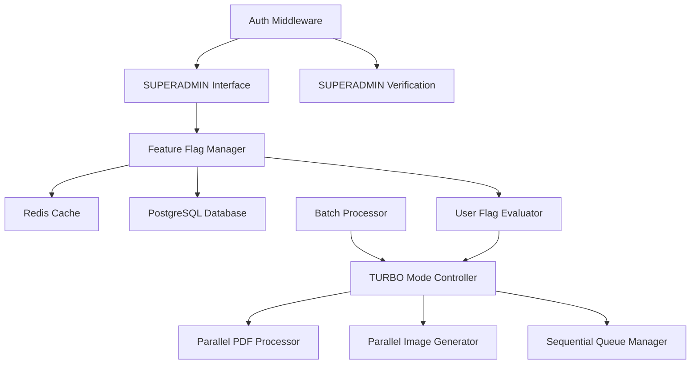

# Design Document

## Overview

This design implements a comprehensive feature flag management system with TURBO mode for batch lead processing. The solution transforms the existing `/admin/resposta-rapida` page into a full-featured feature flag management interface while adding parallel processing capabilities for premium users.

## Architecture

### System Components



### Feature Flag Categories

1. **System Flags** - Core system functionality
2. **AI Integration Flags** - AI-related features
3. **Processing Flags** - Batch processing and performance features
4. **User-Specific Flags** - Premium features per user
5. **Legacy Flags** - Existing Flash Intent functionality

## Components and Interfaces

### 1. Enhanced Feature Flag Management Interface

**Location:** `/app/admin/resposta-rapida/page.tsx`

**Key Features:**
- Tabbed interface for different flag categories
- Real-time flag status updates
- User-specific flag management
- Global flag controls
- Performance metrics dashboard

**Interface Structure:**
```typescript
interface FeatureFlagCategory {
  id: string;
  name: string;
  description: string;
  flags: FeatureFlag[];
}

interface FeatureFlag {
  id: string;
  name: string;
  description: string;
  category: string;
  enabled: boolean;
  rolloutPercentage: number;
  userSpecific: boolean;
  systemCritical: boolean;
}

interface UserFeatureFlagOverride {
  userId: string;
  flagId: string;
  enabled: boolean;
  expiresAt?: Date;
}
```

### 2. TURBO Mode Batch Processor

**Location:** `/app/admin/leads-chatwit/components/batch-processor/TurboModeProcessor.tsx`

**Key Features:**
- Parallel PDF unification (up to 10 leads)
- Parallel image generation
- Fallback to sequential processing
- Progress tracking for parallel operations
- Resource usage monitoring

**Interface Structure:**
```typescript
interface TurboModeConfig {
  enabled: boolean;
  maxParallelLeads: number;
  fallbackOnError: boolean;
  resourceThreshold: number;
}

interface ParallelProcessingResult {
  leadId: string;
  success: boolean;
  processingTime: number;
  error?: string;
}

interface TurboModeMetrics {
  totalLeads: number;
  parallelProcessed: number;
  sequentialProcessed: number;
  timeSaved: number;
  errorRate: number;
}
```

### 3. Feature Flag Service Extensions

**Location:** `/lib/feature-flags/turbo-mode-service.ts`

**Key Features:**
- TURBO mode flag evaluation
- User eligibility checking
- Resource monitoring
- Performance tracking

### 4. Enhanced BatchProcessorOrchestrator

**Modifications to existing file:**
- TURBO mode detection
- Parallel processing coordination
- Visual indicators for TURBO mode
- Performance metrics collection

## Data Models

### 1. Feature Flag Schema Extensions

```sql
-- Add new columns to existing FeatureFlag table
ALTER TABLE "FeatureFlag" ADD COLUMN "category" TEXT DEFAULT 'system';
ALTER TABLE "FeatureFlag" ADD COLUMN "userSpecific" BOOLEAN DEFAULT false;
ALTER TABLE "FeatureFlag" ADD COLUMN "systemCritical" BOOLEAN DEFAULT false;
ALTER TABLE "FeatureFlag" ADD COLUMN "metadata" JSONB DEFAULT '{}';

-- Create user-specific flag overrides table
CREATE TABLE "UserFeatureFlagOverride" (
  "id" TEXT NOT NULL,
  "userId" TEXT NOT NULL,
  "flagId" TEXT NOT NULL,
  "enabled" BOOLEAN NOT NULL,
  "expiresAt" TIMESTAMP(3),
  "createdAt" TIMESTAMP(3) NOT NULL DEFAULT CURRENT_TIMESTAMP,
  "updatedAt" TIMESTAMP(3) NOT NULL,
  "createdBy" TEXT NOT NULL,
  
  CONSTRAINT "UserFeatureFlagOverride_pkey" PRIMARY KEY ("id"),
  CONSTRAINT "UserFeatureFlagOverride_userId_flagId_key" UNIQUE ("userId", "flagId")
);

-- Create feature flag metrics table
CREATE TABLE "FeatureFlagMetrics" (
  "id" TEXT NOT NULL,
  "flagId" TEXT NOT NULL,
  "evaluations" INTEGER NOT NULL DEFAULT 0,
  "enabledCount" INTEGER NOT NULL DEFAULT 0,
  "disabledCount" INTEGER NOT NULL DEFAULT 0,
  "lastEvaluatedAt" TIMESTAMP(3),
  "averageLatencyMs" DOUBLE PRECISION DEFAULT 0,
  "date" DATE NOT NULL,
  
  CONSTRAINT "FeatureFlagMetrics_pkey" PRIMARY KEY ("id"),
  CONSTRAINT "FeatureFlagMetrics_flagId_date_key" UNIQUE ("flagId", "date")
);
```

### 2. TURBO Mode Processing State

```typescript
interface TurboModeState {
  enabled: boolean;
  currentBatch: {
    leadIds: string[];
    startTime: Date;
    estimatedCompletion: Date;
  };
  metrics: {
    totalProcessed: number;
    averageTimePerLead: number;
    errorRate: number;
  };
}
```

## Error Handling

### 1. Feature Flag Management Errors

- **Redis Connection Failure:** Fallback to database queries
- **Database Errors:** Use cached values with warning indicators
- **Permission Errors:** Clear error messages and access denial
- **Validation Errors:** Real-time form validation with specific error messages

### 2. TURBO Mode Processing Errors

- **Parallel Processing Failure:** Automatic fallback to sequential processing
- **Resource Exhaustion:** Throttling and queue management
- **PDF Generation Errors:** Individual lead error handling without batch failure
- **Image Generation Errors:** Retry mechanism with exponential backoff

### 3. Graceful Degradation

```typescript
class TurboModeErrorHandler {
  async handleParallelProcessingError(error: Error, leadIds: string[]): Promise<void> {
    // Log error
    console.error('[TURBO] Parallel processing failed:', error);
    
    // Fallback to sequential
    await this.fallbackToSequential(leadIds);
    
    // Notify user
    this.notifyUser('TURBO mode encountered an error. Processing continued in standard mode.');
    
    // Update metrics
    await this.updateErrorMetrics(error);
  }
}
```

## Testing Strategy

### 1. Unit Tests

**Feature Flag Management:**
- Flag creation, update, deletion
- User-specific flag overrides
- Permission validation
- Cache invalidation

**TURBO Mode Processing:**
- Parallel processing logic
- Error handling and fallback
- Resource monitoring
- Performance metrics

### 2. Integration Tests

**End-to-End Flag Management:**
- SUPERADMIN flag management workflow
- User flag evaluation in real scenarios
- Redis and database synchronization

**Batch Processing Integration:**
- TURBO mode activation and processing
- Fallback scenarios
- Performance under load

### 3. Performance Tests

**TURBO Mode Performance:**
- Parallel processing vs sequential benchmarks
- Resource utilization monitoring
- Scalability testing with varying lead counts

**Feature Flag Performance:**
- Flag evaluation latency
- Cache hit rates
- Database query optimization

## Implementation Phases

### Phase 1: Feature Flag Management Interface
1. Transform `/admin/resposta-rapida` page
2. Add comprehensive flag categories
3. Implement user-specific flag management
4. Add performance metrics dashboard

### Phase 2: TURBO Mode Infrastructure
1. Create TURBO mode feature flag
2. Implement parallel processing service
3. Add resource monitoring
4. Create fallback mechanisms

### Phase 3: Batch Processor Integration
1. Modify BatchProcessorOrchestrator
2. Add TURBO mode detection
3. Implement parallel PDF and image processing
4. Add visual indicators and progress tracking

### Phase 4: Testing and Optimization
1. Comprehensive testing suite
2. Performance optimization
3. Error handling refinement
4. Documentation and monitoring

## Security Considerations

### 1. Access Control
- SUPERADMIN role verification for flag management
- User-specific flag isolation
- Audit logging for all flag changes

### 2. Resource Protection
- TURBO mode resource limits
- Rate limiting for flag evaluations
- Memory and CPU monitoring

### 3. Data Integrity
- Atomic flag updates
- Consistent cache invalidation
- Backup and recovery procedures

## Monitoring and Observability

### 1. Feature Flag Metrics
- Flag evaluation frequency
- Performance impact measurement
- Error rate tracking
- User adoption metrics

### 2. TURBO Mode Monitoring
- Processing time improvements
- Resource utilization
- Error rates and fallback frequency
- User satisfaction metrics

### 3. System Health
- Redis connection status
- Database performance
- Cache hit rates
- Overall system performance impact