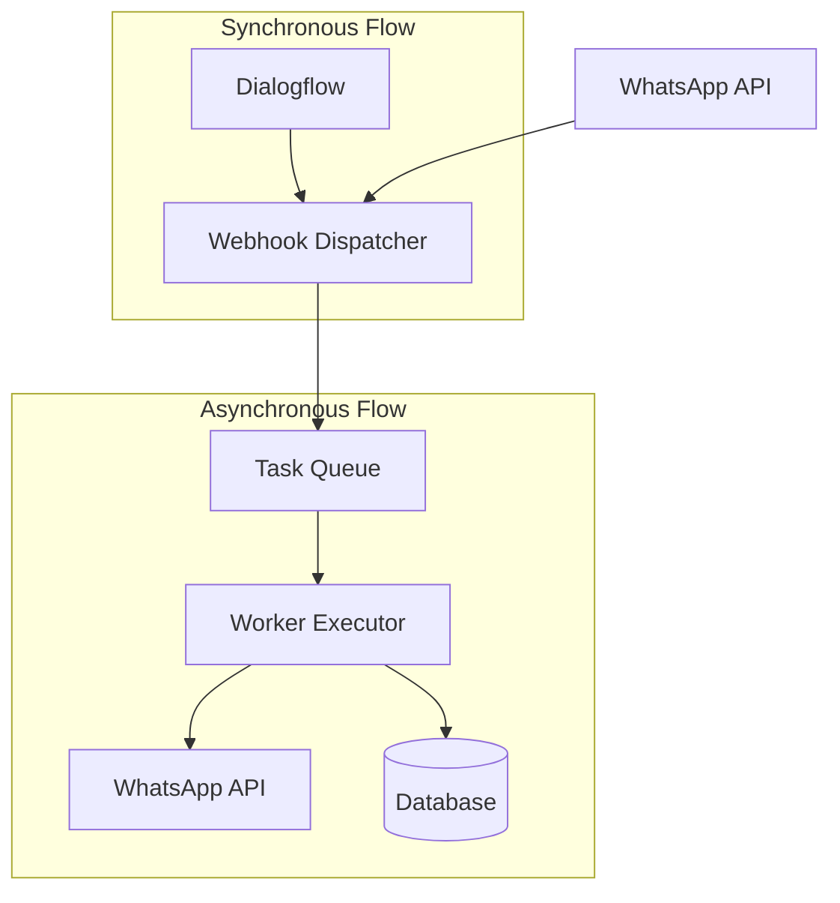
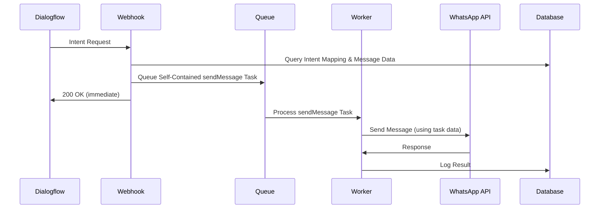
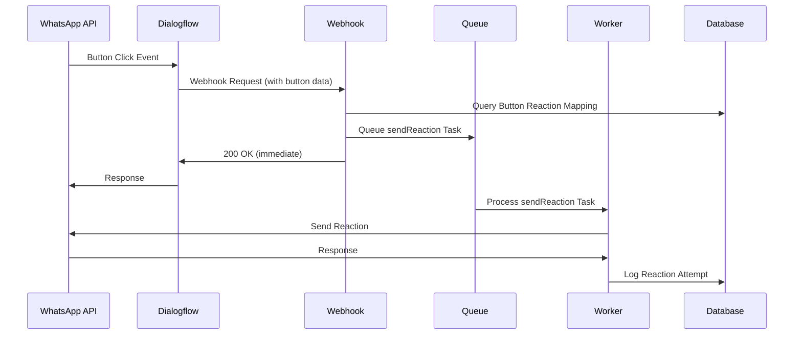

# Design Document

## Overview

This design document outlines the refactoring of the Dialogflow webhook response system to implement a fully asynchronous architecture. The current system suffers from timeout issues because the webhook directly communicates with WhatsApp API during request processing, causing delays that exceed Dialogflow's response time limits.

The new architecture separates concerns into two main components:
1. **Webhook Dispatcher**: Receives Dialogflow requests, queues tasks, and responds immediately
2. **Worker Executor**: Processes queued tasks and handles all WhatsApp API communication

This design ensures that Dialogflow always receives a fast response (< 2 seconds) while maintaining reliable message delivery through an asynchronous queue system.

## Architecture

### High-Level Architecture Diagram



### Flow Diagrams

#### Flow 1: Intent Response Processing


#### Flow 2: Button Reaction Processing


## Components and Interfaces

### 1. Webhook Dispatcher (`app/api/admin/mtf-diamante/whatsapp/webhook/route.ts`)

**Responsibilities:**
- Receive and parse Dialogflow requests
- Identify request type (intent or button click)
- Query database for mappings
- Create and queue appropriate tasks
- Respond immediately to Dialogflow

**Key Functions:**
```typescript
interface WebhookRequest {
  queryResult?: {
    intent?: { displayName: string };
    parameters?: Record<string, any>;
  };
  originalDetectIntentRequest?: {
    payload?: {
      interactive?: { type: string; button_reply?: { id: string } };
      context?: { id: string };
      sender?: { id: string };
    };
  };
}

interface TaskData {
  type: 'sendMessage' | 'sendReaction';
  recipientPhone: string;
  whatsappApiKey: string;
  // Additional fields based on task type
}
```

### 2. Task Queue System (`lib/queue/mtf-diamante-webhook.queue.ts`)

**Responsibilities:**
- Manage task queuing and dequeuing
- Handle task prioritization and retry logic
- Provide interfaces for different task types

**Task Types:**
```typescript
interface SendMessageTask {
  type: 'sendMessage';
  recipientPhone: string;
  whatsappApiKey: string;
  messageData: {
    type: 'template' | 'interactive';
    // For template messages
    templateId?: string;
    templateName?: string;
    variables?: Record<string, any>;
    // For interactive messages (complete data from database)
    interactiveContent?: {
      header?: { type: string; content: string };
      body: string;
      footer?: string;
      buttons?: Array<{ id: string; title: string }>;
      // ... other interactive message fields
    };
  };
}

interface SendReactionTask {
  type: 'sendReaction';
  recipientPhone: string;
  messageId: string;
  emoji: string;
  whatsappApiKey: string;
}
```

### 3. Worker Executor (`worker/WebhookWorkerTasks/mtf-diamante-webhook.task.ts`)

**Responsibilities:**
- Process tasks from the queue
- Determine message type and call appropriate handlers
- Handle WhatsApp API communication
- Implement retry logic and error handling

**Key Functions:**
```typescript
async function processWebhookTask(job: Job<TaskData>): Promise<void> {
  const { type, data } = job;
  
  switch (type) {
    case 'sendMessage':
      await processSendMessage(data);
      break;
    case 'sendReaction':
      await processSendReaction(data);
      break;
  }
}
```

### 4. WhatsApp Communication Libraries

#### Message Sending (`lib/whatsapp-messages.ts`)
```typescript
interface TemplateMessageData {
  recipientPhone: string;
  templateId: string;
  variables: Record<string, any>;
  whatsappApiKey: string;
}

interface InteractiveMessageData {
  recipientPhone: string;
  header?: HeaderData;
  body: string;
  footer?: string;
  buttons: ButtonData[];
  whatsappApiKey: string;
}

async function sendTemplateMessage(data: TemplateMessageData): Promise<MessageResult>;
async function sendInteractiveMessage(data: InteractiveMessageData): Promise<MessageResult>;
```

#### Reaction Sending (`lib/whatsapp-reactions.ts`)
```typescript
interface ReactionMessageData {
  recipientPhone: string;
  messageId: string;
  emoji: string;
  whatsappApiKey: string;
}

async function sendReactionMessage(data: ReactionMessageData): Promise<ReactionResult>;
```

## Data Models

### Database Query Functions

```typescript
// Intent to message mapping queries
async function findMessageMappingByIntent(intentName: string, caixaId: string): Promise<MappingResult | null>;

// Button to reaction mapping queries  
async function findReactionByButtonId(buttonId: string): Promise<ReactionMapping | null>;

// Template and interactive message data queries
async function getTemplateData(templateId: string): Promise<TemplateData | null>;
async function getInteractiveMessageData(messageId: string): Promise<InteractiveMessageData | null>;
```

### Enhanced Database Models

The existing Prisma schema will be extended with:

```prisma
// Enhanced mapping model to support both templates and interactive messages
model MapeamentoIntencao {
  id                   String @id @default(cuid())
  intentName           String
  caixaEntradaId       String
  
  // Response type indicators
  templateId           String?
  mensagemInterativaId String?
  unifiedTemplateId    String?
  
  // Metadata
  isActive             Boolean @default(true)
  createdAt            DateTime @default(now())
  updatedAt            DateTime @updatedAt
  
  // Relations
  caixaEntrada         CaixaEntrada @relation(fields: [caixaEntradaId], references: [id])
  template             WhatsAppTemplate? @relation(fields: [templateId], references: [templateId])
  mensagemInterativa   MensagemInterativa? @relation(fields: [mensagemInterativaId], references: [id])
  unifiedTemplate      Template? @relation(fields: [unifiedTemplateId], references: [id])
}

// Button reaction mapping (can be stored in config or database)
model ButtonReactionMapping {
  id          String @id @default(cuid())
  buttonId    String @unique
  emoji       String
  description String?
  isActive    Boolean @default(true)
  createdAt   DateTime @default(now())
  updatedAt   DateTime @updatedAt
}
```

## Error Handling

### Webhook Error Handling
- Database query failures: Log error internally, still return 200 OK to Dialogflow
- Queue failures: Log CRITICAL error, trigger immediate alert, still return 200 OK to Dialogflow (accept that messages won't be sent while queue is unavailable)
- Invalid request format: Log error, return 200 OK to prevent Dialogflow retries

### Worker Error Handling
- WhatsApp API failures: Implement exponential backoff retry (3 attempts)
- Template/message not found: Log error, mark task as failed
- Network timeouts: Retry with increasing delays
- Maximum retries exceeded: Move to dead letter queue for manual review

### Retry Strategy
```typescript
const retryConfig = {
  attempts: 3,
  backoff: {
    type: 'exponential',
    delay: 2000, // Start with 2 seconds
    factor: 2    // Double delay each retry
  }
};
```

## Testing Strategy

### Unit Tests
- Webhook request parsing and validation
- Task creation and queuing logic
- Worker task processing functions
- WhatsApp API communication functions
- Database query functions

### Integration Tests
- End-to-end flow from Dialogflow request to WhatsApp message delivery
- Queue system reliability under load
- Error handling and retry mechanisms
- Database transaction integrity

### Performance Tests
- Webhook response time under various loads
- Queue processing throughput
- Memory usage during high-volume periods
- Database query performance optimization

### Test Data Setup
```typescript
// Mock Dialogflow intent request
const mockIntentRequest = {
  queryResult: {
    intent: { displayName: 'welcome' },
    parameters: { name: 'João' }
  },
  originalDetectIntentRequest: {
    payload: {
      sender: { id: '5511999999999' },
      whatsapp_api_key: 'test_key'
    }
  }
};

// Mock button click request
const mockButtonClickRequest = {
  originalDetectIntentRequest: {
    payload: {
      interactive: {
        type: 'button_reply',
        button_reply: { id: 'accept_proposal' }
      },
      context: { id: 'wamid.123456' },
      sender: { id: '5511999999999' }
    }
  }
};
```

## Performance Considerations

### Webhook Optimization
- Minimize database queries in webhook handler
- Use connection pooling for database access
- Implement request validation early to fail fast
- Cache frequently accessed mappings

### Queue Optimization
- Use Redis for queue storage for high performance
- Implement queue partitioning for scalability
- Monitor queue depth and processing rates
- Set appropriate job timeouts and cleanup policies

### Worker Optimization
- Process tasks in parallel where possible
- Implement circuit breaker pattern for WhatsApp API calls
- Use connection pooling for HTTP requests
- Monitor worker health and auto-scaling

## Security Considerations

### API Key Management
- Store WhatsApp API keys securely in database
- Implement key rotation mechanisms
- Validate API key permissions before use
- Log API key usage for audit purposes

### Request Validation
- Validate all incoming webhook requests
- Sanitize user input and parameters
- Implement rate limiting on webhook endpoint
- Use HTTPS for all external communications

### Data Privacy
- Encrypt sensitive data in queue tasks
- Implement data retention policies
- Log minimal necessary information
- Comply with data protection regulations

## Monitoring and Observability

### Metrics to Track
- Webhook response times
- Queue depth and processing rates
- Task success/failure rates
- WhatsApp API response times and error rates
- Database query performance

### Logging Strategy
- Structured logging with correlation IDs
- Different log levels for different environments
- Centralized log aggregation
- Alert on critical errors and performance degradation

### Health Checks
- Webhook endpoint health
- Queue system connectivity
- Worker process status
- Database connectivity
- WhatsApp API accessibility