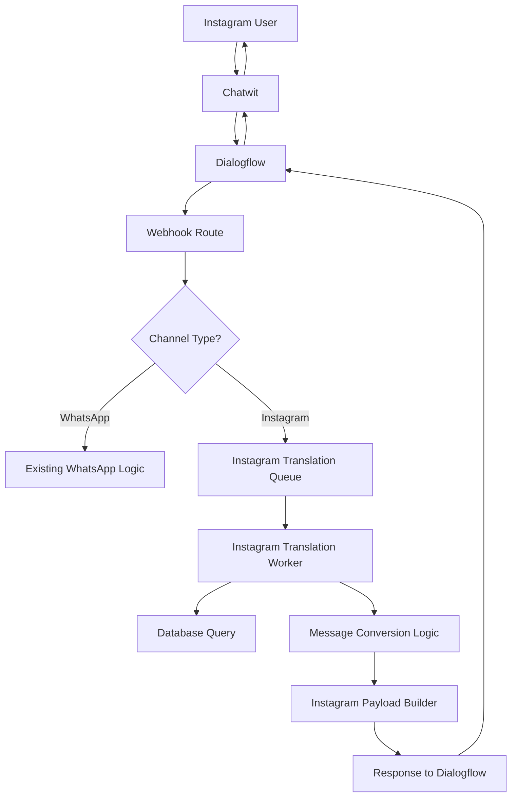
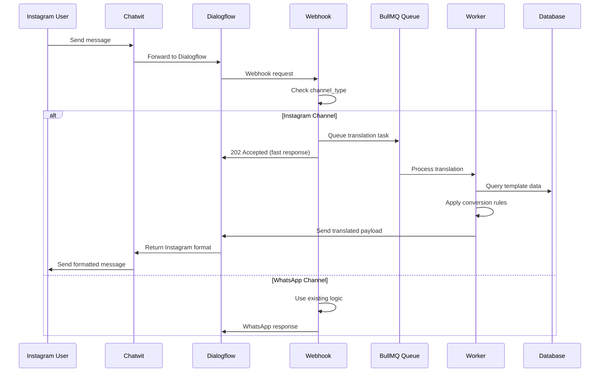

# Design Document

## Overview

O sistema de tradução de mensagens interativas para Instagram será implementado como uma extensão do webhook existente do Dialogflow. A arquitetura seguirá o padrão de filas BullMQ já estabelecido no sistema, criando uma nova task específica para tradução de mensagens que será processada de forma assíncrona para garantir resposta rápida ao Dialogflow.

O sistema funcionará como um tradutor inteligente que:
1. Identifica o canal de origem através do `channel_type`
2. Busca o template de mensagem interativa no banco de dados
3. Aplica regras de conversão baseadas no comprimento do texto
4. Retorna o payload formatado para Instagram via Dialogflow

## Architecture

### High-Level Architecture



### Component Interaction Flow



## Components and Interfaces

### 1. Webhook Route Enhancement

**File:** `app/api/admin/mtf-diamante/dialogflow/webhook/route.ts`

**Modifications:**
- Add channel type detection logic
- Create Instagram translation task when `channel_type === "Channel::Instagram"`
- Maintain existing WhatsApp logic unchanged

```typescript
interface ChannelDetectionResult {
  isInstagram: boolean;
  channelType: string;
  originalPayload: any;
}

interface InstagramTranslationTask {
  type: 'instagram_translation';
  intentName: string;
  inboxId: string;
  contactPhone: string;
  conversationId: string;
  originalPayload: any;
  correlationId: string;
}
```

### 2. Instagram Translation Queue

**File:** `lib/queue/instagram-translation.queue.ts`

**Purpose:** Manage Instagram translation tasks with BullMQ

```typescript
interface InstagramTranslationJobData {
  intentName: string;
  inboxId: string;
  contactPhone: string;
  conversationId: string;
  originalPayload: any;
  correlationId: string;
  metadata?: {
    timestamp: Date;
    retryCount?: number;
  };
}

interface InstagramTranslationResult {
  success: boolean;
  fulfillmentMessages?: any[];
  error?: string;
  processingTime: number;
}
```

### 3. Instagram Translation Worker

**File:** `worker/WebhookWorkerTasks/instagram-translation.task.ts`

**Purpose:** Process Instagram translation tasks

```typescript
interface MessageConversionRules {
  maxBodyLengthForGeneric: 80;
  maxBodyLengthForButton: 640;
  maxSubtitleLength: 80;
  maxTitleLength: 80;
  maxButtonsCount: 3;
}

interface InstagramTemplate {
  type: 'generic' | 'button';
  payload: GenericTemplatePayload | ButtonTemplatePayload;
}

interface GenericTemplatePayload {
  template_type: 'generic';
  elements: Array<{
    title: string;
    image_url?: string;
    subtitle?: string;
    buttons: InstagramButton[];
  }>;
}

interface ButtonTemplatePayload {
  template_type: 'button';
  text: string;
  buttons: InstagramButton[];
}

interface InstagramButton {
  type: 'web_url' | 'postback';
  title: string;
  url?: string;
  payload?: string;
}
```

### 4. Message Conversion Engine

**File:** `lib/instagram/message-converter.ts`

**Purpose:** Core logic for converting WhatsApp templates to Instagram format

```typescript
interface WhatsAppTemplate {
  headerTipo?: string;
  headerConteudo?: string;
  texto: string;
  rodape?: string;
  botoes: Array<{
    id: string;
    titulo: string;
    tipo: string;
    url?: string;
  }>;
}

interface ConversionResult {
  success: boolean;
  instagramTemplate?: InstagramTemplate;
  error?: string;
  warnings?: string[];
}

class MessageConverter {
  convert(whatsappTemplate: WhatsAppTemplate): ConversionResult;
  private determineTemplateType(bodyLength: number): 'generic' | 'button' | 'incompatible';
  private convertToGenericTemplate(template: WhatsAppTemplate): GenericTemplatePayload;
  private convertToButtonTemplate(template: WhatsAppTemplate): ButtonTemplatePayload;
  private convertButtons(buttons: any[]): InstagramButton[];
}
```

## Data Models

### Existing Models (No Changes Required)

O sistema utilizará os modelos existentes do Prisma sem modificações:

- `MensagemInterativa` - Template de mensagem interativa
- `BotaoMensagemInterativa` - Botões da mensagem
- `DialogflowIntentMapping` - Mapeamento de intenções
- `CaixaEntrada` - Configuração da caixa de entrada

### New Queue Job Data Structure

```typescript
interface InstagramTranslationJob {
  id: string;
  type: 'instagram_translation';
  data: InstagramTranslationJobData;
  opts: {
    attempts: 3;
    backoff: {
      type: 'exponential';
      delay: 2000;
    };
    removeOnComplete: 100;
    removeOnFail: 50;
  };
}
```

## Error Handling

### Error Categories

1. **Validation Errors**
   - Missing required fields in payload
   - Invalid channel_type format
   - Malformed template data

2. **Conversion Errors**
   - Message body exceeds Instagram limits (>640 chars)
   - Invalid button configuration
   - Missing template data in database

3. **System Errors**
   - Database connection failures
   - Queue processing errors
   - Dialogflow communication issues

### Error Response Strategy

```typescript
interface ErrorResponse {
  success: false;
  error: string;
  errorCode: string;
  fallbackAction: 'whatsapp_only' | 'retry' | 'skip';
  correlationId: string;
}

enum ErrorCodes {
  TEMPLATE_NOT_FOUND = 'TEMPLATE_NOT_FOUND',
  MESSAGE_TOO_LONG = 'MESSAGE_TOO_LONG',
  INVALID_CHANNEL = 'INVALID_CHANNEL',
  DATABASE_ERROR = 'DATABASE_ERROR',
  CONVERSION_FAILED = 'CONVERSION_FAILED'
}
```

### Retry Logic

- **Transient Errors:** 3 attempts with exponential backoff
- **Permanent Errors:** No retry, log and continue
- **Timeout Errors:** Fast fail after 5 seconds

## Testing Strategy

### Unit Tests

1. **Message Converter Tests**
   - Test all conversion scenarios (Generic, Button, Incompatible)
   - Validate character limits and truncation
   - Test button conversion logic

2. **Queue Handler Tests**
   - Test task creation and processing
   - Validate error handling and retries
   - Test correlation ID tracking

3. **Webhook Integration Tests**
   - Test channel type detection
   - Validate payload routing logic
   - Test backward compatibility

### Integration Tests

1. **End-to-End Flow Tests**
   - Instagram message flow from webhook to response
   - WhatsApp flow remains unchanged
   - Error scenarios and fallbacks

2. **Database Integration Tests**
   - Template query performance
   - Data consistency validation
   - Connection error handling

### Performance Tests

1. **Response Time Tests**
   - Webhook response under 5 seconds
   - Queue processing performance
   - Database query optimization

2. **Load Tests**
   - Concurrent Instagram and WhatsApp requests
   - Queue capacity and throughput
   - Memory usage monitoring

## Implementation Phases

### Phase 1: Core Infrastructure
- Create Instagram translation queue
- Implement basic message converter
- Add channel type detection to webhook

### Phase 2: Message Conversion Logic
- Implement Generic Template conversion
- Implement Button Template conversion
- Add validation and error handling

### Phase 3: Integration and Testing
- Integrate with existing webhook flow
- Comprehensive testing suite
- Performance optimization

### Phase 4: Monitoring and Observability
- Add metrics and logging
- Error tracking and alerting
- Performance monitoring dashboards

## Security Considerations

1. **Input Validation**
   - Sanitize all incoming payload data
   - Validate channel_type against whitelist
   - Prevent injection attacks in template data

2. **Rate Limiting**
   - Implement per-inbox rate limiting
   - Prevent queue flooding attacks
   - Monitor unusual traffic patterns

3. **Data Privacy**
   - Log minimal PII in error messages
   - Secure correlation ID generation
   - Encrypt sensitive template data

## Performance Considerations

1. **Response Time Optimization**
   - Immediate 202 response to Dialogflow
   - Asynchronous processing via queues
   - Database query optimization

2. **Memory Management**
   - Efficient payload processing
   - Queue job cleanup policies
   - Connection pooling for database

3. **Scalability**
   - Horizontal scaling of workers
   - Queue partitioning by inbox
   - Caching of frequently used templates

## Monitoring and Observability

### Metrics to Track

1. **Performance Metrics**
   - Webhook response time
   - Queue processing time
   - Database query performance
   - Conversion success rate

2. **Business Metrics**
   - Instagram vs WhatsApp message volume
   - Template conversion success rate
   - Error rate by error type

3. **System Health Metrics**
   - Queue depth and processing rate
   - Worker health and availability
   - Database connection status

### Logging Strategy

```typescript
interface LogEntry {
  timestamp: Date;
  level: 'info' | 'warn' | 'error';
  correlationId: string;
  component: string;
  message: string;
  metadata?: Record<string, any>;
}
```

### Alerting Rules

1. **Critical Alerts**
   - Webhook response time > 10 seconds
   - Queue processing failure rate > 5%
   - Database connection failures

2. **Warning Alerts**
   - Conversion failure rate > 10%
   - Queue depth > 1000 jobs
   - High memory usage in workers