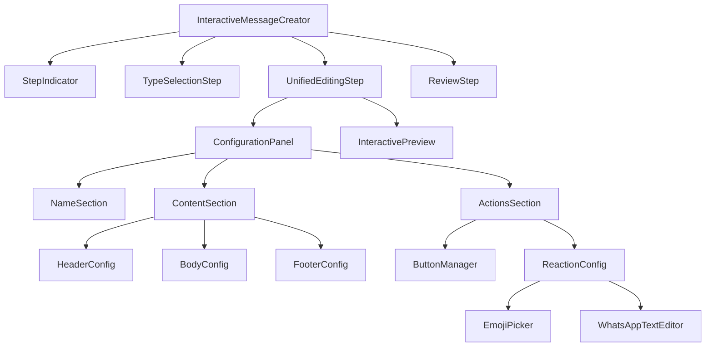

# Design Document

## Overview

This design outlines the refactoring of the interactive message creation system into a streamlined 3-step workflow with unified editing capabilities and automatic reaction configuration. The system will maintain backward compatibility with existing infrastructure while introducing a modern, user-friendly interface with real-time preview functionality.

## Architecture

### High-Level Architecture

```mermaid
graph TB
    subgraph "Frontend - 3-Step Workflow"
        A[Step 1: Configure Model] --> B[Step 2: Edit Model]
        B --> C[Step 3: Review & Save]
    end
    
    subgraph "Step 2 Components"
        D[Unified Configuration Panel]
        E[Real-time Preview]
        F[Reaction Configuration]
        D <--> E
        D --> F
    end
    
    subgraph "Backend APIs"
        G[Interactive Messages API]
        H[Button Reactions API]
        I[WhatsApp Webhook API]
    end
    
    subgraph "Processing Pipeline"
        J[Webhook Handler]
        K[Queue System]
        L[Worker Tasks]
        M[WhatsApp API]
    end
    
    C --> G
    C --> H
    
    note right of C: Optimized: Single API call<br/>POST /api/messages-with-reactions
    I --> J
    J --> K
    K --> L
    L --> M
```

### Component Hierarchy



## Components and Interfaces

### Core Data Structures

```typescript
interface InteractiveMessage {
  id?: string;
  name: string;
  type: InteractiveMessageType;
  header?: {
    type: 'text' | 'image' | 'video' | 'document';
    text?: string;
    media_url?: string;
    filename?: string;
  };
  body: {
    text: string;
  };
  footer?: {
    text: string;
  };
  action?: {
    buttons?: InteractiveButton[];
    sections?: ListSection[];
  };
}

interface InteractiveButton {
  id: string;
  text: string;
  type: 'reply' | 'url' | 'phone_number';
  url?: string;
  phone_number?: string;
}

type Reaction = 
  | { type: 'emoji'; value: string }
  | { type: 'text'; value: string };

interface ButtonReaction {
  buttonId: string;
  reaction?: Reaction;
}

interface MessageWithReactions {
  message: InteractiveMessage;
  reactions: ButtonReaction[];
}
```

### Step 2: Unified Editing Interface

#### UnifiedEditingStep Component

```typescript
interface UnifiedEditingStepProps {
  message: InteractiveMessage;
  reactions: ButtonReaction[];
  onMessageUpdate: (updates: Partial<InteractiveMessage>) => void;
  onReactionUpdate: (buttonId: string, reaction: Partial<ButtonReaction>) => void;
  onNext: () => void;
  onBack: () => void;
}
```

**Layout Structure:**
- Left Panel (60%): Configuration form with sections
- Right Panel (40%): Real-time preview
- Responsive design for smaller screens (stacked layout)

#### Configuration Panel Sections

1. **Name Section**
   - Template name input
   - Language selection
   - Character counter

2. **Content Section**
   - Header configuration (type selector, media upload, text input)
   - Body text editor with variable support
   - Footer text input

3. **Actions Section**
   - Button management interface
   - Reaction configuration per button
   - Visual indicators for configured reactions

#### InteractivePreview Component (Enhanced)

```typescript
interface InteractivePreviewProps {
  message: InteractiveMessage;
  reactions: ButtonReaction[];
  showReactionIndicators?: boolean;
  onButtonClick?: (buttonId: string) => void;
  className?: string;
}
```

**Features:**
- WhatsApp-style visual rendering
- Real-time updates on message changes
- Reaction indicators (⚡️ icon) for buttons with configured reactions
- Theme-aware background (light/dark WhatsApp backgrounds)
- Media preview support (images, videos, documents)

### Reaction Configuration System

#### ReactionConfigManager Component

```typescript
interface ReactionConfigManagerProps {
  buttonId: string;
  currentReaction?: ButtonReaction;
  onReactionChange: (reaction: ButtonReaction) => void;
  onReactionRemove: () => void;
}
```

**Workflow:**
1. User clicks "Add Reaction" button next to a message button
2. Modal opens with two options: "React with Emoji" or "React with Text"
3. Based on selection, appropriate editor opens (EmojiPicker or WhatsAppTextEditor)
4. Reaction is saved to local state and preview updates immediately

### Step 3: Review and Save Interface

#### ReviewStep Component

```typescript
interface ReviewStepProps {
  message: InteractiveMessage;
  reactions: ButtonReaction[];
  onSave: () => Promise<void>;
  onBack: () => void;
  saving: boolean;
}
```

**Features:**
- Non-editable message preview
- Reaction summary table
- Save/Send for Analysis buttons
- Loading states during save operations

## API Design Optimizations

### Unified Save Endpoint

Instead of making separate API calls to save messages and reactions, we implement a single atomic endpoint:

```typescript
// POST /api/admin/mtf-diamante/messages-with-reactions
interface SaveMessageWithReactionsRequest {
  message: InteractiveMessage;
  reactions: ButtonReaction[];
}

interface SaveMessageWithReactionsResponse {
  success: boolean;
  messageId: string;
  reactionIds: string[];
  errors?: string[];
}
```

**Benefits:**
- **Atomicity**: Single database transaction ensures data consistency
- **Simplified Frontend**: One API call instead of multiple sequential calls
- **Better Error Handling**: Unified error response for all operations
- **Performance**: Reduced network overhead and database connections

**Implementation:**
```typescript
// Backend implementation
export async function POST(request: Request) {
  const { message, reactions } = await request.json();
  
  return await db.transaction(async (tx) => {
    // Save message
    const savedMessage = await tx.interactiveMessage.create({
      data: message
    });
    
    // Save reactions
    const savedReactions = await tx.buttonReactionMapping.createMany({
      data: reactions.map(r => ({
        ...r,
        messageId: savedMessage.id
      }))
    });
    
    return { messageId: savedMessage.id, reactionIds: savedReactions.map(r => r.id) };
  });
}
```

### Component Naming Consistency

To ensure consistency across the codebase, we standardize component names:

- **WhatsAppTextEditor** (preferred over EnhancedTextArea)
  - More descriptive and specific to WhatsApp context
  - Clearly indicates the component's purpose
  - Aligns with other WhatsApp-specific components

- **InteractivePreview** (maintains current naming)
  - Clear indication of preview functionality
  - Generic enough to be reused in different contexts

- **ButtonReactionConfig** (standardized naming pattern)
  - Follows the pattern: [Feature][Action][Type]
  - Consistent with other configuration components

## Data Models

### Database Schema Extensions

The existing database schema already supports the required functionality:

```sql
-- Interactive Messages (existing)
table InteractiveMessage {
  id: string
  name: string
  type: string
  bodyText: string
  headerType: string?
  headerContent: string?
  footerText: string?
  actionData: json?
  caixaId: string
  createdById: string
  createdAt: datetime
  updatedAt: datetime
}

-- Button Reaction Mappings (existing)
table ButtonReactionMapping {
  id: string
  buttonId: string (unique)
  messageId: string
  emoji: string?
  textReaction: string?
  createdBy: string
  createdAt: datetime
  updatedAt: datetime
}
```

### State Management

#### React State Structure

```typescript
interface InteractiveMessageState {
  currentStep: 'type-selection' | 'configuration' | 'preview';
  message: InteractiveMessage;
  reactions: ButtonReaction[];
  uploadedFiles: MinIOMediaFile[];
  saving: boolean;
  errors: Record<string, string>;
}
```

#### State Update Patterns

- **Message Updates**: Immutable updates using spread operator
- **Reaction Updates**: Array manipulation with proper key-based updates
- **Validation**: Real-time validation with error state management
- **Auto-save**: Optional auto-save functionality for draft messages

## Error Handling

### Frontend Error Handling

1. **Validation Errors**
   - Real-time field validation
   - Visual error indicators
   - Prevent progression to next step if errors exist

2. **API Errors**
   - Toast notifications for user feedback
   - Retry mechanisms for transient failures
   - Graceful degradation for non-critical features

3. **Upload Errors**
   - Progress indicators with error states
   - Retry functionality for failed uploads
   - File type and size validation

### Backend Error Handling

1. **Atomic Operations**
   - Database transactions for message + reaction saves
   - Rollback mechanisms for partial failures
   - Consistent error responses

2. **Webhook Processing**
   - Queue-based error handling with retries
   - Dead letter queues for failed reactions
   - Comprehensive logging for debugging

## Testing Strategy

### Unit Testing

1. **Component Testing**
   - React Testing Library for component behavior
   - Mock API responses and user interactions
   - Snapshot testing for UI consistency

2. **Utility Function Testing**
   - Message validation logic
   - Phone number formatting
   - Reaction processing functions

### Integration Testing

1. **API Testing**
   - End-to-end API workflow testing
   - Database transaction testing
   - Webhook processing pipeline testing

2. **User Flow Testing**
   - Complete 3-step workflow testing
   - Reaction configuration and triggering
   - Error scenario testing

### E2E Testing

1. **Browser Testing**
   - Complete user workflows
   - Cross-browser compatibility
   - Mobile responsiveness

2. **WhatsApp Integration Testing**
   - Webhook event simulation
   - Reaction delivery verification
   - Message format validation

## Performance Considerations

### Frontend Optimizations

1. **Real-time Preview**
   - Debounced updates to prevent excessive re-renders
   - Memoization of expensive preview calculations
   - Lazy loading of preview components

2. **File Uploads**
   - Progress tracking and cancellation
   - Chunked uploads for large files
   - Client-side image optimization

### Backend Optimizations

1. **Database Queries**
   - Indexed queries for reaction lookups
   - Batch operations for multiple reactions
   - Connection pooling optimization

2. **Queue Processing**
   - Parallel processing where possible
   - Rate limiting for WhatsApp API calls
   - Efficient retry strategies

## Security Considerations

### Data Validation

1. **Input Sanitization**
   - XSS prevention in text inputs
   - File type validation for uploads
   - SQL injection prevention

2. **Authorization**
   - User session validation
   - Resource access control
   - API key protection

### WhatsApp Integration

1. **Webhook Security**
   - Signature verification
   - Rate limiting
   - Request origin validation

2. **API Key Management**
   - Secure storage and transmission
   - Key rotation capabilities
   - Access logging

## Migration Strategy

### Backward Compatibility

1. **Existing Messages**
   - Support for loading existing interactive messages
   - Graceful handling of legacy data formats
   - Migration utilities for data transformation

2. **API Compatibility**
   - Maintain existing API endpoints
   - Gradual deprecation of old interfaces
   - Version-aware response formatting

### Deployment Strategy

1. **Feature Flags**
   - Gradual rollout of new interface
   - A/B testing capabilities
   - Quick rollback mechanisms

2. **Data Migration**
   - Background migration of existing data
   - Validation of migrated data
   - Rollback procedures for failed migrations