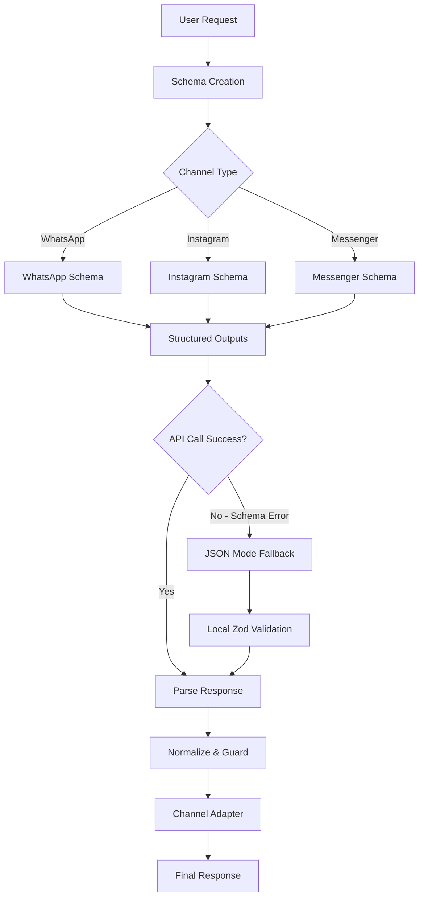

# Design Document

## Overview

Este documento detalha o design para corrigir os erros de schema inválido no sistema SocialWise Flow com a nova API OpenAI GPT-5. O problema central é que os schemas Zod atuais geram `allOf`/`anyOf` no JSON Schema, que não são suportados pelo Structured Outputs da OpenAI. A solução implementa um padrão de fallback automático baseado na rota de teste `app/api/openai-source-test/route.ts` que funciona 100% com a nova API.

## Architecture

### Current State Analysis

O sistema atual em `services/openai-components/server-socialwise.ts` usa:
- Schemas Zod com combinações `.min().max().regex()` que geram `allOf`
- Campos `.optional()` que não são requeridos (OpenAI prefere campos requeridos)
- Chamadas diretas para `client.responses.parse` sem fallback
- Schemas estáticos que não consideram as capacidades específicas de cada modelo

### Target Architecture



## Components and Interfaces

### 1. Schema Factory System

**Purpose**: Criar schemas dinamicamente por canal, evitando `allOf`/`anyOf`

```typescript
// Schema creation functions
function createButtonSchemaForChannel(channel: ChannelType): z.ZodSchema
function createButtonsSchema(channel: ChannelType): z.ZodSchema  
function createRouterSchema(channel: ChannelType): z.ZodSchema

// Channel constraints
interface ChannelConstraints {
  bodyMax: number;
  buttonTitleMax: number;
  payloadMax: number;
  maxButtons: number;
  titleWordMax: number;
}
```

**Key Design Principles**:
- Use regex patterns for string length validation instead of `.min()/.max()`
- Use `.nullable().default(null)` for optional fields instead of `.optional()`
- Always use `.strict()` to ensure `additionalProperties: false`
- Create schemas dynamically based on channel constraints

### 2. Structured Outputs with Fallback

**Purpose**: Implementar o padrão `structuredOrJson` da rota de teste

```typescript
interface StructuredOrJsonResult<T> {
  mode: "structured" | "json_mode_fallback";
  id: string;
  parsed: T;
  meta: {
    usage?: any;
    incomplete_details?: any;
  };
  openaiRequestEcho: any;
  raw_text?: string;
}

async function structuredOrJson<T>(args: {
  model: string;
  messages: ResponsesInput;
  instructions?: string;
  previous_response_id?: string;
  store?: boolean;
  max_output_tokens?: number;
  signal?: AbortSignal;
  verbosity: Verbosity;
  reasoning?: { effort: Effort };
  sampling?: { temperature?: number; top_p?: number };
  schema: z.ZodSchema<T>;
  schemaName: string;
}): Promise<StructuredOrJsonResult<T>>
```

**Flow**:
1. Try `client.responses.parse` with `zodTextFormat(schema, name)`
2. If fails with schema error, fallback to `client.responses.create` with JSON mode
3. Parse JSON response locally with Zod
4. Return result with mode indicator

### 3. Model Capabilities System

**Purpose**: Aplicar parâmetros dinâmicos baseados nas capacidades do modelo

```typescript
interface ModelCapabilities {
  reasoning: boolean;    // Supports reasoning.effort
  structured: boolean;   // Supports Structured Outputs
  sampling: boolean;     // Supports temperature/top_p
  label: string;
}

const MODEL_CAPS: Record<string, ModelCapabilities> = {
  "gpt-5": { reasoning: true, structured: true, sampling: true, label: "GPT-5" },
  "gpt-5-nano": { reasoning: true, structured: true, sampling: true, label: "GPT-5 Nano" },
  "gpt-4.1-nano": { reasoning: false, structured: true, sampling: true, label: "GPT-4.1 Nano" },
};
```

### 4. Captain Configuration Integration

**Purpose**: Integrar com o sistema de capitão real da produção seguindo o padrão da rota de teste

```typescript
interface CaptainConfig {
  // Configurações básicas do capitão
  id: string;
  name: string;
  model: string;
  instructions?: string;
  
  // SocialWise Flow optimization settings (seguindo o padrão da produção)
  embedipreview: boolean;
  reasoningEffort: "minimal" | "low" | "medium" | "high";
  verbosity: "low" | "medium" | "high";
  temperature?: number | null;
  topP?: number | null;
  tempSchema: number;
  tempCopy: number;
  warmupDeadlineMs: number;
  hardDeadlineMs: number;
  softDeadlineMs: number;
  shortTitleLLM: boolean;
  toolChoice: "none" | "auto";
}

function resolveCaptainPrefs(captain: CaptainConfig): {
  verbosity: Verbosity;
  reasoning?: { effort: Effort };
  sampling?: { temperature?: number; top_p?: number };
  caps: ModelCapabilities;
  timeouts: {
    warmup: number;
    hard: number;
    soft: number;
  };
}
```

### 5. Text Format Builder with Captain Integration

**Purpose**: Construir formato de texto seguindo o padrão da rota de teste com configurações do capitão

```typescript
function buildTextFormat<T>(
  schema: z.ZodSchema<T>, 
  name: string, 
  captain: CaptainConfig
): {
  format: any;
  verbosity?: Verbosity;
}

// Helper para detectar capacidades do modelo (seguindo o padrão da rota de teste)
const isGPT5 = (m?: string) => (m || "").toLowerCase().includes("gpt-5");
const normEffort = (e?: string) => e === "low" || e === "medium" || e === "high" ? e : "low";
const normVerb = (v?: string) => v === "low" || v === "medium" || v === "high" ? v : "low";

// Mescla Structured Outputs + verbosity do GPT-5 (padrão da rota de teste)
function buildTextFormat<T>(schema: T, name: string, captain: CaptainConfig) {
  const base: any = { format: zodTextFormat(schema as any, name) };
  if (isGPT5(captain.model)) base.verbosity = normVerb(captain.verbosity);
  return base;
}
```

## Data Models

### Fixed Schema Patterns

**Button Schema (Compatible)**:
```typescript
const Button = z.object({
  title: z.string().regex(/^.{1,20}$/u, "1-20 chars"),
  payload: z.string().regex(/^.{0,100}$/u).nullable().default(null),
}).strict();
```

**Router Decision Schema (Compatible)**:
```typescript
const RouterDecision = z.object({
  mode: z.enum(["intent", "chat"]),
  intent_payload: z.string().regex(/^@[a-z0-9_]+$/u).nullable(),
  response_text: z.string().regex(/^.{1,1024}$/u).nullable(),
  text: z.string().regex(/^.{1,1024}$/u).nullable(),
  buttons: z.array(Button).max(3).nullable(),
}).strict();
```

**Warmup Buttons Schema (Compatible)**:
```typescript
const WarmupButtons = z.object({
  response_text: z.string().regex(/^.{1,1024}$/u),
  buttons: z.array(Button).min(1).max(3),
}).strict();
```

### Response Types

```typescript
interface GenerationResult<T> {
  success: boolean;
  mode?: "structured" | "json_mode_fallback";
  data?: T;
  error?: string;
  debug?: {
    request?: any;
    response_meta?: any;
    raw_text?: string;
  };
}
```

## Error Handling

### Schema Validation Errors

1. **Structured Outputs Failure**: Automatic fallback to JSON mode
2. **JSON Parsing Failure**: Return error with raw text for debugging
3. **Zod Validation Failure**: Return detailed validation errors
4. **Incomplete Response**: Handle `incomplete_details.reason`

### Retry Strategies

1. **Schema Error Retry**: Switch from Structured to JSON mode
2. **Sampling Parameter Retry**: Remove unsupported parameters and retry
3. **Array Schema Drift**: Use strict mode with conservative sampling

### Error Response Format

```typescript
interface ErrorResponse {
  success: false;
  error: string;
  debug?: {
    openai?: {
      request?: any;
      raw_output_text?: string;
    };
    validation_errors?: any[];
  };
}
```

## Testing Strategy

### Unit Tests

1. **Schema Compatibility Tests**:
   - Verify schemas don't generate `allOf`/`anyOf`
   - Test `zodTextFormat` output format
   - Validate `additionalProperties: false`

2. **Fallback Mechanism Tests**:
   - Mock Structured Outputs failure
   - Verify JSON mode fallback works
   - Test local Zod validation

3. **Model Capabilities Tests**:
   - Test reasoning parameter inclusion/exclusion
   - Test sampling parameter handling
   - Test verbosity application

### Integration Tests

1. **End-to-End API Tests**:
   - Test with real OpenAI API calls
   - Verify both structured and fallback modes
   - Test timeout and cancellation

2. **Channel-Specific Tests**:
   - Test WhatsApp, Instagram, Messenger schemas
   - Verify channel constraints are applied
   - Test payload generation

### Performance Tests

1. **Response Time Tests**:
   - Measure structured vs fallback performance
   - Test timeout handling
   - Verify session continuity

2. **Error Rate Tests**:
   - Monitor schema validation success rates
   - Track fallback usage frequency
   - Measure retry success rates

## Implementation Phases

### Phase 1: Schema Fixes (Cirúrgico - 5 tarefas)
- Fix existing schemas to avoid `allOf`/`anyOf` using regex patterns
- Implement dynamic schema creation by channel following the test route pattern
- Add schema compatibility tests with `zodTextFormat`

### Phase 2: Fallback System (Baseado na Bíblia)
- Implement `structuredOrJson` pattern exactly as in the test route
- Add automatic fallback logic with try/catch for schema errors
- Update all generation functions to use the new pattern

### Phase 3: Captain Integration (Seguindo a Produção)
- Integrate with existing captain configuration system
- Use captain settings for model, reasoning, verbosity, and timeouts
- Maintain backward compatibility with existing captain interface

### Phase 4: SocialWise Flow Updates (Rápido)
- Update `generateWarmupButtons`, `routerLLM`, `generateFreeChatButtons`
- Apply the new patterns to all SocialWise Flow functions
- Test with real captain configurations

### Phase 5: Testing & Monitoring (Validação)
- Add comprehensive test coverage
- Monitor structured vs fallback usage rates
- Performance optimization based on real usage

## Migration Strategy

### Backward Compatibility
- Maintain existing function signatures
- Add new parameters as optional
- Preserve existing behavior where possible

### Rollout Plan
1. Deploy schema fixes first (low risk)
2. Enable fallback system (medium risk)
3. Activate dynamic preferences (high value)
4. Monitor and optimize (ongoing)

### Integration with Production Flow
- Manter compatibilidade com `lib/socialwise-flow/processor.ts`
- Usar configurações do capitão através de `loadAssistantConfiguration`
- Preservar o sistema de bandas (HARD, SOFT, LOW, ROUTER)
- Integrar com os formatters existentes (WhatsApp, Instagram)

## Production Integration Strategy

### SocialWise Flow Processor Integration

O sistema atual em `lib/socialwise-flow/processor.ts` já carrega configurações do capitão através de `loadAssistantConfiguration()`. A integração deve:

1. **Usar a configuração existente**: O processor já obtém todas as configurações necessárias do capitão
2. **Manter o fluxo de bandas**: HARD, SOFT, LOW, ROUTER devem continuar funcionando
3. **Aplicar os schemas corrigidos**: Nas funções `generateWarmupButtons`, `routerLLM`, `generateFreeChatButtons`

### Current Captain Configuration Flow

```typescript
// O processor já faz isso - apenas precisamos corrigir os schemas
const agentConfig = await loadAssistantConfiguration(context.inboxId, context.chatwitAccountId);

// Configuração final já inclui:
// - model, instructions, reasoningEffort, verbosity
// - temperature, tempSchema, tempCopy
// - warmupDeadlineMs, hardDeadlineMs, softDeadlineMs
// - embedipreview, shortTitleLLM, toolChoice
```

### Integration Points

1. **SOFT Band**: `generateWarmupButtons` em `processSoftBand()`
2. **LOW Band**: `generateFreeChatButtons` em `processLowBand()`  
3. **ROUTER Band**: `routerLLM` em `processRouterBand()`

### Channel Formatters Integration

Os formatters existentes devem continuar funcionando:
- `lib/socialwise/whatsapp-formatter.ts`
- `lib/socialwise/instagram-formatter.ts`
- `lib/socialwise-flow/channel-formatting.ts`

### Key Files to Update

1. `services/openai-components/server-socialwise.ts` - Corrigir schemas e implementar fallback
2. `lib/socialwise-flow/processor.ts` - Usar as funções corrigidas (sem mudanças estruturais)
3. Channel formatters - Manter compatibilidade com novos schemas