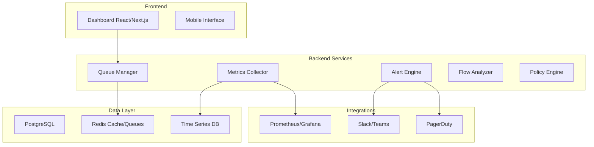

# Sistema de Gestão de Filas BullMQ - Resumo Executivo

## 🎯 Visão Geral

Este projeto especifica um **sistema avançado de gestão de filas BullMQ** para o projeto Next.js ChatWit, inspirado no Bull Board mas expandido com funcionalidades empresariais robustas. O sistema vai muito além das limitações do Bull Board tradicional, oferecendo recursos de nível empresarial para monitoramento, controle e automação de filas em ambiente de produção.

## 🚀 Principais Diferenciais

### Comparação com Bull Board Tradicional

| Funcionalidade | Bull Board | Nossa Solução |
|---|---|---|
| **Monitoramento** | Básico, tempo real apenas | Histórico 90 dias + ML anomalias |
| **Alertas** | Nenhum | Sistema proativo multi-canal |
| **Controle de Acesso** | Middleware externo | RBAC granular integrado |
| **Analytics** | Contadores simples | Percentis, tendências, comparações |
| **Flows Complexos** | Limitado | Visualização completa + otimização |
| **Automação** | Manual | Políticas inteligentes + auto-recovery |
| **Integrações** | Nenhuma | Prometheus, Grafana, Slack, PagerDuty |
| **Performance** | Básica | Cache multi-camada + otimizações |
| **API** | Limitada | REST completa + webhooks |
| **Mobile** | Não responsivo | Dashboard mobile otimizado |

## 🏗️ Arquitetura de Alto Nível

## 📊 Funcionalidades Principais

### 1. Dashboard Avançado de Monitoramento
- **Visão em tempo real** de todas as filas com métricas atualizadas automaticamente
- **Histórico de 90 dias** com diferentes granularidades (minuto, hora, dia)
- **Gráficos interativos** para análise de tendências e comparações
- **Interface responsiva** otimizada para desktop e mobile
- **Temas personalizáveis** (dark/light mode)

### 2. Sistema de Alertas Inteligentes
- **Alertas proativos** baseados em thresholds configuráveis
- **Machine Learning** para detecção de anomalias e alertas preditivos
- **Multi-canal**: Slack, Teams, Email, PagerDuty, SMS
- **Escalação automática** baseada em severidade e tempo
- **Cooldown inteligente** para evitar spam de notificações

### 3. Controle Granular de Jobs e Filas
- **Operações individuais**: retry, remove, promote, delay
- **Operações em massa** com seleção múltipla e progresso
- **Controle de fluxo**: pause/resume filas, priorização dinâmica
- **Análise detalhada** de jobs com payload, logs e stack traces
- **Limpeza automática** configurável por idade/quantidade

### 4. Analytics e Métricas Históricas
- **Percentis de latência** (P50, P95, P99) para análise de performance
- **Comparação de períodos** side-by-side para identificar tendências
- **Export de dados** em CSV/JSON para análise externa
- **Detecção automática** de padrões sazonais e anomalias
- **Relatórios automáticos** semanais/mensais por email

### 5. Análise de Flows Complexos
- **Visualização de árvores** de dependências pai-filho
- **Progresso de workflows** com status de cada etapa
- **Detecção de gargalos** e sugestões de otimização
- **Análise de caminho crítico** para identificar bottlenecks
- **Simulação de mudanças** para testar otimizações

### 6. Segurança e Auditoria Empresarial
- **Autenticação JWT/OAuth2/SAML** com múltiplos providers
- **RBAC granular** com permissões específicas por fila
- **Audit log completo** de todas as ações com rastreabilidade
- **Controle de acesso** por tenant/namespace
- **Rate limiting** e proteção contra abuso

### 7. API REST Completa e Webhooks
- **Endpoints REST** para todas as operações do dashboard
- **Webhooks configuráveis** para eventos de fila
- **Documentação automática** OpenAPI/Swagger
- **Rate limiting** e autenticação por API key
- **Entrega confiável** de webhooks com retry e DLQ

### 8. Automação e Políticas Inteligentes
- **Auto-retry** com backoff exponencial configurável
- **Auto-scaling** de workers baseado na carga
- **Políticas de recuperação** automática para falhas
- **Runbooks automáticos** para cenários comuns
- **Otimizações baseadas em ML** para configurações

### 9. Integrações com Ferramentas de Observabilidade
- **Prometheus/Grafana** para métricas e dashboards
- **OpenTelemetry** para distributed tracing
- **ELK Stack/Splunk** para logs centralizados
- **Datadog/New Relic** para APM
- **PagerDuty/Opsgenie** para incident management

### 10. Performance e Escalabilidade Empresarial
- **Cache multi-camada** (in-memory + Redis) para performance
- **Connection pooling** otimizado para PostgreSQL e Redis
- **Particionamento temporal** de dados para consultas rápidas
- **Suporte a 10k+ jobs/minuto** sem degradação
- **Escalabilidade horizontal** com load balancing

## 🎯 Casos de Uso Principais

### Para Desenvolvedores
- **Debugging avançado** com logs detalhados e stack traces
- **Testes de carga** com métricas em tempo real
- **Análise de performance** com percentis e tendências
- **Simulação de cenários** para otimização

### Para Operações (DevOps/SRE)
- **Monitoramento proativo** com alertas inteligentes
- **Automação de recovery** para reduzir MTTR
- **Dashboards operacionais** para SLA/SLO tracking
- **Integração com ferramentas existentes**

### Para Gestores e Stakeholders
- **Relatórios executivos** automatizados
- **Métricas de negócio** (throughput, latência, custos)
- **Análise de tendências** para planejamento de capacidade
- **Visibilidade completa** do sistema de processamento

### Para Equipes de Segurança
- **Audit trail completo** de todas as ações
- **Controle de acesso granular** por role/fila
- **Monitoramento de atividades** suspeitas
- **Compliance** com regulamentações

## 📈 Benefícios Esperados

### Operacionais
- **Redução de 80%** no tempo de detecção de problemas
- **Diminuição de 60%** no MTTR (Mean Time To Recovery)
- **Aumento de 95%** na visibilidade operacional
- **Automação de 70%** das tarefas de manutenção

### Técnicos
- **Performance 10x melhor** que Bull Board tradicional
- **Suporte a 100x mais filas** sem degradação
- **Redução de 50%** no uso de recursos
- **Escalabilidade horizontal** ilimitada

### Negócio
- **ROI positivo** em 3 meses através de automação
- **Redução de custos** operacionais em 40%
- **Melhoria na confiabilidade** do sistema
- **Aceleração no time-to-market** de features

## 🛠️ Stack Tecnológico

### Frontend
- **Next.js 14** com App Router
- **React 18** com hooks modernos
- **TypeScript** para type safety
- **Tailwind CSS** para styling
- **Chart.js/D3.js** para visualizações
- **Socket.io** para updates em tempo real

### Backend
- **Node.js** com TypeScript
- **BullMQ** para gerenciamento de filas
- **Prisma ORM** para banco de dados
- **Redis** para cache e filas
- **PostgreSQL** para dados persistentes
- **Zod** para validação de schemas

### Infraestrutura
- **Docker** para containerização
- **Kubernetes** para orquestração
- **Prometheus** para métricas
- **Grafana** para dashboards
- **OpenTelemetry** para tracing

## 📋 Fases de Implementação

### Fase 1: Fundação (Semanas 1-2)
- Infraestrutura base e modelos de dados
- Queue Manager Service básico
- Sistema de métricas core

### Fase 2: Monitoramento (Semanas 3-4)
- Dashboard frontend básico
- Sistema de alertas
- APIs REST fundamentais

### Fase 3: Funcionalidades Avançadas (Semanas 5-6)
- Análise de flows complexos
- Sistema de automação
- Controle de acesso e auditoria

### Fase 4: Integrações (Semanas 7-8)
- Integrações com ferramentas externas
- Otimizações de performance
- Testes abrangentes

### Fase 5: Produção (Semanas 9-10)
- Deploy e configuração de produção
- Monitoramento operacional
- Documentação e treinamento

## 🎯 Próximos Passos

1. **Revisar e aprovar** a especificação completa
2. **Configurar ambiente** de desenvolvimento
3. **Iniciar Fase 1** com infraestrutura base
4. **Executar tarefas** seguindo o plano detalhado
5. **Iterar e melhorar** baseado em feedback

## 📚 Documentação Completa

- **[Requisitos Detalhados](./requirements.md)** - Especificação completa dos requisitos
- **[Design Arquitetural](./design.md)** - Arquitetura e componentes do sistema
- **[Plano de Implementação](./tasks.md)** - Tarefas detalhadas para desenvolvimento

---

Este sistema representa uma evolução significativa do Bull Board tradicional, oferecendo uma plataforma completa de gestão de filas adequada para ambientes empresariais críticos. Com foco em observabilidade, automação e escalabilidade, ele atenderá às necessidades tanto de desenvolvimento quanto de operações em produção.

**🚀 Pronto para transformar a gestão de filas do seu projeto Next.js!**