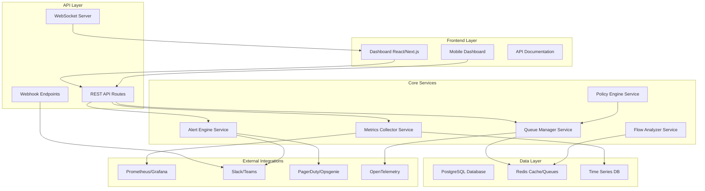
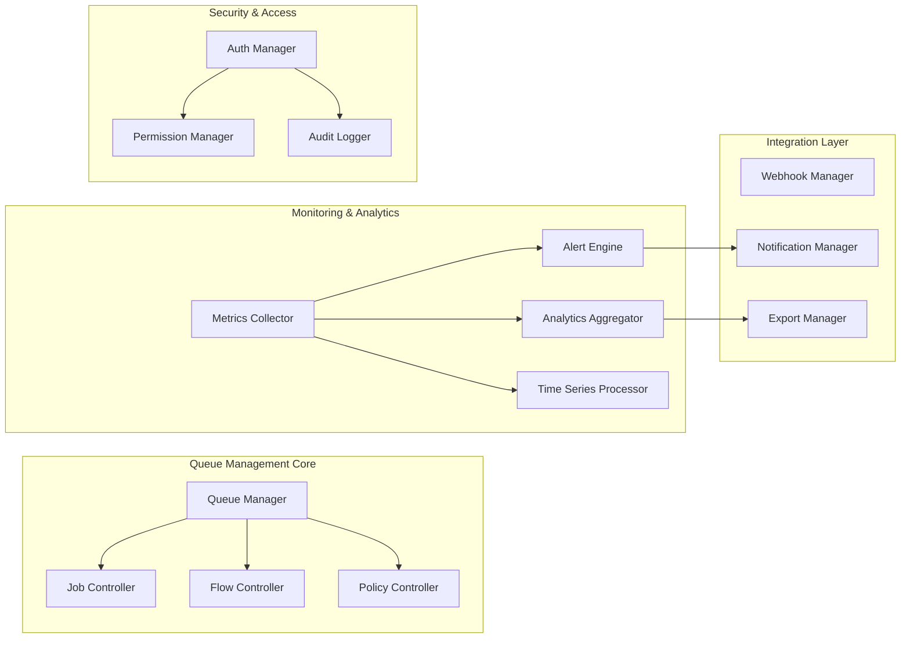

# Sistema de Gestão de Filas BullMQ - Documento de Design

## Visão Geral

Este documento detalha o design arquitetural para um sistema avançado de gestão de filas BullMQ integrado ao projeto Next.js ChatWit. O sistema será construído como uma evolução do Bull Board tradicional, incorporando funcionalidades empresariais robustas para monitoramento, controle e automação de filas em ambiente de produção.

## Arquitetura

### Arquitetura Geral do Sistema



### Arquitetura de Componentes Detalhada



## Componentes e Interfaces

### 1. Queue Manager Service

**Responsabilidade:** Gerenciamento central de todas as operações de fila

```typescript
interface QueueManagerService {
  // Operações de Fila
  registerQueue(queue: Queue, config: QueueConfig): Promise<void>
  getQueueHealth(queueName: string): Promise<QueueHealth>
  getAllQueuesHealth(): Promise<Map<string, QueueHealth>>
  
  // Operações de Job
  getJobs(queueName: string, state: JobState, pagination: Pagination): Promise<JobList>
  retryJob(queueName: string, jobId: string): Promise<boolean>
  removeJob(queueName: string, jobId: string): Promise<boolean>
  promoteJob(queueName: string, jobId: string): Promise<boolean>
  
  // Operações em Massa
  retryAllFailed(queueName: string): Promise<BatchResult>
  cleanCompleted(queueName: string, olderThan: number): Promise<BatchResult>
  pauseQueue(queueName: string): Promise<boolean>
  resumeQueue(queueName: string): Promise<boolean>
  
  // Controle de Fluxo
  getFlowTree(flowId: string): Promise<FlowTree>
  cancelFlow(flowId: string): Promise<boolean>
  retryFlow(flowId: string): Promise<boolean>
}

interface QueueConfig {
  name: string
  priority: number
  concurrency: number
  rateLimiter?: RateLimiterConfig
  retryPolicy: RetryPolicy
  cleanupPolicy: CleanupPolicy
  alertThresholds: AlertThresholds
}

interface QueueHealth {
  name: string
  status: 'healthy' | 'warning' | 'critical'
  counts: {
    waiting: number
    active: number
    completed: number
    failed: number
    delayed: number
  }
  performance: {
    throughput: number // jobs/min
    avgProcessingTime: number // ms
    successRate: number // %
    errorRate: number // %
  }
  resources: {
    memoryUsage: number // bytes
    cpuUsage: number // %
    connections: number
  }
  lastUpdated: Date
}
```

### 2. Metrics Collector Service

**Responsabilidade:** Coleta, agregação e armazenamento de métricas

```typescript
interface MetricsCollectorService {
  // Coleta de Métricas
  collectQueueMetrics(queueName: string): Promise<QueueMetrics>
  collectJobMetrics(jobId: string): Promise<JobMetrics>
  collectSystemMetrics(): Promise<SystemMetrics>
  
  // Agregação Temporal
  aggregateMetrics(timeRange: TimeRange, granularity: Granularity): Promise<AggregatedMetrics>
  calculatePercentiles(queueName: string, metric: string, timeRange: TimeRange): Promise<Percentiles>
  
  // Análise de Tendências
  detectAnomalies(queueName: string, timeRange: TimeRange): Promise<Anomaly[]>
  predictTrends(queueName: string, horizon: number): Promise<TrendPrediction>
  
  // Export de Dados
  exportMetrics(format: 'csv' | 'json', filters: MetricFilters): Promise<ExportResult>
}

interface QueueMetrics {
  queueName: string
  timestamp: Date
  throughput: {
    jobsPerMinute: number
    jobsPerHour: number
    jobsPerDay: number
  }
  latency: {
    p50: number
    p95: number
    p99: number
    max: number
  }
  reliability: {
    successRate: number
    errorRate: number
    retryRate: number
  }
  resources: {
    memoryUsage: number
    cpuTime: number
    ioOperations: number
  }
}

interface JobMetrics {
  jobId: string
  queueName: string
  jobType: string
  status: JobState
  timing: {
    createdAt: Date
    startedAt?: Date
    completedAt?: Date
    processingTime?: number
    waitTime?: number
  }
  resources: {
    memoryPeak: number
    cpuTime: number
  }
  attempts: number
  error?: string
  correlationId?: string
}
```

### 3. Alert Engine Service

**Responsabilidade:** Sistema de alertas proativos e inteligentes

```typescript
interface AlertEngineService {
  // Configuração de Alertas
  createAlertRule(rule: AlertRule): Promise<string>
  updateAlertRule(ruleId: string, rule: Partial<AlertRule>): Promise<boolean>
  deleteAlertRule(ruleId: string): Promise<boolean>
  
  // Processamento de Alertas
  evaluateRules(): Promise<Alert[]>
  processAlert(alert: Alert): Promise<void>
  acknowledgeAlert(alertId: string, userId: string): Promise<boolean>
  
  // Escalação e Notificação
  escalateAlert(alertId: string): Promise<void>
  sendNotification(alert: Alert, channels: NotificationChannel[]): Promise<void>
  
  // Machine Learning
  trainAnomalyDetection(queueName: string): Promise<void>
  detectAnomalies(metrics: QueueMetrics[]): Promise<Anomaly[]>
}

interface AlertRule {
  id?: string
  name: string
  description: string
  queueName?: string // null = global
  condition: AlertCondition
  severity: 'info' | 'warning' | 'error' | 'critical'
  channels: NotificationChannel[]
  cooldown: number // minutes
  enabled: boolean
  createdBy: string
}

interface AlertCondition {
  metric: string
  operator: '>' | '<' | '==' | '!=' | 'contains'
  threshold: number | string
  timeWindow: number // minutes
  aggregation?: 'avg' | 'sum' | 'max' | 'min' | 'count'
}

interface Alert {
  id: string
  ruleId: string
  queueName?: string
  severity: 'info' | 'warning' | 'error' | 'critical'
  title: string
  message: string
  metrics: Record<string, any>
  createdAt: Date
  acknowledgedAt?: Date
  acknowledgedBy?: string
  resolvedAt?: Date
  status: 'active' | 'acknowledged' | 'resolved'
}
```

### 4. Flow Analyzer Service

**Responsabilidade:** Análise e gerenciamento de fluxos complexos

```typescript
interface FlowAnalyzerService {
  // Análise de Fluxos
  analyzeFlow(flowId: string): Promise<FlowAnalysis>
  getFlowTree(flowId: string): Promise<FlowTree>
  getFlowMetrics(flowId: string): Promise<FlowMetrics>
  
  // Detecção de Problemas
  detectOrphanedJobs(): Promise<OrphanedJob[]>
  detectCircularDependencies(): Promise<CircularDependency[]>
  detectBottlenecks(flowId: string): Promise<Bottleneck[]>
  
  // Otimização
  suggestOptimizations(flowId: string): Promise<Optimization[]>
  simulateFlowChanges(flowId: string, changes: FlowChange[]): Promise<SimulationResult>
}

interface FlowTree {
  flowId: string
  rootJob: FlowNode
  totalJobs: number
  completedJobs: number
  failedJobs: number
  status: 'pending' | 'running' | 'completed' | 'failed' | 'cancelled'
  startedAt?: Date
  completedAt?: Date
  estimatedCompletion?: Date
}

interface FlowNode {
  jobId: string
  jobName: string
  status: JobState
  children: FlowNode[]
  dependencies: string[]
  metrics: JobMetrics
  error?: string
}

interface FlowMetrics {
  flowId: string
  totalDuration: number
  criticalPath: string[]
  parallelism: number
  efficiency: number // %
  bottlenecks: Bottleneck[]
}
```

### 5. Dashboard Frontend Components

**Responsabilidade:** Interface de usuário rica e responsiva

```typescript
// Componentes Principais
interface DashboardComponents {
  // Visão Geral
  SystemOverview: React.FC<SystemOverviewProps>
  QueueGrid: React.FC<QueueGridProps>
  MetricsSummary: React.FC<MetricsSummaryProps>
  
  // Detalhes de Fila
  QueueDetails: React.FC<QueueDetailsProps>
  JobList: React.FC<JobListProps>
  JobDetails: React.FC<JobDetailsProps>
  
  // Fluxos
  FlowVisualizer: React.FC<FlowVisualizerProps>
  FlowTimeline: React.FC<FlowTimelineProps>
  
  // Analytics
  MetricsChart: React.FC<MetricsChartProps>
  PerformanceDashboard: React.FC<PerformanceDashboardProps>
  TrendAnalysis: React.FC<TrendAnalysisProps>
  
  // Alertas
  AlertCenter: React.FC<AlertCenterProps>
  AlertConfiguration: React.FC<AlertConfigurationProps>
  
  // Administração
  UserManagement: React.FC<UserManagementProps>
  SystemConfiguration: React.FC<SystemConfigurationProps>
  AuditLog: React.FC<AuditLogProps>
}

interface QueueDetailsProps {
  queueName: string
  realTimeUpdates: boolean
  onJobAction: (action: JobAction) => void
  onBatchAction: (action: BatchAction) => void
}

interface JobListProps {
  queueName: string
  state: JobState
  pagination: Pagination
  filters: JobFilters
  sortBy: SortOptions
  onJobSelect: (jobId: string) => void
  onBatchSelect: (jobIds: string[]) => void
}
```

## Modelos de Dados

### Schema do Banco de Dados

```sql
-- Configuração de Filas
CREATE TABLE queue_configs (
    id UUID PRIMARY KEY DEFAULT gen_random_uuid(),
    name VARCHAR(255) UNIQUE NOT NULL,
    display_name VARCHAR(255),
    description TEXT,
    priority INTEGER DEFAULT 0,
    concurrency INTEGER DEFAULT 1,
    rate_limiter JSONB,
    retry_policy JSONB NOT NULL,
    cleanup_policy JSONB NOT NULL,
    alert_thresholds JSONB NOT NULL,
    created_at TIMESTAMP DEFAULT NOW(),
    updated_at TIMESTAMP DEFAULT NOW(),
    created_by VARCHAR(255) NOT NULL
);

-- Métricas de Fila (Time Series)
CREATE TABLE queue_metrics (
    id UUID PRIMARY KEY DEFAULT gen_random_uuid(),
    queue_name VARCHAR(255) NOT NULL,
    timestamp TIMESTAMP NOT NULL,
    waiting_count INTEGER NOT NULL,
    active_count INTEGER NOT NULL,
    completed_count INTEGER NOT NULL,
    failed_count INTEGER NOT NULL,
    delayed_count INTEGER NOT NULL,
    throughput_per_minute DECIMAL(10,2),
    avg_processing_time DECIMAL(10,2),
    success_rate DECIMAL(5,2),
    error_rate DECIMAL(5,2),
    memory_usage BIGINT,
    cpu_usage DECIMAL(5,2),
    created_at TIMESTAMP DEFAULT NOW()
);

-- Índices para performance
CREATE INDEX idx_queue_metrics_queue_timestamp ON queue_metrics(queue_name, timestamp DESC);
CREATE INDEX idx_queue_metrics_timestamp ON queue_metrics(timestamp DESC);

-- Métricas de Job (Time Series)
CREATE TABLE job_metrics (
    id UUID PRIMARY KEY DEFAULT gen_random_uuid(),
    job_id VARCHAR(255) NOT NULL,
    queue_name VARCHAR(255) NOT NULL,
    job_name VARCHAR(255),
    job_type VARCHAR(255),
    status VARCHAR(50) NOT NULL,
    created_at TIMESTAMP NOT NULL,
    started_at TIMESTAMP,
    completed_at TIMESTAMP,
    processing_time INTEGER, -- milliseconds
    wait_time INTEGER, -- milliseconds
    attempts INTEGER DEFAULT 0,
    max_attempts INTEGER DEFAULT 1,
    memory_peak BIGINT,
    cpu_time INTEGER, -- milliseconds
    error_message TEXT,
    correlation_id VARCHAR(255),
    flow_id VARCHAR(255),
    parent_job_id VARCHAR(255),
    payload_size INTEGER,
    result_size INTEGER
);

-- Índices para job metrics
CREATE INDEX idx_job_metrics_queue_status ON job_metrics(queue_name, status);
CREATE INDEX idx_job_metrics_correlation ON job_metrics(correlation_id);
CREATE INDEX idx_job_metrics_flow ON job_metrics(flow_id);
CREATE INDEX idx_job_metrics_created_at ON job_metrics(created_at DESC);

-- Regras de Alerta
CREATE TABLE alert_rules (
    id UUID PRIMARY KEY DEFAULT gen_random_uuid(),
    name VARCHAR(255) NOT NULL,
    description TEXT,
    queue_name VARCHAR(255), -- NULL = global
    condition JSONB NOT NULL,
    severity VARCHAR(20) NOT NULL CHECK (severity IN ('info', 'warning', 'error', 'critical')),
    channels JSONB NOT NULL,
    cooldown INTEGER DEFAULT 5, -- minutes
    enabled BOOLEAN DEFAULT true,
    created_at TIMESTAMP DEFAULT NOW(),
    updated_at TIMESTAMP DEFAULT NOW(),
    created_by VARCHAR(255) NOT NULL
);

-- Histórico de Alertas
CREATE TABLE alerts (
    id UUID PRIMARY KEY DEFAULT gen_random_uuid(),
    rule_id UUID REFERENCES alert_rules(id),
    queue_name VARCHAR(255),
    severity VARCHAR(20) NOT NULL,
    title VARCHAR(500) NOT NULL,
    message TEXT NOT NULL,
    metrics JSONB,
    status VARCHAR(20) DEFAULT 'active' CHECK (status IN ('active', 'acknowledged', 'resolved')),
    created_at TIMESTAMP DEFAULT NOW(),
    acknowledged_at TIMESTAMP,
    acknowledged_by VARCHAR(255),
    resolved_at TIMESTAMP,
    resolution_note TEXT
);

-- Fluxos de Trabalho
CREATE TABLE job_flows (
    id UUID PRIMARY KEY DEFAULT gen_random_uuid(),
    flow_id VARCHAR(255) UNIQUE NOT NULL,
    name VARCHAR(255),
    description TEXT,
    root_job_id VARCHAR(255) NOT NULL,
    status VARCHAR(20) DEFAULT 'pending' CHECK (status IN ('pending', 'running', 'completed', 'failed', 'cancelled')),
    total_jobs INTEGER DEFAULT 0,
    completed_jobs INTEGER DEFAULT 0,
    failed_jobs INTEGER DEFAULT 0,
    started_at TIMESTAMP,
    completed_at TIMESTAMP,
    estimated_completion TIMESTAMP,
    created_at TIMESTAMP DEFAULT NOW(),
    metadata JSONB
);

-- Dependências entre Jobs
CREATE TABLE job_dependencies (
    id UUID PRIMARY KEY DEFAULT gen_random_uuid(),
    flow_id VARCHAR(255) NOT NULL,
    job_id VARCHAR(255) NOT NULL,
    parent_job_id VARCHAR(255),
    dependency_type VARCHAR(50) DEFAULT 'sequential' CHECK (dependency_type IN ('sequential', 'parallel', 'conditional')),
    condition JSONB,
    created_at TIMESTAMP DEFAULT NOW()
);

-- Configurações do Sistema
CREATE TABLE system_configs (
    id UUID PRIMARY KEY DEFAULT gen_random_uuid(),
    key VARCHAR(255) UNIQUE NOT NULL,
    value JSONB NOT NULL,
    description TEXT,
    category VARCHAR(100),
    created_at TIMESTAMP DEFAULT NOW(),
    updated_at TIMESTAMP DEFAULT NOW(),
    updated_by VARCHAR(255)
);

-- Usuários e Permissões
CREATE TABLE queue_users (
    id UUID PRIMARY KEY DEFAULT gen_random_uuid(),
    user_id VARCHAR(255) UNIQUE NOT NULL,
    email VARCHAR(255) NOT NULL,
    name VARCHAR(255) NOT NULL,
    role VARCHAR(50) DEFAULT 'viewer' CHECK (role IN ('viewer', 'operator', 'admin', 'superadmin')),
    permissions JSONB,
    queue_access JSONB, -- specific queue permissions
    created_at TIMESTAMP DEFAULT NOW(),
    updated_at TIMESTAMP DEFAULT NOW(),
    last_login TIMESTAMP
);

-- Log de Auditoria
CREATE TABLE audit_logs (
    id UUID PRIMARY KEY DEFAULT gen_random_uuid(),
    user_id VARCHAR(255) NOT NULL,
    action VARCHAR(255) NOT NULL,
    resource_type VARCHAR(100) NOT NULL,
    resource_id VARCHAR(255),
    queue_name VARCHAR(255),
    details JSONB,
    ip_address INET,
    user_agent TEXT,
    created_at TIMESTAMP DEFAULT NOW()
);

-- Políticas de Automação
CREATE TABLE automation_policies (
    id UUID PRIMARY KEY DEFAULT gen_random_uuid(),
    name VARCHAR(255) NOT NULL,
    description TEXT,
    queue_name VARCHAR(255), -- NULL = global
    trigger_condition JSONB NOT NULL,
    actions JSONB NOT NULL,
    enabled BOOLEAN DEFAULT true,
    priority INTEGER DEFAULT 0,
    created_at TIMESTAMP DEFAULT NOW(),
    updated_at TIMESTAMP DEFAULT NOW(),
    created_by VARCHAR(255) NOT NULL,
    last_executed TIMESTAMP,
    execution_count INTEGER DEFAULT 0
);

-- Webhooks de Integração
CREATE TABLE webhook_configs (
    id UUID PRIMARY KEY DEFAULT gen_random_uuid(),
    name VARCHAR(255) NOT NULL,
    url VARCHAR(1000) NOT NULL,
    events JSONB NOT NULL, -- array of event types
    headers JSONB,
    secret VARCHAR(255),
    enabled BOOLEAN DEFAULT true,
    retry_policy JSONB,
    created_at TIMESTAMP DEFAULT NOW(),
    updated_at TIMESTAMP DEFAULT NOW(),
    created_by VARCHAR(255) NOT NULL
);

-- Log de Webhooks
CREATE TABLE webhook_deliveries (
    id UUID PRIMARY KEY DEFAULT gen_random_uuid(),
    webhook_id UUID REFERENCES webhook_configs(id),
    event_type VARCHAR(100) NOT NULL,
    payload JSONB NOT NULL,
    response_status INTEGER,
    response_body TEXT,
    attempts INTEGER DEFAULT 1,
    delivered_at TIMESTAMP,
    created_at TIMESTAMP DEFAULT NOW()
);
```

### Modelos Redis para Cache

```typescript
// Cache de Configurações de Fila
interface QueueConfigCache {
  key: `queue:config:${queueName}`
  value: QueueConfig
  ttl: 3600 // 1 hour
}

// Cache de Métricas em Tempo Real
interface QueueMetricsCache {
  key: `queue:metrics:${queueName}:${timestamp}`
  value: QueueMetrics
  ttl: 300 // 5 minutes
}

// Cache de Saúde de Fila
interface QueueHealthCache {
  key: `queue:health:${queueName}`
  value: QueueHealth
  ttl: 30 // 30 seconds
}

// Cache de Sessão de Usuário
interface UserSessionCache {
  key: `user:session:${userId}`
  value: {
    permissions: string[]
    queueAccess: Record<string, string[]>
    lastActivity: Date
  }
  ttl: 1800 // 30 minutes
}

// Cache de Alertas Ativos
interface ActiveAlertsCache {
  key: `alerts:active`
  value: Alert[]
  ttl: 60 // 1 minute
}
```

## Tratamento de Erros

### Estratégia de Error Handling

```typescript
// Hierarquia de Erros Customizados
class QueueManagementError extends Error {
  constructor(
    message: string,
    public code: string,
    public statusCode: number = 500,
    public details?: any
  ) {
    super(message)
    this.name = 'QueueManagementError'
  }
}

class QueueNotFoundError extends QueueManagementError {
  constructor(queueName: string) {
    super(`Queue not found: ${queueName}`, 'QUEUE_NOT_FOUND', 404)
  }
}

class JobNotFoundError extends QueueManagementError {
  constructor(jobId: string) {
    super(`Job not found: ${jobId}`, 'JOB_NOT_FOUND', 404)
  }
}

class InsufficientPermissionsError extends QueueManagementError {
  constructor(action: string, resource: string) {
    super(`Insufficient permissions for ${action} on ${resource}`, 'INSUFFICIENT_PERMISSIONS', 403)
  }
}

class RateLimitExceededError extends QueueManagementError {
  constructor(limit: number, window: number) {
    super(`Rate limit exceeded: ${limit} requests per ${window}s`, 'RATE_LIMIT_EXCEEDED', 429)
  }
}

// Error Handler Global
interface ErrorHandler {
  handleError(error: Error, context: ErrorContext): Promise<ErrorResponse>
  logError(error: Error, context: ErrorContext): Promise<void>
  notifyError(error: Error, context: ErrorContext): Promise<void>
}

interface ErrorContext {
  userId?: string
  queueName?: string
  jobId?: string
  action: string
  requestId: string
  timestamp: Date
}

interface ErrorResponse {
  success: false
  error: {
    code: string
    message: string
    details?: any
    requestId: string
    timestamp: Date
  }
}
```

### Circuit Breaker Pattern

```typescript
class CircuitBreaker {
  private failures = 0
  private lastFailureTime?: Date
  private state: 'closed' | 'open' | 'half-open' = 'closed'
  
  constructor(
    private threshold: number = 5,
    private timeout: number = 60000, // 1 minute
    private resetTimeout: number = 30000 // 30 seconds
  ) {}
  
  async execute<T>(operation: () => Promise<T>): Promise<T> {
    if (this.state === 'open') {
      if (this.shouldAttemptReset()) {
        this.state = 'half-open'
      } else {
        throw new Error('Circuit breaker is open')
      }
    }
    
    try {
      const result = await operation()
      this.onSuccess()
      return result
    } catch (error) {
      this.onFailure()
      throw error
    }
  }
  
  private onSuccess(): void {
    this.failures = 0
    this.state = 'closed'
  }
  
  private onFailure(): void {
    this.failures++
    this.lastFailureTime = new Date()
    
    if (this.failures >= this.threshold) {
      this.state = 'open'
    }
  }
  
  private shouldAttemptReset(): boolean {
    return this.lastFailureTime && 
           (Date.now() - this.lastFailureTime.getTime()) >= this.resetTimeout
  }
}
```

## Estratégia de Testes

### Estrutura de Testes

```typescript
// Testes Unitários
describe('QueueManagerService', () => {
  describe('registerQueue', () => {
    it('should register a new queue with default config')
    it('should throw error when queue already exists')
    it('should validate queue configuration')
  })
  
  describe('getQueueHealth', () => {
    it('should return current queue health metrics')
    it('should return null for non-existent queue')
    it('should cache health data for performance')
  })
})

// Testes de Integração
describe('Queue Management Integration', () => {
  it('should handle complete job lifecycle')
  it('should process batch operations correctly')
  it('should maintain data consistency during failures')
  it('should respect rate limiting')
})

// Testes de Performance
describe('Performance Tests', () => {
  it('should handle 1000+ concurrent queue operations')
  it('should maintain response time < 2s with large datasets')
  it('should scale horizontally without data loss')
})

// Testes End-to-End
describe('Dashboard E2E', () => {
  it('should display real-time queue metrics')
  it('should allow job management operations')
  it('should send alerts when thresholds are exceeded')
  it('should export metrics in multiple formats')
})
```

### Estratégia de Mocking

```typescript
// Mock do Redis para testes
class MockRedis {
  private data = new Map<string, any>()
  
  async get(key: string): Promise<string | null> {
    return this.data.get(key) || null
  }
  
  async set(key: string, value: string, ttl?: number): Promise<void> {
    this.data.set(key, value)
    if (ttl) {
      setTimeout(() => this.data.delete(key), ttl * 1000)
    }
  }
}

// Mock do BullMQ para testes
class MockQueue {
  private jobs = new Map<string, any>()
  
  async add(name: string, data: any, opts?: any): Promise<any> {
    const job = { id: Date.now().toString(), name, data, opts }
    this.jobs.set(job.id, job)
    return job
  }
  
  async getJobs(states: string[]): Promise<any[]> {
    return Array.from(this.jobs.values())
  }
}
```

## Considerações de Segurança

### Autenticação e Autorização

```typescript
// JWT Token Structure
interface JWTPayload {
  userId: string
  email: string
  role: 'viewer' | 'operator' | 'admin' | 'superadmin'
  permissions: string[]
  queueAccess: Record<string, string[]>
  iat: number
  exp: number
}

// Permission System
class PermissionManager {
  static readonly PERMISSIONS = {
    // Queue Operations
    QUEUE_VIEW: 'queue:view',
    QUEUE_MANAGE: 'queue:manage',
    QUEUE_DELETE: 'queue:delete',
    
    // Job Operations
    JOB_VIEW: 'job:view',
    JOB_RETRY: 'job:retry',
    JOB_DELETE: 'job:delete',
    JOB_PROMOTE: 'job:promote',
    
    // System Operations
    SYSTEM_CONFIG: 'system:config',
    USER_MANAGE: 'user:manage',
    ALERT_MANAGE: 'alert:manage',
    
    // Analytics
    METRICS_VIEW: 'metrics:view',
    METRICS_EXPORT: 'metrics:export',
  } as const
  
  hasPermission(user: JWTPayload, permission: string, queueName?: string): boolean {
    // Check global permissions
    if (user.permissions.includes(permission)) {
      return true
    }
    
    // Check queue-specific permissions
    if (queueName && user.queueAccess[queueName]?.includes(permission)) {
      return true
    }
    
    return false
  }
}
```

### Rate Limiting

```typescript
class RateLimiter {
  constructor(
    private redis: Redis,
    private windowMs: number = 60000, // 1 minute
    private maxRequests: number = 100
  ) {}
  
  async checkLimit(key: string): Promise<{ allowed: boolean; remaining: number; resetTime: Date }> {
    const now = Date.now()
    const window = Math.floor(now / this.windowMs)
    const redisKey = `rate_limit:${key}:${window}`
    
    const current = await this.redis.incr(redisKey)
    
    if (current === 1) {
      await this.redis.expire(redisKey, Math.ceil(this.windowMs / 1000))
    }
    
    const allowed = current <= this.maxRequests
    const remaining = Math.max(0, this.maxRequests - current)
    const resetTime = new Date((window + 1) * this.windowMs)
    
    return { allowed, remaining, resetTime }
  }
}
```

### Input Validation

```typescript
import { z } from 'zod'

// Schemas de Validação
const QueueConfigSchema = z.object({
  name: z.string().min(1).max(255).regex(/^[a-zA-Z0-9_-]+$/),
  displayName: z.string().max(255).optional(),
  description: z.string().max(1000).optional(),
  priority: z.number().int().min(0).max(100).default(0),
  concurrency: z.number().int().min(1).max(1000).default(1),
  retryPolicy: z.object({
    attempts: z.number().int().min(1).max(10),
    backoff: z.enum(['fixed', 'exponential']),
    delay: z.number().int().min(0)
  }),
  cleanupPolicy: z.object({
    removeOnComplete: z.number().int().min(0).max(10000),
    removeOnFail: z.number().int().min(0).max(10000)
  })
})

const JobActionSchema = z.object({
  action: z.enum(['retry', 'remove', 'promote', 'delay']),
  jobIds: z.array(z.string()).min(1).max(1000),
  delay: z.number().int().min(0).optional()
})

// Middleware de Validação
function validateInput<T>(schema: z.ZodSchema<T>) {
  return (req: Request, res: Response, next: NextFunction) => {
    try {
      const validated = schema.parse(req.body)
      req.body = validated
      next()
    } catch (error) {
      if (error instanceof z.ZodError) {
        return res.status(400).json({
          success: false,
          error: {
            code: 'VALIDATION_ERROR',
            message: 'Invalid input data',
            details: error.errors
          }
        })
      }
      next(error)
    }
  }
}
```

Este design fornece uma base sólida para implementar um sistema de gestão de filas BullMQ robusto e escalável, com todas as funcionalidades empresariais necessárias para ambientes de produção críticos.