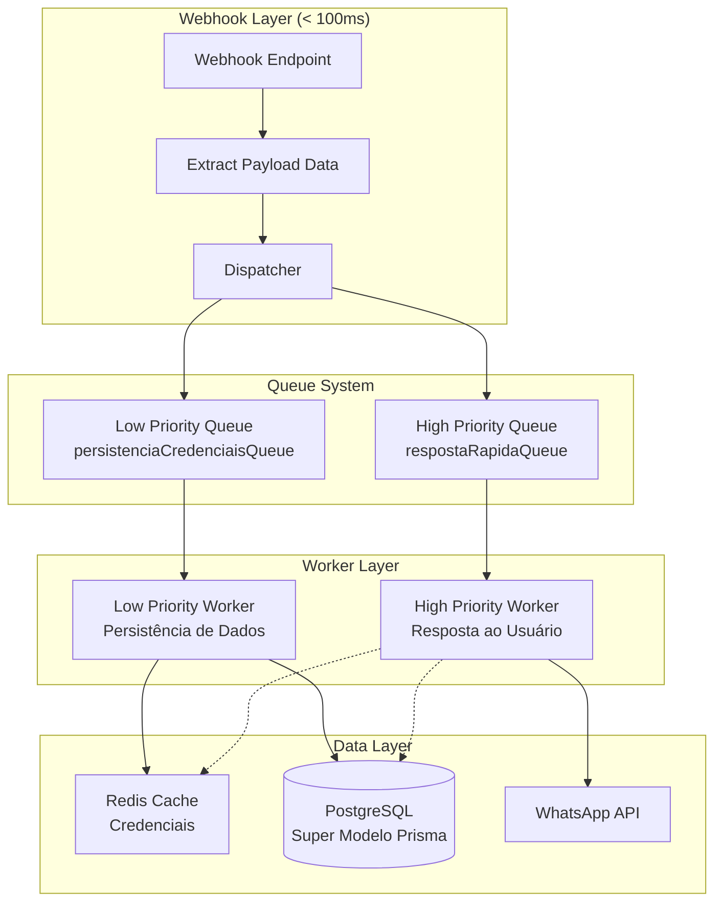

# Design Document

## Overview

Este documento apresenta o design detalhado para a refatoração completa do sistema ChatWit, alinhando-o com o novo "Super Modelo" do Prisma. A arquitetura proposta implementa três princípios fundamentais:

1. **Velocidade Primeiro**: O webhook responde em milissegundos transferindo processamento para workers assíncronos
2. **Fonte Única da Verdade**: Payload do webhook para resposta imediata, banco de dados para estado geral
3. **Resiliência e Desacoplamento**: Resposta ao usuário não espera atualização de dados no banco

O sistema atual possui fragmentação de dados, consultas lentas ao banco durante o webhook e falta de cache inteligente. O novo design resolve esses problemas através de uma arquitetura de filas com duas prioridades e um sistema de cache Redis otimizado.

## Architecture

### High-Level Architecture



### Request Flow

1. **Webhook Recebe Requisição** (0-10ms)
   - Extrai dados essenciais do payload
   - Identifica tipo de interação (intent/button_click)
   - Extrai credenciais diretamente do payload

2. **Dispatcher Enfileira Jobs** (10-50ms)
   - Gera correlationId único para rastreabilidade
   - Job alta prioridade: resposta ao usuário
   - Job baixa prioridade: persistência de credenciais
   - Responde 202 Accepted imediatamente

3. **Worker Alta Prioridade** (Assíncrono)
   - Processa resposta usando dados do payload
   - Consulta mapeamentos no banco (otimizado)
   - Envia mensagem via WhatsApp API

4. **Worker Baixa Prioridade** (Assíncrono)
   - Atualiza credenciais no banco
   - Gerencia cache Redis
   - Mantém dados sincronizados

## Components and Interfaces

### 1. Webhook Dispatcher

**Arquivo**: `app/api/admin/mtf-diamante/dialogflow/webhook/route.ts`

```typescript
interface WebhookPayload {
  originalDetectIntentRequest: {
    payload: {
      inbox_id: string;
      contact_phone: string;
      interaction_type: "button_reply" | "intent";
      button_id?: string;
      wamid: string;
      whatsapp_api_key: string;
      phone_number_id: string;
      business_id: string;
      contact_source: string;
      message_id: number;
      account_id: number;
      account_name: string;
    }
  };
  queryResult: {
    intent: {
      displayName: string;
    }
  };
}

interface DispatcherResponse {
  status: 202; // Accepted - processamento assíncrono
  body: {
    correlationId: string; // Para rastreabilidade
  };
}
```

**Responsabilidades**:
- Gerar correlationId único para cada requisição
- Extrair dados essenciais em < 50ms
- Enfileirar jobs com prioridades diferentes
- Responder 202 Accepted imediatamente ao Dialogflow
- Manter logs estruturados com correlationId para debugging

### 2. Queue System

**Arquivos**: 
- `lib/queue/resposta-rapida.queue.ts`
- `lib/queue/persistencia-credenciais.queue.ts`

```typescript
interface RespostaRapidaJob {
  type: 'processarResposta';
  data: {
    inboxId: string;
    contactPhone: string;
    interactionType: 'button_reply' | 'intent';
    buttonId?: string;
    intentName?: string;
    wamid: string;
    credentials: {
      token: string;
      phoneNumberId: string;
      businessId: string;
    };
    correlationId: string;
  };
}

interface PersistenciaCredenciaisJob {
  type: 'atualizarCredenciais';
  data: {
    inboxId: string;
    whatsappApiKey: string;
    phoneNumberId: string;
    businessId: string;
    contactSource: string;
    leadData: {
      messageId: number;
      accountId: number;
      accountName: string;
    };
  };
}
```

### 3. High Priority Worker

**Arquivo**: `worker/respostaRapida.worker.ts`

```typescript
interface WorkerResponse {
  success: boolean;
  messageId?: string;
  error?: string;
  processingTime: number;
}

class RespostaRapidaWorker {
  async processJob(job: RespostaRapidaJob): Promise<WorkerResponse> {
    // 1. Determinar tipo de resposta
    // 2. Consultar mapeamentos (otimizado)
    // 3. Enviar via WhatsApp API
    // 4. Retornar resultado
  }
}
```

### 4. Low Priority Worker

**Arquivo**: `worker/persistencia.worker.ts`

```typescript
interface PersistenciaResult {
  credentialsUpdated: boolean;
  cacheUpdated: boolean;
  leadUpdated: boolean;
}

class PersistenciaWorker {
  async processJob(job: PersistenciaCredenciaisJob): Promise<PersistenciaResult> {
    // 1. Verificar cache Redis
    // 2. Atualizar ChatwitInbox se necessário
    // 3. Atualizar/criar Lead
    // 4. Invalidar cache
  }
}
```

### 5. Database Query Layer

**Arquivo**: `lib/dialogflow-database-queries.ts` (Refatorado)

```typescript
interface UnifiedQueryResult {
  template?: Template;
  mapeamento?: MapeamentoIntencao | MapeamentoBotao;
  credentials?: ChatwitInboxCredentials;
}

class UnifiedDatabaseQueries {
  // Consultas otimizadas para o novo modelo
  async findTemplateByIntent(intentName: string, inboxId: string): Promise<Template | null>
  async findActionByButtonId(buttonId: string): Promise<MapeamentoBotao | null>
  async getCredentialsWithFallback(inboxId: string): Promise<WhatsAppCredentials>
  async updateLead(contactSource: string, leadData: any): Promise<Lead>
}
```

### 6. Redis Cache Manager

**Arquivo**: `lib/cache/credentials-cache.ts`

```typescript
interface CacheManager {
  // Gerenciamento inteligente de cache
  async getCredentials(inboxId: string): Promise<WhatsAppCredentials | null>
  async setCredentials(inboxId: string, credentials: WhatsAppCredentials, ttl?: number): Promise<void>
  async invalidateCredentials(inboxId: string): Promise<void>
  async isCredentialsUpdated(inboxId: string): Promise<boolean>
  async markCredentialsUpdated(inboxId: string, ttl?: number): Promise<void>
}
```

## Data Models

### 1. Unified Lead Model

O modelo `Lead` centraliza todos os contatos, independente da origem:

```typescript
model Lead {
  id: string @id @default(cuid())
  name: string?
  email: string?
  phone: string?
  source: LeadSource // INSTAGRAM, CHATWIT_OAB, MANUAL
  sourceIdentifier: string // ID no sistema de origem
  
  // Dados específicos por source
  instagramProfile: LeadInstagramProfile?
  oabData: LeadOabData?
  
  // Relacionamentos
  userId: string?
  user: User?
  automacoes: LeadAutomacao[]
  chats: Chat[]
  disparos: DisparoMtfDiamante[]
}
```

### 2. Unified Template System

O modelo `Template` unifica todos os tipos de mensagem:

```typescript
model Template {
  id: string @id @default(cuid())
  name: string
  type: TemplateType // WHATSAPP_OFFICIAL, INTERACTIVE_MESSAGE, AUTOMATION_REPLY
  scope: TemplateScope // GLOBAL, PRIVATE
  
  // Conteúdo específico por tipo
  interactiveContent: InteractiveContent?
  whatsappOfficialInfo: WhatsAppOfficialInfo?
  simpleReplyText: string?
  
  // Relacionamentos
  mapeamentos: MapeamentoIntencao[]
}
```

### 3. Smart Credentials Management

```typescript
model ChatwitInbox {
  id: string @id @default(cuid())
  inboxId: string // ID do Chatwit (ex: "4")
  
  // Credenciais específicas (override)
  whatsappApiKey: string?
  phoneNumberId: string?
  whatsappBusinessAccountId: string?
  
  // Fallback com proteção contra loops
  fallbackParaInboxId: string?
  fallbackParaInbox: ChatwitInbox?
  fallbackDeInboxes: ChatwitInbox[] // Inboxes que fazem fallback para este
}

// Classe para resolver fallbacks com segurança
class CredentialsFallbackResolver {
  private static readonly MAX_FALLBACK_DEPTH = 5;
  
  static async resolveCredentials(
    inboxId: string, 
    visited: Set<string> = new Set()
  ): Promise<WhatsAppCredentials | null> {
    // Proteção contra loops infinitos
    if (visited.has(inboxId) || visited.size >= this.MAX_FALLBACK_DEPTH) {
      console.warn(`Fallback loop detected or max depth reached for inbox: ${inboxId}`);
      return null;
    }
    
    visited.add(inboxId);
    // Lógica de resolução recursiva...
  }
}

model WhatsAppGlobalConfig {
  id: string @id @default(cuid())
  // Credenciais padrão (fallback final)
  whatsappApiKey: string
  phoneNumberId: string
  whatsappBusinessAccountId: string
}
```

### 4. Button Action Mapping

```typescript
model MapeamentoBotao {
  id: string @id @default(cuid())
  buttonId: string @unique
  actionType: ActionType // SEND_TEMPLATE, ADD_TAG, START_FLOW, ASSIGN_TO_AGENT
  actionPayload: Json // Dados flexíveis da ação
  
  inboxId: string
  inbox: ChatwitInbox
}
```

## Error Handling

### 1. Webhook Error Handling

```typescript
class WebhookErrorHandler {
  static async handleError(error: Error, request: any): Promise<Response> {
    // Log detalhado do erro
    console.error('[Webhook Error]', {
      error: error.message,
      stack: error.stack,
      requestId: request.correlationId,
      timestamp: new Date().toISOString()
    });
    
    // Sempre retorna 202 para evitar retry do Dialogflow
    return new Response(JSON.stringify({ 
      correlationId: request.correlationId || 'unknown' 
    }), { 
      status: 202,
      headers: { 'Content-Type': 'application/json' }
    });
  }
}
```

### 2. Worker Error Handling

```typescript
class WorkerErrorHandler {
  static async handleJobError(job: Job, error: Error): Promise<void> {
    // Log estruturado com contexto
    const errorContext = {
      jobId: job.id,
      jobType: job.name,
      attemptsMade: job.attemptsMade,
      maxAttempts: job.opts.attempts,
      error: error.message,
      data: job.data
    };
    
    console.error('[Worker Error]', errorContext);
    
    // Dead letter queue para jobs que falharam muito
    if (job.attemptsMade >= (job.opts.attempts || 3)) {
      await this.sendToDeadLetterQueue(job, error);
    }
  }
}
```

### 3. Database Error Handling

```typescript
class DatabaseErrorHandler {
  static async handleQueryError(error: Error, query: string): Promise<null> {
    console.error('[Database Error]', {
      error: error.message,
      query: query,
      timestamp: new Date().toISOString()
    });
    
    // Retorna null para permitir fallbacks
    return null;
  }
}
```

## Testing Strategy

### 1. Unit Tests

**Webhook Dispatcher Tests**:
```typescript
describe('WebhookDispatcher', () => {
  test('should extract payload data correctly', () => {
    // Test payload extraction
  });
  
  test('should enqueue jobs with correct priorities', () => {
    // Test job enqueueing
  });
  
  test('should respond in < 100ms', () => {
    // Performance test
  });
});
```

**Worker Tests**:
```typescript
describe('RespostaRapidaWorker', () => {
  test('should process intent jobs correctly', () => {
    // Test intent processing
  });
  
  test('should process button jobs correctly', () => {
    // Test button processing
  });
  
  test('should handle errors gracefully', () => {
    // Test error handling
  });
});
```

### 2. Integration Tests

**End-to-End Webhook Tests**:
```typescript
describe('Webhook E2E', () => {
  test('should process complete webhook flow', async () => {
    // 1. Send webhook request
    // 2. Verify immediate 202 response with correlationId
    // 3. Wait for async processing
    // 4. Verify WhatsApp message sent
    // 5. Verify database updated
    // 6. Verify logs contain correlationId
  });
});
```

**Credentials Fallback Tests**:
```typescript
describe('Credentials Fallback Chain', () => {
  test('should use inbox-specific credentials when available', async () => {
    // Cenário 1: ChatwitInbox com credenciais próprias
  });
  
  test('should fallback to parent inbox credentials', async () => {
    // Cenário 2: ChatwitInbox sem credenciais, com fallback
  });
  
  test('should fallback to global config as last resort', async () => {
    // Cenário 3: ChatwitInbox sem credenciais e sem fallback
  });
  
  test('should detect and handle fallback loops', async () => {
    // Cenário 4: Loop A -> B -> A
  });
  
  test('should respect max fallback depth', async () => {
    // Cenário 5: Cadeia muito longa de fallbacks
  });
});
```

**Database Migration Tests**:
```typescript
describe('Database Migration', () => {
  test('should migrate legacy data correctly', () => {
    // Test data migration
  });
  
  test('should maintain data integrity', () => {
    // Test referential integrity
  });
});
```

### 3. Performance Tests

**Load Testing**:
```typescript
describe('Performance', () => {
  test('webhook should handle 100 concurrent requests', () => {
    // Load test webhook
  });
  
  test('workers should process jobs within SLA', () => {
    // Test worker performance
  });
});
```

### 4. Cache Tests

**Redis Cache Tests**:
```typescript
describe('CredentialsCache', () => {
  test('should cache credentials correctly', () => {
    // Test cache operations
  });
  
  test('should handle cache misses gracefully', () => {
    // Test fallback behavior
  });
  
  test('should expire cache correctly', () => {
    // Test TTL behavior
  });
});
```

## Implementation Phases

### Phase 1: Core Infrastructure
- Implementar novo sistema de filas
- Criar workers de alta e baixa prioridade
- Implementar cache Redis inteligente
- Refatorar webhook dispatcher

### Phase 2: Database Layer
- Atualizar queries para usar modelo unificado
- Implementar sistema de fallback de credenciais
- Migrar dados existentes
- Otimizar consultas críticas

### Phase 3: Frontend Updates
- Atualizar APIs para modelo unificado
- Implementar filtros por source
- Atualizar interfaces de configuração
- Migrar componentes legados

### Phase 4: Testing & Optimization
- Implementar testes abrangentes
- Otimizar performance
- Monitoramento e alertas
- Documentação final

Cada fase será implementada incrementalmente, mantendo compatibilidade com o sistema existente até a migração completa.