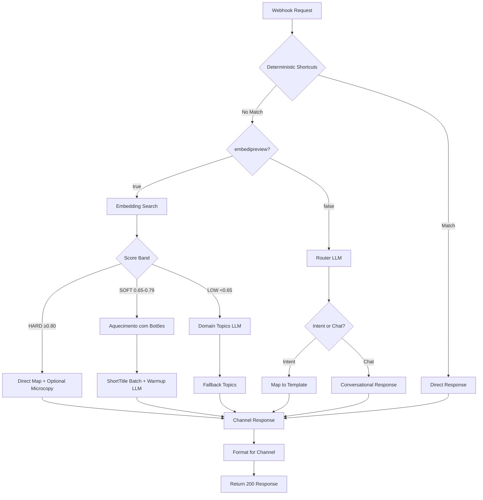

# Design Document

## Overview

The SocialWise Flow optimization transforms the current webhook route from a high-latency (26+ seconds), inefficient LLM-heavy system into an intelligent, sub-400ms response architecture. The design implements an "LLM-first with embedding acceleration" approach that provides conversational intelligence while maintaining strict performance SLAs.

The core philosophy is: **Embeddings route with low cost and latency; LLM delivers the experience**. The system uses deterministic fallbacks only when necessary, with LLM as the default for user experience, enhanced by structured outputs and real deadline management.

## Architecture

### High-Level Flow



### Performance Bands and SLAs

| Band | Score Range | Strategy | Target Latency | LLM Calls |
|------|-------------|----------|----------------|-----------|
| **HARD** | ≥ 0.80 | Direct mapping + optional microcopy | 50-100ms | 0-1 (optional) |
| **SOFT** | 0.65-0.79 | Aquecimento com Botões | 200-250ms | 2 (batch) |
| **LOW** | < 0.65 | Domain topics suggestion | 150-200ms | 1 |
| **Router** | embedipreview=false | Full LLM routing | 200-300ms | 1 |

### Budget Allocation

- **Total Route Budget**: 400ms (p95)
- **Parse + Routing**: 30-60ms
- **Embedding Search**: 20-60ms (memory/Redis/vector DB)
- **LLM Operations**: ≤ 250ms (with deadline abort)
- **Channel Formatting**: 10-30ms

## Components and Interfaces

### 1. Enhanced OpenAI Service (`services/openai.ts`)

#### New Methods

```typescript
// Abort-enabled LLM calls with real deadline management
async function withDeadlineAbort<T>(
  fn: (signal: AbortSignal) => Promise<T>,
  ms = 250
): Promise<T | null>

// Batch short title generation (SOFT band only)
async generateShortTitlesBatch(
  intents: { slug: string; name?: string; desc?: string }[],
  agent: { model: string; developer?: string; instructions?: string }
): Promise<string[] | null>

// UX Writing warmup buttons with structured outputs
async generateWarmupButtons(
  userText: string,
  candidates: { slug: string; desc?: string }[],
  agent: { model: string; developer?: string; instructions?: string }
): Promise<{ introduction_text: string; buttons: Array<{title: string; payload: string}> } | null>

// Router LLM for embedipreview=false mode
async routerLLM(
  userText: string,
  agent: { model: string; developer?: string; instructions?: string }
): Promise<{ mode: "intent" | "chat"; intent_payload?: string; text?: string; buttons?: any[] } | null>
```

#### Enhanced Responses API Integration

- **Consistent Input Format**: Use string content for cache-friendliness unless multimodal is required
- **Abort Controllers**: All LLM calls run with real AbortController and deadline management
- **Structured Outputs**: JSON schema validation with `strict: true` for critical operations
- **Reasoning Control**: `effort: "minimal"` by default, configurable per agent
- **Store Parameter**: Enable conversation continuity with `store: true`

### 2. Intelligent Intent Classification System

#### Embedding-First Pipeline (embedipreview=true)

```typescript
interface ClassificationResult {
  band: 'HARD' | 'SOFT' | 'LOW';
  score: number;
  candidates: IntentCandidate[];
  strategy: 'direct_map' | 'warmup_buttons' | 'domain_topics';
}

interface IntentCandidate {
  slug: string;
  name: string;
  description: string;
  score: number;
  shortTitle?: string; // Generated in SOFT band
}
```

#### Router LLM Pipeline (embedipreview=false)

```typescript
interface RouterDecision {
  mode: 'intent' | 'chat';
  intent_payload?: string;
  introduction_text?: string;
  buttons?: ButtonOption[];
  text?: string;
}
```

### 3. UX Writing and Button Generation

#### Aquecimento com Botões System

The system uses specialized prompts for legal domain UX writing:

```typescript
const WARMUP_PROMPT_TEMPLATE = `
# INSTRUÇÃO
Você é um especialista em UX Writing e Microcopy para chatbots jurídicos. 
Sua tarefa é gerar um conjunto de opções de botões para um usuário que fez uma pergunta ambígua.

# CONTEXTO
O sistema de IA identificou as seguintes intenções como as mais prováveis, mas não tem certeza suficiente para agir.

# INTENÇÕES CANDIDATAS
{candidates}

# MENSAGEM ORIGINAL DO USUÁRIO
"{userText}"

# SUA TAREFA
Gere uma resposta no formato JSON com:
1. "introduction_text": frase curta e amigável (≤ 180 chars)
2. "buttons": até 3 objetos com "title" (≤ 20 chars, ação do usuário) e "payload" (@intent_name)
`;
```

#### Button Validation and Clamping

```typescript
function clampTitle(s: string, max = 20): string {
  const clean = String(s || "").replace(/\s+/g, " ").trim();
  if (clean.length <= max) return clean;
  const cut = clean.slice(0, max + 1);
  const lastSpace = cut.lastIndexOf(" ");
  return (lastSpace > 0 ? cut.slice(0, lastSpace) : clean.slice(0, max)).trim();
}

function clampBody(s: string, max = 1024): string {
  const clean = String(s || "").trim();
  return clean.length <= max ? clean : clean.slice(0, max).trimEnd();
}
```

### 4. Channel-Specific Response Formatting

#### WhatsApp Interactive Messages

```typescript
interface WhatsAppResponse {
  type: "interactive";
  interactive: {
    type: "button";
    body: { text: string }; // ≤ 1024 chars
    action: {
      buttons: Array<{
        type: "reply";
        reply: { id: string; title: string }; // id ≤ 256, title ≤ 20
      }>;
    };
  };
}
```

#### Instagram/Messenger Button Templates

```typescript
interface InstagramResponse {
  message: {
    attachment: {
      type: "template";
      payload: {
        template_type: "button";
        text: string; // ≤ 640 chars
        buttons: Array<{
          type: "postback";
          title: string; // ≤ 20 chars
          payload: string; // ≤ 1000 chars
        }>;
      };
    };
  };
}
```

### 5. Agent Configuration System

#### Per-Agent Settings

```typescript
interface AgentConfig {
  model: string; // e.g., "gpt-5-nano-2025-08-07"
  developer?: string; // System instructions
  instructions?: string; // Additional context
  reasoningEffort: "minimal" | "low" | "medium" | "high";
  verbosity: "low" | "medium" | "high";
  toolChoice: "none" | "auto";
  shortTitleLLM: boolean;
  warmupDeadlineMs: number; // Default: 250ms
  embedipreview: boolean; // true = embedding-first, false = LLM-first
  tempSchema: number; // Temperature for structured outputs (0.0-0.2)
  tempCopy: number; // Temperature for microcopy (0.3-0.5)
}
```

## Data Models

### 1. Enhanced Webhook Payload Processing

```typescript
interface SocialwiseFlowPayload {
  session_id: string;
  context: {
    'socialwise-chatwit': {
      inbox_data: { id: string; name: string; channel_type: string };
      account_data: { id: string };
      whatsapp_phone_number_id?: string;
      whatsapp_business_id?: string;
      wamid?: string;
      message_data?: {
        interactive_data?: { interaction_type: string; button_id: string; button_title: string };
        instagram_data?: { interaction_type: string; postback_payload: string };
      };
    };
    message?: {
      content_attributes?: {
        interaction_type?: string;
        button_reply?: { id: string; title: string };
        quick_reply_payload?: string;
        postback_payload?: string;
      };
    };
  };
  message: string;
  channel_type: string;
}
```

### 2. Intent Classification Data

```typescript
interface EmbeddingSearchResult {
  intent: string;
  score: number;
  description?: string;
  metadata?: Record<string, any>;
}

interface ClassificationMetrics {
  embedding_ms: number;
  llm_warmup_ms?: number;
  llm_confirm_ms?: number;
  route_total_ms: number;
  band: 'HARD' | 'SOFT' | 'LOW' | 'ROUTER';
  strategy_used: string;
  timeout_occurred: boolean;
  json_parse_success: boolean;
}
```

### 3. Response Templates

```typescript
interface ChannelResponse {
  whatsapp?: WhatsAppResponse;
  instagram?: InstagramResponse;
  facebook?: { message: { text: string } };
  text?: string;
  action?: 'handoff';
}

interface ButtonOption {
  title: string; // ≤ 20 chars
  payload: string; // Matches ^@[a-z0-9_]+$
}
```

## Error Handling

### 1. Deadline and Abort Management

```typescript
class DeadlineManager {
  static async withAbort<T>(
    operation: (signal: AbortSignal) => Promise<T>,
    timeoutMs: number
  ): Promise<T | null> {
    const controller = new AbortController();
    const timeout = setTimeout(() => controller.abort(), timeoutMs);
    
    try {
      return await operation(controller.signal);
    } catch (error) {
      if (error.name === 'AbortError') {
        console.warn(`Operation aborted after ${timeoutMs}ms`);
        return null;
      }
      throw error;
    } finally {
      clearTimeout(timeout);
    }
  }
}
```

### 2. Fallback Strategies

| Failure Point | Fallback Strategy | Performance Impact |
|---------------|-------------------|-------------------|
| Embedding search timeout | Use Router LLM | +150ms |
| LLM timeout (SOFT) | Deterministic buttons with humanized titles | +0ms |
| LLM timeout (LOW) | Default legal topics | +0ms |
| JSON parse failure | Sanitized deterministic response | +0ms |
| Channel formatting error | Plain text response | +0ms |

### 3. Graceful Degradation

```typescript
interface FallbackConfig {
  enableEmbeddingFallback: boolean;
  enableLLMFallback: boolean;
  defaultLegalTopics: string[];
  handoffTriggers: string[];
  maxRetries: number;
}
```

## Testing Strategy

### 1. Performance Testing

```typescript
describe('SocialWise Flow Performance', () => {
  test('HARD band responses under 100ms', async () => {
    const start = Date.now();
    const response = await processWebhook(hardBandPayload);
    const duration = Date.now() - start;
    expect(duration).toBeLessThan(100);
  });

  test('SOFT band responses under 250ms', async () => {
    const start = Date.now();
    const response = await processWebhook(softBandPayload);
    const duration = Date.now() - start;
    expect(duration).toBeLessThan(250);
  });

  test('Abort mechanism prevents timeout waste', async () => {
    const mockLLM = jest.fn().mockImplementation(() => 
      new Promise(resolve => setTimeout(resolve, 500))
    );
    
    const result = await withDeadlineAbort(mockLLM, 100);
    expect(result).toBeNull();
    expect(mockLLM).toHaveBeenCalled();
  });
});
```

### 2. UX and Content Testing

```typescript
describe('Aquecimento com Botões', () => {
  test('generates contextual legal buttons', async () => {
    const userText = "recebi uma notificação do detran e quero entrar na justiça";
    const candidates = [
      { slug: "mandado_seguranca", desc: "Ação judicial para direito líquido e certo" },
      { slug: "recurso_multa_transito", desc: "Defesa administrativa no órgão de trânsito" }
    ];
    
    const result = await generateWarmupButtons(userText, candidates, agent);
    
    expect(result.buttons).toHaveLength(3);
    expect(result.buttons[0].title).toMatch(/Recorrer|Multa/);
    expect(result.buttons[1].title).toMatch(/Ação|Judicial/);
    expect(result.introduction_text).toContain("qual");
  });

  test('respects character limits', async () => {
    const result = await generateWarmupButtons(userText, candidates, agent);
    
    result.buttons.forEach(button => {
      expect(button.title.length).toBeLessThanOrEqual(20);
      expect(button.payload).toMatch(/^@[a-z0-9_]+$/);
    });
    expect(result.introduction_text.length).toBeLessThanOrEqual(180);
  });
});
```

### 3. Integration Testing

```typescript
describe('Channel Response Formatting', () => {
  test('WhatsApp interactive message format', async () => {
    const response = buildButtons('whatsapp', 'Escolha uma opção:', buttons);
    
    expect(response.type).toBe('interactive');
    expect(response.interactive.body.text.length).toBeLessThanOrEqual(1024);
    expect(response.interactive.action.buttons).toHaveLength(3);
    
    response.interactive.action.buttons.forEach(btn => {
      expect(btn.reply.title.length).toBeLessThanOrEqual(20);
      expect(btn.reply.id.length).toBeLessThanOrEqual(256);
    });
  });

  test('Instagram button template format', async () => {
    const response = buildButtons('instagram', 'Posso ajudar com:', buttons);
    
    expect(response.message.attachment.payload.template_type).toBe('button');
    expect(response.message.attachment.payload.text.length).toBeLessThanOrEqual(640);
    
    response.message.attachment.payload.buttons.forEach(btn => {
      expect(btn.title.length).toBeLessThanOrEqual(20);
      expect(btn.payload.length).toBeLessThanOrEqual(1000);
    });
  });
});
```

## Monitoring and Observability

### 1. Performance Metrics

```typescript
interface PerformanceMetrics {
  // Timing metrics
  embedding_search_ms: number;
  llm_warmup_ms?: number;
  llm_microcopy_ms?: number;
  route_total_ms: number;
  
  // Classification metrics
  direct_map_rate: number; // % of HARD band classifications
  warmup_rate: number; // % of SOFT band classifications
  vague_rate: number; // % of LOW band classifications
  
  // Quality metrics
  timeout_rate: number;
  json_parse_fail_rate: number;
  abort_rate: number;
  button_ctr: number; // Click-through rate on generated buttons
  handoff_rate: number; // % of conversations escalated to human
}
```

### 2. Health Checks

```typescript
interface SystemHealth {
  embedding_index_status: 'healthy' | 'degraded' | 'unavailable';
  llm_response_time_p95: number;
  abort_controller_effectiveness: number;
  fallback_usage_rate: number;
}
```

### 3. Quality Sampling

```typescript
interface QualitySample {
  user_input: string; // Sanitized
  classification_result: string;
  generated_buttons?: string[];
  response_time_ms: number;
  user_satisfaction_score?: number;
}
```

This design provides a comprehensive foundation for transforming the SocialWise Flow into an intelligent, high-performance system that maintains conversational quality while achieving strict latency requirements.