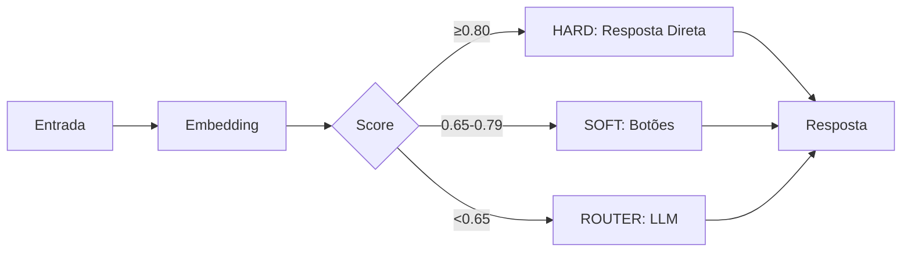

# Arquitetura do Sistema - Resumo Otimizado

## 📁 Estrutura Principal

```
/
├── app/           # Next.js App Router
├── components/    # Componentes React reutilizáveis
├── lib/           # Bibliotecas e utilitários principais
├── worker/        # Processadores de jobs em background
├── prisma/        # Schema e migrações do banco
└── types/         # Definições TypeScript
```

## 🏗️ Arquitetura Core

### **1. Sistema de Fluxo Principal (SocialWise Flow)**
```
Webhook → Validação → Classificação → Processamento → Resposta
```

**Bandas de Performance:**
- **HARD (≥0.80)**: Mapeamento direto de intent
- **SOFT (0.65-0.79)**: Botões de warmup
- **ROUTER (<0.65)**: Roteamento via LLM

### **2. Integrações de IA**
- **OpenAI**: Embeddings e classificação
- **Chatwit**: Integração de plataforma
- **Intent Classifier**: Motor de classificação
- **Template Registry**: Gestão de templates

### **3. Canais Suportados**
- WhatsApp (mensagens interativas)
- Instagram (templates e postbacks)
- Facebook Messenger
- Respostas universais de fallback

## 🎯 Módulos Administrativos

### **IA Capitão**
- Gerenciamento de intents e FAQs
- Processamento de documentos
- Roteamento dinâmico

### **MTF Diamante**
- Templates avançados
- Processamento em lote
- Gestão de leads

## 💰 Sistema de Custos

```
Evento → Validação → Cálculo → Armazenamento → Auditoria
```

**Componentes:**
- Budget Guard (previne gastos excessivos)
- Pricing Service (preços dinâmicos com cache)
- FX Rate Service (câmbio)
- Cost Tracker (monitoramento em tempo real)

## 📊 Monitoramento e Observabilidade

### **APM (Application Performance Monitor)**
- Métricas em tempo real
- Detecção de anomalias
- Sistema de alertas configurável

### **Queue Monitor**
- Saúde das filas
- Throughput e taxa de sucesso
- Alertas automáticos

## 🔒 Segurança

- **Autenticação**: Bearer token ou HMAC
- **Rate Limiting**: Por sessão e conta
- **Idempotência**: Prevenção de duplicatas
- **Sanitização**: Proteção contra XSS/injection
- **LGPD Compliance**: Minimização de dados

## ⚡ Otimizações de Performance

### **Cache Multi-nível**
- Resultados de classificação
- Embeddings
- Respostas de templates

### **Metas de Resposta**
- HARD band: <120ms
- Outras bandas: <500ms
- Enhancement não-bloqueante

## 🔧 Convenções Principais

### **Código**
- TypeScript obrigatório
- Textos em PT-BR para usuário
- Nomes de variáveis/funções em inglês
- Importações com alias `@/`

### **Nomenclatura**
- Componentes: `PascalCase.tsx`
- Páginas: `kebab-case/page.tsx`
- Utilitários: `camelCase.ts`
- API Routes: `route.ts`

### **API Routes (Next.js 15)**
```typescript
// Params são Promises - sempre await
const params = await params;

// Autenticação padrão
const session = await auth();
if (!session?.user?.id) {
  return NextResponse.json(
    { error: "Usuário não autenticado." },
    { status: 401 }
  );
}
```

## 🚀 Workers e Background Jobs

### **Tipos de Filas**
- **Alta Prioridade**: Operações user-facing
- **Baixa Prioridade**: Tasks em background
- **Cost Events**: Tracking de custos
- **Instagram Translation**: Processamento de traduções
- **Lead Processing**: Gestão de leads

### **Pipeline de Processamento**
1. Webhook Worker (parent)
2. Task-specific processors
3. Service integrations
4. Result persistence

## 📈 Fluxo de Classificação



## 🎨 UI Components

- **Base**: Shadcn/UI
- **Diálogos**: Sempre usar Dialog do Shadcn
- **Updates**: Preferir UI otimista
- **Organização**: Feature-based + co-location

---

**Princípios Chave:**
1. **Eficiência**: Cache agressivo, processamento não-bloqueante
2. **Resiliência**: Fallbacks em múltiplos níveis
3. **Observabilidade**: Monitoramento completo com alertas
4. **Segurança**: Validação em múltiplas camadas
5. **Escalabilidade**: Arquitetura baseada em filas e workers