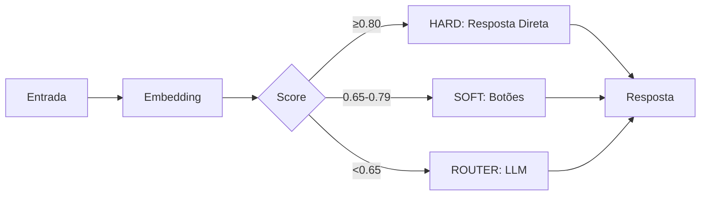

# Arquitetura do Sistema - Resumo Otimizado

## 📁 Estrutura Principal

```
/
├── app/           # Next.js App Router
├── components/    # Componentes React reutilizáveis
├── lib/           # Bibliotecas e utilitários principais
├── worker/        # Processadores de jobs em background
├── prisma/        # Schema e migrações do banco
└── types/         # Definições TypeScript
```

## 🏗️ Arquitetura Core

### **1. Sistema de Fluxo Principal (SocialWise Flow)**
```
Webhook → Validação → Classificação → Processamento → Resposta
```

**Bandas de Performance:**
- **HARD (≥0.80)**: Mapeamento direto de intent
- **SOFT (0.65-0.79)**: Botões de warmup
- **ROUTER (<0.65)**: Roteamento via LLM

### **2. Integrações de IA**
- **OpenAI**: Embeddings e classificação
- **Chatwit**: Integração de plataforma
- **Intent Classifier**: Motor de classificação
- **Template Registry**: Gestão de templates

### **3. Canais Suportados**
- WhatsApp (mensagens interativas)
- Instagram (templates e postbacks)
- Facebook Messenger
- Respostas universais de fallback

## 🎯 Módulos Administrativos

### **IA Capitão**
- Gerenciamento de intents e FAQs
- Processamento de documentos
- Roteamento dinâmico

### **MTF Diamante**
- Templates avançados
- Processamento em lote
- Gestão de leads
- **Flow Builder**: Canvas visual para criação de fluxos conversacionais
- **Flow Engine**: Execução deadline-first com sync/async automático

## 💰 Sistema de Custos

```
Evento → Validação → Cálculo → Armazenamento → Auditoria
```

**Componentes:**
- Budget Guard (previne gastos excessivos)
- Pricing Service (preços dinâmicos com cache)
- FX Rate Service (câmbio)
- Cost Tracker (monitoramento em tempo real)

## 📊 Monitoramento e Observabilidade

### **APM (Application Performance Monitor)**
- Métricas em tempo real
- Detecção de anomalias
- Sistema de alertas configurável

### **Queue Monitor**
- Saúde das filas
- Throughput e taxa de sucesso
- Alertas automáticos

## 🔒 Segurança

- **Autenticação**: Bearer token ou HMAC
- **Rate Limiting**: Por sessão e conta
- **Idempotência**: Prevenção de duplicatas
- **Sanitização**: Proteção contra XSS/injection
- **LGPD Compliance**: Minimização de dados

## ⚡ Otimizações de Performance

### **Cache Multi-nível**
- Resultados de classificação
- Embeddings
- Respostas de templates

### **Metas de Resposta**
- HARD band: <120ms
- Outras bandas: <500ms
- Enhancement não-bloqueante

## 🔧 Convenções Principais

### **Código**
- TypeScript obrigatório
- Textos em PT-BR para usuário
- Nomes de variáveis/funções em inglês
- Importações com alias `@/`

### **Nomenclatura**
- Componentes: `PascalCase.tsx`
- Páginas: `kebab-case/page.tsx`
- Utilitários: `camelCase.ts`
- API Routes: `route.ts`

### **API Routes (Next.js 15)**
```typescript
// Params são Promises - sempre await
const params = await params;

// Autenticação padrão
const session = await auth();
if (!session?.user?.id) {
  return NextResponse.json(
    { error: "Usuário não autenticado." },
    { status: 401 }
  );
}
```

## 🚀 Workers e Background Jobs

### **Tipos de Filas**
- **Alta Prioridade**: Operações user-facing
- **Baixa Prioridade**: Tasks em background
- **Cost Events**: Tracking de custos
- **Instagram Translation**: Processamento de traduções
- **Lead Processing**: Gestão de leads

### **Pipeline de Processamento**
1. Webhook Worker (parent)
2. Task-specific processors
3. Service integrations
4. Result persistence

## 📈 Fluxo de Classificação



## 🎨 UI Components

- **Base**: Shadcn/UI
- **Diálogos**: Sempre usar Dialog do Shadcn
- **Updates**: Preferir UI otimista
- **Organização**: Feature-based + co-location

---

**Princípios Chave:**
1. **Eficiência**: Cache agressivo, processamento não-bloqueante
2. **Resiliência**: Fallbacks em múltiplos níveis
3. **Observabilidade**: Monitoramento completo com alertas
4. **Segurança**: Validação em múltiplas camadas
5. **Escalabilidade**: Arquitetura baseada em filas e workers

## 🎨 Flow Builder & Flow Engine

### **Flow Builder (Canvas Visual)**
Sistema de criação visual de fluxos conversacionais com drag-and-drop.

**Componentes Principais:**
- **Canvas**: `app/admin/mtf-diamante/components/FlowBuilderTab.tsx`
- **Hook do Canvas**: `app/admin/mtf-diamante/components/flow-builder/hooks/useFlowCanvas.ts`
- **Seletor de Flows**: `app/admin/mtf-diamante/components/flow-builder/panels/FlowSelector.tsx`
- **Config de Nós**: `app/admin/mtf-diamante/components/flow-builder/panels/NodeDetailDialog.tsx`

**Tipos de Nós:**
- **Start Node**: Ponto de entrada do fluxo
- **Interactive Message Node**: Mensagens com botões/carrossel
- **Text Message Node**: Mensagens de texto simples
- **Media Node**: Imagens, vídeos, documentos
- **Delay Node**: Pausas temporais
- **Reaction Nodes**: Nós de reação a botões

**APIs:**
- Listar flows: `GET /api/admin/mtf-diamante/flows`
- Flow por ID: `GET /api/admin/mtf-diamante/flows/[flowId]`
- Canvas sync: `POST /api/admin/mtf-diamante/flow-canvas`
- Import/Export: `POST /api/admin/mtf-diamante/flows/import`

### **Flow Engine (Execução)**
Motor de execução deadline-first com transição automática sync→async.

**Arquitetura:**
- **DeadlineGuard**: `services/flow-engine/deadline-guard.ts` (28s sync window)
- **FlowOrchestrator**: `services/flow-engine/flow-orchestrator.ts` (coordenação)
- **FlowExecutor**: `services/flow-engine/flow-executor.ts` (execução de nós)
- **ChatwitDeliveryService**: `services/flow-engine/chatwit-delivery-service.ts` (async delivery)
- **VariableResolver**: `services/flow-engine/variable-resolver.ts` (substituição de variáveis)

**Estratégia de Execução:**
1. Sync até deadline (28s com 5s margem)
2. Migra para async via Chatwit API
3. Uma vez async, nunca volta para sync

**Entry Points:**
1. **Via Intent Mapping (HARD band ≥0.80)**:
   - Intent classificada → `MapeamentoIntencao.flowId` → `executeFlowById()`
2. **Via Button Click (flow_ prefix)**:
   - Botão `flow_*` → `FlowOrchestrator.handle()` → Resume session

**Prioridade de Roteamento:**
1. `flow_*` prefix → FlowOrchestrator (Flow Engine)
2. Else → MapeamentoBotao (Legacy button reactions)
3. Not mapped → SocialWise Flow (LLM classification)

### **Integração com SocialWise Flow**

```
User Message → Classification (HARD ≥0.80)
    ↓
Intent "xyz" → MapeamentoIntencao.flowId exists?
    ├─ YES → FlowOrchestrator.executeFlowById()
    │        → Execute from START node
    │        → Return interactive message
    └─ NO  → Return legacy template
```

**Anti-Loop Protocol:**
- Session injeta `activeIntentSlug` no context
- Router LLM filtra hint do intent ativo

### **Validação e Limites**

**Validação de Flow:**
- `types/flow-builder.ts` → `validateFlowCanvas()`
- Verifica nós órfãos, ciclos, conexões inválidas

**Limites de Mensagens:**
- `types/interactive-messages.ts` → `MESSAGE_LIMITS`
- Constraints por canal (WhatsApp, Instagram, Facebook)
- Clamping automático: `lib/socialwise/clamps.ts`

**Processamento:**
- Intent processor: `worker/processors/intent.processor.ts`
- Button processor: `worker/processors/button.processor.ts`
- Band handlers: `lib/socialwise-flow/processor-components/band-handlers.ts`
- Templates: `lib/socialwise/templates.ts`

### **Índice de Arquivos Flow Builder**

| Feature | Path |
|---|---|
| Canvas principal | `app/admin/mtf-diamante/components/FlowBuilderTab.tsx` |
| Hook do canvas | `app/admin/mtf-diamante/components/flow-builder/hooks/useFlowCanvas.ts` |
| Flow selector | `app/admin/mtf-diamante/components/flow-builder/panels/FlowSelector.tsx` |
| Dialog config nó | `app/admin/mtf-diamante/components/flow-builder/panels/NodeDetailDialog.tsx` |
| Validação flow | `types/flow-builder.ts` → `validateFlowCanvas()` |
| Interactive msg node | `app/admin/mtf-diamante/components/flow-builder/nodes/InteractiveMessageNode.tsx` |
| Delay node | `app/admin/mtf-diamante/components/flow-builder/nodes/DelayNode.tsx` |
| Media node | `app/admin/mtf-diamante/components/flow-builder/nodes/MediaNode.tsx` |
| Context menu | `app/admin/mtf-diamante/components/flow-builder/ui/NodeContextMenu.tsx` |
| EditableText | `app/admin/mtf-diamante/components/flow-builder/ui/EditableText.tsx` |
| Node palette | `app/admin/mtf-diamante/components/flow-builder/panels/NodePalette.tsx` |
| Preview | `app/admin/mtf-diamante/components/interactive-message-creator/unified-editing-step/PreviewSection.tsx` |
| Interactive preview | `app/admin/mtf-diamante/components/shared/InteractivePreview.tsx` |
| API listar flows | `app/api/admin/mtf-diamante/flows/route.ts` |
| API flow por ID | `app/api/admin/mtf-diamante/flows/[flowId]/route.ts` |

### **Índice de Arquivos Flow Engine**

| Feature | Path |
|---|---|
| DeadlineGuard | `services/flow-engine/deadline-guard.ts` |
| FlowOrchestrator | `services/flow-engine/flow-orchestrator.ts` |
| FlowExecutor | `services/flow-engine/flow-executor.ts` |
| ChatwitDeliveryService | `services/flow-engine/chatwit-delivery-service.ts` |
| VariableResolver | `services/flow-engine/variable-resolver.ts` |
| Barrel export | `services/flow-engine/index.ts` |
| Types | `types/flow-engine.ts` |

### **Índice de Arquivos Mensagens Interativas**

| Feature | Path |
|---|---|
| Limites | `types/interactive-messages.ts` → `MESSAGE_LIMITS` |
| Validação | `lib/validation/interactive-message-validation.ts` |
| Constraints por canal | `services/openai-components/server-socialwise-componentes/channel-constraints.ts` |
| Clamping | `lib/socialwise/clamps.ts` |
| Geração payload | `app/admin/mtf-diamante/components/interactive-message-creator/unified-editing-step/utils.ts` |

### **Índice de Arquivos Processamento**

| Feature | Path |
|---|---|
| Intent processor | `worker/processors/intent.processor.ts` |
| Button processor | `worker/processors/button.processor.ts` |
| Band handlers (flow exec) | `lib/socialwise-flow/processor-components/band-handlers.ts` |
| Templates (intent→flow) | `lib/socialwise/templates.ts` |
| API mapeamento | `app/api/admin/mtf-diamante/mapeamentos/[caixaId]/route.ts` |
| API flow-canvas (sync) | `app/api/admin/mtf-diamante/flow-canvas/route.ts` |
| UI mapeamento | `app/admin/mtf-diamante/components/MapeamentoTab.tsx` |