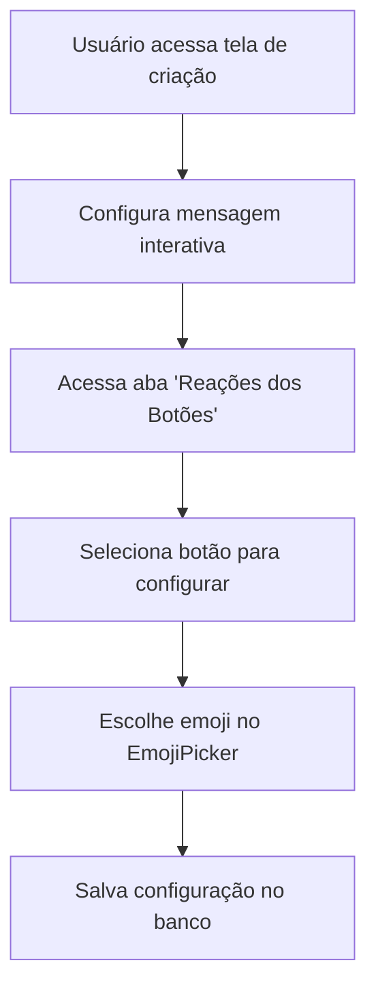
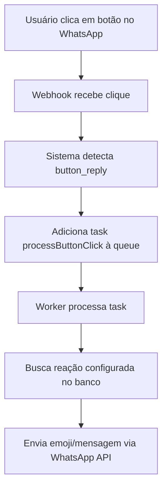

# Sistema de Mapeamento de Emojis para Botões - Implementação Completa

## 📋 Visão Geral

O sistema de mapeamento de emojis para botões permite configurar reações automáticas (emojis ou mensagens de texto) que são enviadas quando usuários clicam em botões de mensagens interativas ou templates do WhatsApp.

## 🏗️ Arquitetura do Sistema

### 1. Componentes Frontend

#### `EmojiPicker.tsx`
- Seletor de emojis com categorias organizadas como no WhatsApp
- Interface intuitiva com busca e emojis populares
- Suporte a temas claro/escuro

#### `ButtonEmojiMapper.tsx`
- Componente principal para configurar reações de botões
- Permite associar emojis ou mensagens de texto a botões específicos
- Interface para gerenciar múltiplos mapeamentos

#### `InteractivePreview.tsx`
- Preview interativo de mensagens com botões clicáveis
- Modo de configuração para definir reações diretamente no preview
- Visualização em tempo real das reações configuradas

### 2. Integração nas Telas Principais

#### Tela de Criação de Mensagens Interativas
- Nova aba "Reações dos Botões" no `InteractiveMessageCreator`
- Preview interativo com botões clicáveis para configuração
- Configuração em tempo real durante a criação da mensagem

#### Tela de Mapeamento de Intenções
- Botão de configuração de reações na tabela de mapeamentos
- Modal para configurar reações de templates e mensagens interativas
- Suporte a diferentes tipos de mensagens

### 3. Backend e APIs

#### API de Button Reactions (`/api/admin/mtf-diamante/button-reactions/`)
- `GET`: Buscar reações configuradas
- `POST`: Criar/atualizar reações
- `DELETE`: Remover reações específicas

#### API de Template Details (`/api/admin/mtf-diamante/templates/details/[id]/`)
- Buscar detalhes de templates incluindo botões
- Extração automática de botões dos componentes

### 4. Sistema de Processamento Assíncrono

#### Worker Queue
- Nova task `processButtonClick` para processar cliques em botões
- Detecção automática de cliques em botões interativos
- Processamento assíncrono de reações

#### Webhook Integration
- Detecção de cliques em botões no webhook do WhatsApp
- Adição automática de tasks de processamento à queue
- Suporte a button_reply e list_reply

## 🔄 Fluxo de Funcionamento

### 1. Configuração de Reações



### 2. Processamento de Cliques



## 🗄️ Estrutura do Banco de Dados

### Tabela `ButtonReactionMapping`

```sql
model ButtonReactionMapping {
  id            String   @id @default(cuid())
  buttonId      String   @unique
  messageId     String
  emoji         String?
  textReaction  String?
  createdBy     String
  createdAt     DateTime @default(now())
  updatedAt     DateTime @updatedAt
}
```

## 🎯 Funcionalidades Implementadas

### ✅ Configuração de Reações
- [x] Seletor de emojis com categorias
- [x] Configuração de reações por botão
- [x] Suporte a emojis e mensagens de texto
- [x] Interface intuitiva de configuração

### ✅ Preview Interativo
- [x] Botões clicáveis no preview
- [x] Modo de configuração visual
- [x] Feedback em tempo real
- [x] Suporte a diferentes tipos de mensagem

### ✅ Integração com Telas Existentes
- [x] Aba de reações no criador de mensagens
- [x] Configuração no mapeamento de intenções
- [x] Modal de configuração para templates

### ✅ Processamento Automático
- [x] Detecção de cliques em botões
- [x] Processamento assíncrono via queue
- [x] Envio automático de reações
- [x] Log de tentativas de reação

### ✅ APIs e Backend
- [x] CRUD completo para reações
- [x] Busca de detalhes de templates
- [x] Integração com webhook do WhatsApp
- [x] Sistema de queue para processamento

## 🧪 Testes

### Script de Teste Automatizado
- Arquivo: `test-button-emoji-mapping.ts`
- Testa criação, busca, atualização e remoção de mapeamentos
- Simula cliques em botões e processamento via queue
- Validação completa do fluxo end-to-end

### Como Executar os Testes

```bash
# Executar teste completo
npx tsx test-button-emoji-mapping.ts

# Ou via npm script (se configurado)
npm run test:button-mapping
```

## 📱 Como Usar

### 1. Configurar Reações em Mensagens Interativas

1. Acesse a tela de criação de mensagens interativas
2. Configure sua mensagem com botões
3. Vá para a aba "Reações dos Botões"
4. Clique em cada botão para configurar sua reação
5. Escolha um emoji ou digite uma mensagem de texto
6. Salve a configuração

### 2. Configurar Reações em Templates

1. Acesse a tela de mapeamento de intenções
2. Encontre o mapeamento desejado na tabela
3. Clique no ícone de emoji (😊) na coluna de ações
4. Configure as reações para cada botão do template
5. Salve as configurações

### 3. Testar Reações

1. Envie a mensagem interativa ou template para um contato de teste
2. Clique nos botões da mensagem
3. Observe as reações automáticas sendo enviadas

## 🔧 Configurações Avançadas

### Personalização de Emojis
- O `EmojiPicker` pode ser personalizado com diferentes categorias
- Emojis populares podem ser configurados por contexto
- Suporte a emojis customizados via URL

### Reações de Texto
- Mensagens de texto podem ser usadas como reações
- Suporte a variáveis dinâmicas nas mensagens
- Formatação rica de texto

### Logs e Monitoramento
- Todas as tentativas de reação são logadas
- Métricas de sucesso/falha disponíveis
- Rastreamento de performance via correlationId

## 🚀 Próximos Passos

### Melhorias Futuras
- [ ] Reações condicionais baseadas em contexto
- [ ] Análise de engajamento com botões
- [ ] Reações em cadeia (uma reação dispara outra)
- [ ] Interface de configuração em massa
- [ ] Importação/exportação de configurações

### Otimizações
- [ ] Cache de mapeamentos frequentes
- [ ] Batch processing de reações
- [ ] Retry inteligente para falhas
- [ ] Compressão de payloads grandes

## 📚 Documentação Técnica

### Dependências
- React 18+ para componentes frontend
- Prisma para ORM e banco de dados
- BullMQ para sistema de filas
- Lucide React para ícones
- Tailwind CSS para estilização

### Compatibilidade
- WhatsApp Business API v22.0+
- Dialogflow ES/CX
- Chatwoot para gerenciamento de conversas
- Redis para sistema de filas

## 🐛 Troubleshooting

### Problemas Comuns

1. **Reações não são enviadas**
   - Verificar se o mapeamento está salvo no banco
   - Confirmar se o worker está processando a queue
   - Validar chave da API do WhatsApp

2. **Botões não aparecem no preview**
   - Verificar estrutura da mensagem interativa
   - Confirmar se os botões têm IDs únicos
   - Validar formato dos componentes

3. **Emoji picker não abre**
   - Verificar se não há conflitos de z-index
   - Confirmar se o componente está montado corretamente
   - Validar eventos de clique

### Logs Importantes

```bash
# Worker logs
[MTF Diamante Webhook Worker] Processing button click...
[MTF Diamante Webhook Worker] Button click detected: {...}
[MTF Diamante Webhook Worker] Found button reaction: {...}

# API logs
[Button Reactions API] Creating reaction mapping...
[Button Reactions API] Reaction saved successfully

# Webhook logs
[MTF Diamante Dispatcher] Button click task queued for button: {...}
```

## 📞 Suporte

Para dúvidas ou problemas com a implementação:
1. Consulte os logs do sistema
2. Execute o script de teste para validar a configuração
3. Verifique a documentação da API do WhatsApp
4. Consulte a equipe de desenvolvimento

---

**Implementação concluída com sucesso! 🎉**

O sistema de mapeamento de emojis para botões está totalmente funcional e integrado ao MTF Diamante, proporcionando uma experiência interativa e automatizada para os usuários do WhatsApp.