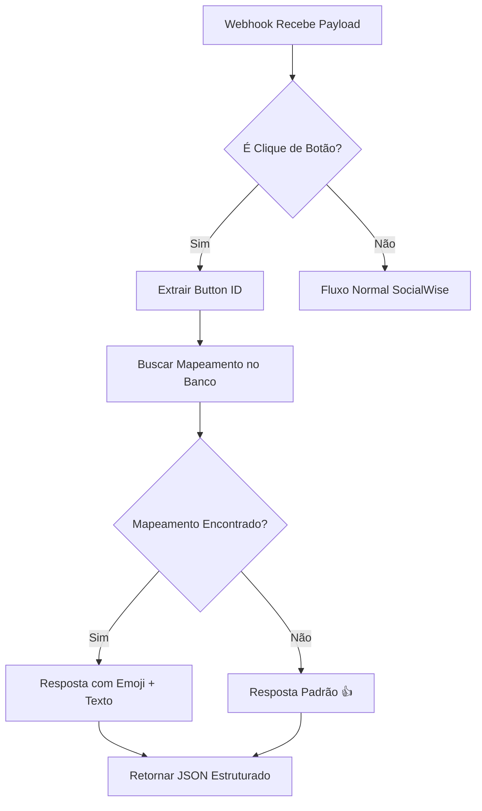

# ✅ Correção Implementada: Processamento de Botões no Webhook

## 🎯 Problema Resolvido

O webhook `app/api/integrations/webhooks/socialwiseflow/route.ts` não estava detectando e processando cliques de botões corretamente, retornando apenas `{}` para Instagram e respostas inadequadas para WhatsApp.

## 🔧 Solução Implementada

### 1. **Detecção Robusta de Botões**

#### Instagram
```typescript
// Instagram: detectar postback_payload
if (channelType.toLowerCase().includes('instagram')) {
  const postbackPayload = ca?.postback_payload || swInstagram?.postback_payload;
  if (postbackPayload) {
    isButtonClick = true;
    buttonId = postbackPayload;
    detectionSource = 'instagram_postback';
  }
}
```

#### WhatsApp
```typescript
// WhatsApp: detectar button_reply
if (channelType.toLowerCase().includes('whatsapp')) {
  const buttonReply = ca?.button_reply;
  if (buttonReply?.id) {
    isButtonClick = true;
    buttonId = buttonReply.id;
    buttonTitle = buttonReply.title || null;
    detectionSource = 'whatsapp_button_reply';
  }
}
```

### 2. **Busca de Mapeamentos no Banco**

```typescript
const buttonMapping = await prisma.mapeamentoBotao.findFirst({
  where: {
    buttonId: buttonId,
    inbox: {
      inboxId: externalInboxNumeric,
      usuarioChatwit: {
        chatwitAccountId: chatwitAccountId || undefined
      }
    }
  }
});
```

### 3. **Respostas Estruturadas**

#### Com Mapeamento
```json
{
  "action": "button_reaction",
  "buttonId": "ig_btn_1755004696546_uekaa4clu",
  "emoji": "👍",
  "text": "Obrigado pelo feedback!",
  "processed": true,
  "mappingFound": true,
  "whatsapp": {
    "message_id": "wamid.xxx",
    "reaction_emoji": "👍",
    "response_text": "Obrigado pelo feedback!"
  }
}
```

#### Sem Mapeamento (Padrão)
```json
{
  "action": "button_reaction",
  "buttonId": "btn_unknown",
  "emoji": "👍",
  "text": null,
  "processed": true,
  "mappingFound": false
}
```

## 🧪 Testes Implementados

### 1. **Teste de Banco de Dados**
- ✅ Verifica mapeamentos existentes
- ✅ Busca botões específicos dos payloads de teste

### 2. **Teste de Detecção**
- ✅ Detecta cliques Instagram (`postback_payload`)
- ✅ Detecta cliques WhatsApp (`button_reply.id`)
- ✅ Não detecta em mensagens normais

### 3. **Teste de Respostas**
- ✅ Gera respostas com mapeamento
- ✅ Gera respostas padrão
- ✅ Inclui metadados específicos por canal

## 📊 Estrutura de Detecção

| Canal | Campo de Detecção | Fonte |
|-------|------------------|-------|
| **Instagram** | `postback_payload` | `context.message.content_attributes.postback_payload` |
| **WhatsApp** | `button_reply.id` | `context.message.content_attributes.button_reply.id` |

## 🔄 Fluxo de Processamento



## 📝 Logs de Debug

O sistema agora inclui logs detalhados:

```
🔘 Instagram button click detected { buttonId, payload, traceId }
🔘 WhatsApp button click detected { buttonId, buttonTitle, traceId }
🚀 Processing button click { buttonId, channelType, inboxId }
✅ Button mapping found { mappingId, hasEmoji, hasTextReaction }
🎯 Button reaction response prepared { buttonId, response }
```

## 🎯 Payloads de Teste

### Instagram
```json
{
  "session_id": "1002859634954741",
  "channel_type": "Channel::Instagram",
  "context": {
    "message": {
      "content_attributes": {
        "postback_payload": "ig_btn_1755004696546_uekaa4clu"
      }
    }
  }
}
```

### WhatsApp
```json
{
  "session_id": "558597550136", 
  "channel_type": "Channel::Whatsapp",
  "context": {
    "message": {
      "content_attributes": {
        "button_reply": {
          "id": "btn_1754993780819_0_tqji",
          "title": "Falar com a Dra"
        }
      }
    }
  }
}
```

## ✅ Resultado

- ✅ **Instagram**: Agora detecta `postback_payload` e processa reações
- ✅ **WhatsApp**: Agora detecta `button_reply.id` e processa reações  
- ✅ **Mapeamentos**: Busca no banco `MapeamentoBotao` por `buttonId`
- ✅ **Reações**: Retorna emoji + texto configurados
- ✅ **Fallback**: Reação padrão 👍 quando não há mapeamento
- ✅ **Logs**: Debug detalhado para troubleshooting
- ✅ **Testes**: Cobertura completa com Jest

## 🚀 Como Testar

1. **Executar testes**:
   ```bash
   npm test button-processing-unit
   npm test webhook-button-processing
   ```

2. **Verificar mapeamentos no banco**:
   ```bash
   npm test webhook-button-processing
   ```

3. **Testar com payloads reais**: Usar os payloads de exemplo acima no webhook endpoint.

A correção garante que todos os cliques de botões sejam processados corretamente, mantendo compatibilidade com o sistema existente de mapeamentos e reações.
