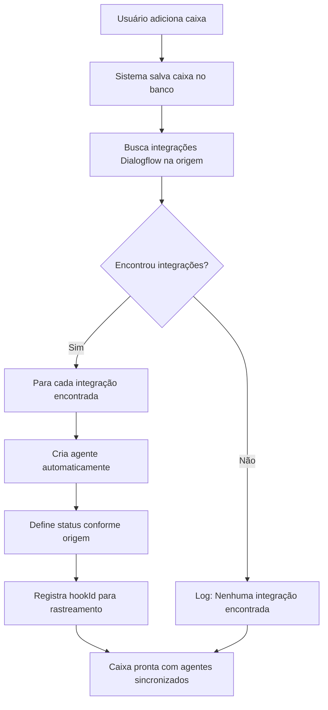

# Sincronização Automática de Agentes Dialogflow

## Visão Geral

O sistema foi projetado para **automaticamente encontrar e sincronizar agentes Dialogflow ativos** quando uma nova caixa de entrada é adicionada ao sistema. Isso elimina a necessidade de configurar manualmente cada agente.

## Como Funciona

### 1. Adição Automática de Agentes

Quando você adiciona uma nova caixa de entrada:

1. **Busca na Origem**: O sistema consulta a API do Chatwit para encontrar integrações Dialogflow ativas para aquela inbox
2. **Criação Automática**: Para cada integração encontrada, um agente é criado automaticamente com:
   - Nome do agente (baseado no project_id ou configuração)
   - Project ID do Google Cloud
   - Credenciais JSON
   - Região configurada
   - Status ativo/inativo conforme a origem
   - ID do hook para rastreamento

3. **Log Detalhado**: Todo o processo é registrado no console para acompanhamento

### 2. Sincronização Manual

Além da sincronização automática, você pode:

- **Via Interface**: Usar o botão "Sincronizar Agentes" na tela de caixas
- **Via API**: Chamar `POST /api/admin/mtf-diamante/dialogflow/sync-agentes`
- **Via Script**: Executar `.\sync-agentes.ps1` no PowerShell

## Logs do Sistema

### Logs de Sucesso
```
🔍 [CaixasEntrada] Buscando agentes Dialogflow ativos na origem para inbox: 123
📋 [CaixasEntrada] Encontrados 2 agentes Dialogflow para esta inbox
✅ [CaixasEntrada] Agente "Atendimento-Bot" criado automaticamente (ATIVO)
✅ [CaixasEntrada] Agente "FAQ-Bot" criado automaticamente (INATIVO)
```

### Logs de Informação
```
ℹ️ [CaixasEntrada] Nenhum agente Dialogflow encontrado para esta inbox na origem.
⚠️ [CaixasEntrada] AccessToken ou baseURL não configurados. Não foi possível sincronizar agentes da origem.
```

### Logs de Erro
```
❌ [CaixasEntrada] Erro ao buscar integrações Dialogflow: [detalhes do erro]
❌ [CaixasEntrada] Erro ao criar agente para hook 456: [detalhes do erro]
```

## Estrutura dos Dados

### Agente Sincronizado da Origem
```typescript
{
  id: "cuid_gerado",
  nome: "Nome do Agente",
  projectId: "projeto-google-cloud",
  credentials: "{...json_credentials...}",
  region: "us-central1",
  ativo: true,
  hookId: "123", // ID do hook na origem - IMPORTANTE para rastreamento
  inboxId: "caixa_id",
  usuarioChatwitId: "usuario_id"
}
```

### Diferença entre Agentes
- **Agentes da Origem**: Têm `hookId` preenchido
- **Agentes Manuais**: `hookId` é `null`

## Configuração Necessária

### Variáveis de Ambiente
```env
CHATWIT_BASE_URL=https://chatwit.witdev.com.br
DATABASE_URL=postgresql://...
```

### Configuração do Usuário
- Account ID do Chatwit configurado
- Token de acesso do Chatwit válido

## Comandos Úteis

### Sincronização Manual (PowerShell)
```powershell
# Todos os usuários
.\sync-agentes.ps1

# Usuário específico
.\sync-agentes.ps1 -UsuarioId "usuario_id"
```

### Teste da Funcionalidade
```powershell
npx tsx test-caixa-agente-sync.ts
```

## Fluxo Completo



## Vantagens

1. **Automação Completa**: Não precisa configurar agentes manualmente
2. **Sincronização de Status**: Agentes ativos/inativos conforme a origem
3. **Rastreabilidade**: hookId permite identificar origem dos agentes
4. **Flexibilidade**: Permite sincronização manual quando necessário
5. **Logs Detalhados**: Facilita troubleshooting e acompanhamento

## Troubleshooting

### Problema: Agentes não são criados automaticamente
**Verificar:**
- Token de acesso do Chatwit válido
- CHATWIT_BASE_URL configurado
- Integração Dialogflow ativa na conta Chatwit
- Logs no console para detalhes do erro

### Problema: Agentes criados mas inativos
**Causa:** Status na origem está inativo
**Solução:** Ativar a integração na conta Chatwit ou usar sincronização manual

### Problema: Erro de credenciais
**Verificar:**
- Credenciais JSON válidas na integração Chatwit
- Project ID correto
- Permissões do service account

## Monitoramento

O sistema registra todas as operações nos logs. Monitore:
- Criação automática de agentes
- Erros de sincronização
- Status de integrações
- Performance das chamadas à API

---

**Nota**: Este sistema garante que quando você adiciona uma caixa, ela automaticamente encontra e configura todos os agentes Dialogflow ativos da origem, eliminando trabalho manual e reduzindo erros de configuração.