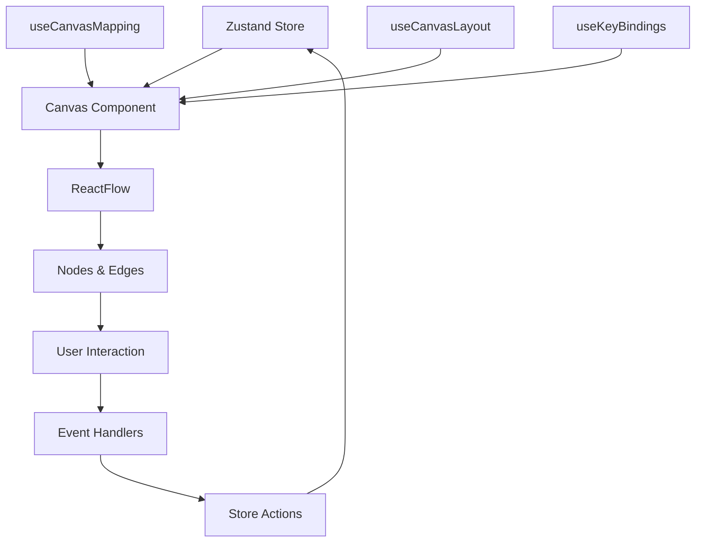

# Guia Completo: Replicando o Canvas do n8n em Next.js

## 📋 Índice

1. [Introdução](#introdução)
2. [Comparação de Tecnologias](#comparação-de-tecnologias)
3. [Setup Inicial](#setup-inicial)
4. [Arquitetura do Projeto](#arquitetura-do-projeto)
5. [Implementação Passo a Passo](#implementação-passo-a-passo)
6. [Features Avançadas](#features-avançadas)
7. [Mapeamento Vue → React](#mapeamento-vue--react)
8. [Exemplos de Código Completos](#exemplos-de-código-completos)
9. [Deploy e Performance](#deploy-e-performance)
10. [Recursos Adicionais](#recursos-adicionais)

---

## Introdução

Este guia mostra como replicar o sistema de canvas do n8n (construído com Vue.js + VueFlow) usando **Next.js 14+ e ReactFlow**.

### Por que é possível?

- **ReactFlow** e **VueFlow** são desenvolvidos pela **mesma equipe**
- Ambos usam **@dagrejs/dagre** para layout automático
- APIs muito similares
- Mesmos conceitos de nodes, edges e handles

### O que você vai construir

Um editor visual de workflows com:
- ✅ Drag and drop de nós
- ✅ Conexões entre nós com validação
- ✅ Layout automático (Tidy Up)
- ✅ Zoom e pan
- ✅ Minimap
- ✅ Atalhos de teclado
- ✅ Context menu
- ✅ State management
- ✅ TypeScript completo

---

## Comparação de Tecnologias

### Stack n8n (Vue)

```
Frontend:
├── Vue 3 (Composition API)
├── VueFlow 1.45.0
├── @vue-flow/background
├── @vue-flow/minimap
├── @vue-flow/controls
├── @dagrejs/dagre
├── Pinia (state)
└── @vueuse/core (utilities)

Linguagem: TypeScript
Build: Vite
```

### Stack Next.js (React)

```
Frontend:
├── React 18
├── ReactFlow 11.x
├── reactflow (inclui background, minimap, controls)
├── @dagrejs/dagre
├── Zustand (state)
└── Custom hooks (utilities)

Linguagem: TypeScript
Build: Turbopack/Webpack
SSR: Next.js App Router
```

### Tabela de Equivalências

| n8n (Vue) | Next.js (React) | Observações |
|-----------|-----------------|-------------|
| `VueFlow` | `ReactFlow` | Mesma equipe, API similar |
| `@vue-flow/core` | `reactflow` | Tudo em um pacote no React |
| `Pinia` | `Zustand` | State management |
| `ref()` | `useState()` | Estado reativo |
| `computed()` | `useMemo()` | Valores computados |
| `watch()` | `useEffect()` | Side effects |
| `onMounted()` | `useEffect(() => {}, [])` | Lifecycle |
| `provide/inject` | `Context API` | Compartilhar dados |
| `<template>` | `JSX` | Sintaxe de UI |
| `@vueuse/core` | Custom hooks | Utilities |

---

## Setup Inicial

### 1. Criar Projeto Next.js

```bash
# Criar projeto com TypeScript, Tailwind, App Router
npx create-next-app@latest canvas-workflow-app

# Opções recomendadas:
# ✅ TypeScript
# ✅ ESLint
# ✅ Tailwind CSS
# ✅ src/ directory
# ✅ App Router
# ❌ Turbopack (ainda experimental)
```

### 2. Instalar Dependências

```bash
cd canvas-workflow-app

# ReactFlow e dependências relacionadas
npm install reactflow

# Layout automático (mesmo do n8n)
npm install @dagrejs/dagre
npm install @types/dagre --save-dev

# State management
npm install zustand

# Utilities
npm install clsx
npm install react-hotkeys-hook

# Icons (opcional)
npm install lucide-react
```

### 3. Estrutura de Pastas

```
canvas-workflow-app/
├── src/
│   ├── app/
│   │   ├── layout.tsx
│   │   ├── page.tsx
│   │   └── globals.css
│   ├── components/
│   │   ├── canvas/
│   │   │   ├── Canvas.tsx
│   │   │   ├── nodes/
│   │   │   │   ├── CustomNode.tsx
│   │   │   │   ├── StickyNote.tsx
│   │   │   │   └── TriggerNode.tsx
│   │   │   ├── edges/
│   │   │   │   └── CustomEdge.tsx
│   │   │   ├── controls/
│   │   │   │   ├── Toolbar.tsx
│   │   │   │   └── ContextMenu.tsx
│   │   │   └── background/
│   │   │       └── CustomBackground.tsx
│   │   └── ui/
│   │       └── button.tsx
│   ├── hooks/
│   │   ├── useCanvas.ts
│   │   ├── useCanvasLayout.ts
│   │   ├── useKeyBindings.ts
│   │   └── useCanvasMapping.ts
│   ├── store/
│   │   ├── canvasStore.ts
│   │   └── workflowStore.ts
│   ├── types/
│   │   ├── canvas.ts
│   │   └── workflow.ts
│   ├── lib/
│   │   ├── layout.ts
│   │   ├── canvasUtils.ts
│   │   └── validation.ts
│   └── constants/
│       └── canvas.ts
├── package.json
├── tsconfig.json
└── tailwind.config.ts
```

---

## Arquitetura do Projeto

### Hierarquia de Componentes

```
page.tsx (App Router)
└── Canvas.tsx (Componente Principal)
    ├── ReactFlow
    │   ├── CustomNode.tsx
    │   │   ├── NodeHeader
    │   │   ├── NodeBody
    │   │   └── NodeHandles (inputs/outputs)
    │   ├── CustomEdge.tsx
    │   │   └── EdgeLabel
    │   ├── Background
    │   ├── Controls
    │   └── MiniMap
    ├── Toolbar.tsx
    └── ContextMenu.tsx
```

### Fluxo de Dados



---

## Implementação Passo a Passo

### Passo 1: Tipos TypeScript

Crie `src/types/canvas.ts`:

```typescript
import type { Node, Edge, NodeProps, EdgeProps } from 'reactflow';

// ========================================
// Node Types
// ========================================

export enum CanvasNodeType {
  Default = 'default',
  Trigger = 'trigger',
  StickyNote = 'sticky-note',
  AddNode = 'add-node',
}

export interface CanvasNodeData {
  id: string;
  name: string;
  type: string;
  subtitle?: string;
  disabled?: boolean;

  // Inputs and Outputs
  inputs: CanvasConnectionPort[];
  outputs: CanvasConnectionPort[];

  // Execution state
  execution?: {
    status?: 'running' | 'success' | 'error' | 'waiting';
    running?: boolean;
    waiting?: string;
  };

  // Issues and validation
  issues?: {
    execution: string[];
    validation: string[];
    visible: boolean;
  };

  // Pinned data
  pinnedData?: {
    count: number;
    visible: boolean;
  };

  // Run data
  runData?: {
    iterations: number;
    outputMap?: ExecutionOutputMap;
    visible: boolean;
  };

  // Render options
  render: {
    type: CanvasNodeType;
    options: Record<string, unknown>;
  };
}

export interface CanvasConnectionPort {
  type: NodeConnectionType;
  index: number;
  label?: string;
  required?: boolean;
  maxConnections?: number;
}

export enum NodeConnectionType {
  Main = 'main',
  AiTool = 'ai_tool',
  AiDocument = 'ai_document',
  AiMemory = 'ai_memory',
}

// ========================================
// Edge Types
// ========================================

export interface CanvasConnectionData {
  source: CanvasConnectionPort;
  target: CanvasConnectionPort;
  status?: 'success' | 'error' | 'running' | 'pinned';
  label?: string;
  maxConnections?: number;
}

// ========================================
// Canvas Types
// ========================================

export type CanvasNode = Node<CanvasNodeData>;
export type CanvasConnection = Edge<CanvasConnectionData>;

export type CanvasNodeProps = NodeProps<CanvasNodeData>;
export type CanvasEdgeProps = EdgeProps<CanvasConnectionData>;

// ========================================
// Execution Types
// ========================================

export type ExecutionStatus =
  | 'new'
  | 'running'
  | 'success'
  | 'error'
  | 'waiting'
  | 'canceled';

export interface ExecutionOutputMap {
  [connectionType: string]: {
    [outputIndex: string]: {
      total: number;
      iterations: number;
    };
  };
}

// ========================================
// Layout Types
// ========================================

export interface BoundingBox {
  x: number;
  y: number;
  width: number;
  height: number;
}

export interface NodeLayoutResult {
  id: string;
  x: number;
  y: number;
  width?: number;
  height?: number;
}

export interface CanvasLayoutResult {
  nodes: NodeLayoutResult[];
  boundingBox: BoundingBox;
}

export type CanvasLayoutTarget = 'selection' | 'all';
export type CanvasLayoutSource =
  | 'keyboard-shortcut'
  | 'canvas-button'
  | 'context-menu';

// ========================================
// Event Types
// ========================================

export interface CanvasEvents {
  'nodes:select': { ids: string[]; panIntoView?: boolean };
  'nodes:delete': { ids: string[] };
  'nodes:duplicate': { ids: string[] };
  'connection:create': { connection: CanvasConnection };
  'connection:delete': { id: string };
  'layout:apply': { target: CanvasLayoutTarget };
}
```

### Passo 2: Constantes

Crie `src/constants/canvas.ts`:

```typescript
// Grid
export const GRID_SIZE = 20;

// Node sizing
export const DEFAULT_NODE_WIDTH = 200;
export const DEFAULT_NODE_HEIGHT = 100;
export const STICKY_NOTE_MIN_WIDTH = 150;
export const STICKY_NOTE_MIN_HEIGHT = 80;

// Layout spacing
export const NODE_SPACING_X = 160; // GRID_SIZE * 8
export const NODE_SPACING_Y = 120; // GRID_SIZE * 6
export const SUBGRAPH_SPACING = 160; // GRID_SIZE * 8

// Colors
export const NODE_COLORS = {
  default: '#ffffff',
  trigger: '#ff6d5a',
  error: '#f56565',
  success: '#48bb78',
  running: '#4299e1',
  disabled: '#cbd5e0',
};

export const EDGE_COLORS = {
  default: '#b1b1b7',
  success: '#48bb78',
  error: '#f56565',
  running: '#4299e1',
  pinned: '#805ad5',
};

// Sticky note colors (same as n8n)
export const STICKY_NOTE_COLORS = [
  '#ff6d5a', // red
  '#ff9b5a', // orange
  '#ffcc5a', // yellow
  '#80cc5a', // green
  '#5ac4ff', // blue
  '#cc5aff', // purple
  '#ff5ac4', // pink
];

// Z-Index
export const Z_INDEX = {
  node: 1,
  stickyNote: -100,
  edge: 0,
  edgeHovered: 1000,
  minimap: 5,
  controls: 5,
  toolbar: 10,
  contextMenu: 100,
};

// Zoom
export const MIN_ZOOM = 0.1;
export const MAX_ZOOM = 4;
export const DEFAULT_ZOOM = 1;

// Animation
export const ZOOM_DURATION = 200;
export const PAN_DURATION = 200;
```

### Passo 3: Zustand Store

Crie `src/store/canvasStore.ts`:

```typescript
import { create } from 'zustand';
import { devtools } from 'zustand/middleware';
import type { CanvasNode, CanvasConnection } from '@/types/canvas';

interface CanvasState {
  // Data
  nodes: CanvasNode[];
  edges: CanvasConnection[];

  // Selection
  selectedNodeIds: string[];
  selectedEdgeIds: string[];

  // Viewport
  viewport: { x: number; y: number; zoom: number };

  // UI State
  isPaneMoving: boolean;
  isConnecting: boolean;
  hasRangeSelection: boolean;

  // Actions - Nodes
  setNodes: (nodes: CanvasNode[]) => void;
  addNode: (node: CanvasNode) => void;
  removeNode: (id: string) => void;
  updateNode: (id: string, data: Partial<CanvasNode>) => void;
  updateNodePosition: (id: string, position: { x: number; y: number }) => void;
  duplicateNodes: (ids: string[]) => void;

  // Actions - Edges
  setEdges: (edges: CanvasConnection[]) => void;
  addEdge: (edge: CanvasConnection) => void;
  removeEdge: (id: string) => void;
  updateEdge: (id: string, data: Partial<CanvasConnection>) => void;

  // Actions - Selection
  selectNodes: (ids: string[]) => void;
  selectEdges: (ids: string[]) => void;
  clearSelection: () => void;
  selectAll: () => void;

  // Actions - Viewport
  setViewport: (viewport: { x: number; y: number; zoom: number }) => void;

  // Actions - UI State
  setIsPaneMoving: (moving: boolean) => void;
  setIsConnecting: (connecting: boolean) => void;
  setHasRangeSelection: (hasRange: boolean) => void;
}

export const useCanvasStore = create<CanvasState>()(
  devtools(
    (set, get) => ({
      // Initial state
      nodes: [],
      edges: [],
      selectedNodeIds: [],
      selectedEdgeIds: [],
      viewport: { x: 0, y: 0, zoom: 1 },
      isPaneMoving: false,
      isConnecting: false,
      hasRangeSelection: false,

      // Node actions
      setNodes: (nodes) => set({ nodes }),

      addNode: (node) =>
        set((state) => ({ nodes: [...state.nodes, node] })),

      removeNode: (id) =>
        set((state) => ({
          nodes: state.nodes.filter((n) => n.id !== id),
          edges: state.edges.filter(
            (e) => e.source !== id && e.target !== id
          ),
          selectedNodeIds: state.selectedNodeIds.filter((nid) => nid !== id),
        })),

      updateNode: (id, data) =>
        set((state) => ({
          nodes: state.nodes.map((node) =>
            node.id === id ? { ...node, ...data } : node
          ),
        })),

      updateNodePosition: (id, position) =>
        set((state) => ({
          nodes: state.nodes.map((node) =>
            node.id === id ? { ...node, position } : node
          ),
        })),

      duplicateNodes: (ids) =>
        set((state) => {
          const nodesToDuplicate = state.nodes.filter((n) =>
            ids.includes(n.id)
          );

          const newNodes = nodesToDuplicate.map((node) => ({
            ...node,
            id: `${node.id}-copy-${Date.now()}`,
            position: {
              x: node.position.x + 50,
              y: node.position.y + 50,
            },
            selected: false,
          }));

          return { nodes: [...state.nodes, ...newNodes] };
        }),

      // Edge actions
      setEdges: (edges) => set({ edges }),

      addEdge: (edge) =>
        set((state) => ({ edges: [...state.edges, edge] })),

      removeEdge: (id) =>
        set((state) => ({
          edges: state.edges.filter((e) => e.id !== id),
          selectedEdgeIds: state.selectedEdgeIds.filter((eid) => eid !== id),
        })),

      updateEdge: (id, data) =>
        set((state) => ({
          edges: state.edges.map((edge) =>
            edge.id === id ? { ...edge, ...data } : edge
          ),
        })),

      // Selection actions
      selectNodes: (ids) =>
        set({
          selectedNodeIds: ids,
          selectedEdgeIds: [],
        }),

      selectEdges: (ids) =>
        set({
          selectedEdgeIds: ids,
          selectedNodeIds: [],
        }),

      clearSelection: () =>
        set({
          selectedNodeIds: [],
          selectedEdgeIds: [],
        }),

      selectAll: () =>
        set((state) => ({
          selectedNodeIds: state.nodes.map((n) => n.id),
          selectedEdgeIds: [],
        })),

      // Viewport actions
      setViewport: (viewport) => set({ viewport }),

      // UI State actions
      setIsPaneMoving: (moving) => set({ isPaneMoving: moving }),
      setIsConnecting: (connecting) => set({ isConnecting: connecting }),
      setHasRangeSelection: (hasRange) => set({ hasRangeSelection: hasRange }),
    }),
    { name: 'CanvasStore' }
  )
);

// Selectors
export const useSelectedNodes = () => {
  const nodes = useCanvasStore((state) => state.nodes);
  const selectedIds = useCanvasStore((state) => state.selectedNodeIds);
  return nodes.filter((n) => selectedIds.includes(n.id));
};

export const useSelectedEdges = () => {
  const edges = useCanvasStore((state) => state.edges);
  const selectedIds = useCanvasStore((state) => state.selectedEdgeIds);
  return edges.filter((e) => selectedIds.includes(e.id));
};
```

### Passo 4: Layout com Dagre

Crie `src/lib/layout.ts`:

```typescript
import dagre from '@dagrejs/dagre';
import type { Node, Edge } from 'reactflow';
import {
  DEFAULT_NODE_WIDTH,
  DEFAULT_NODE_HEIGHT,
  NODE_SPACING_X,
  NODE_SPACING_Y,
} from '@/constants/canvas';
import type { CanvasNode, CanvasConnection, CanvasLayoutResult } from '@/types/canvas';

export interface LayoutOptions {
  direction?: 'LR' | 'RL' | 'TB' | 'BT';
  nodeSpacingX?: number;
  nodeSpacingY?: number;
}

/**
 * Calculate layout using Dagre algorithm (same as n8n)
 */
export function calculateLayout(
  nodes: CanvasNode[],
  edges: CanvasConnection[],
  options: LayoutOptions = {}
): CanvasLayoutResult {
  const {
    direction = 'LR',
    nodeSpacingX = NODE_SPACING_X,
    nodeSpacingY = NODE_SPACING_Y,
  } = options;

  // Create dagre graph
  const graph = new dagre.graphlib.Graph();
  graph.setDefaultEdgeLabel(() => ({}));

  // Configure graph
  graph.setGraph({
    rankdir: direction,
    nodesep: nodeSpacingY,
    ranksep: nodeSpacingX,
    edgesep: nodeSpacingX,
  });

  // Add nodes to graph
  nodes.forEach((node) => {
    const width = (node.width as number) || DEFAULT_NODE_WIDTH;
    const height = (node.height as number) || DEFAULT_NODE_HEIGHT;

    graph.setNode(node.id, { width, height });
  });

  // Add edges to graph
  edges.forEach((edge) => {
    graph.setEdge(edge.source, edge.target);
  });

  // Run dagre layout algorithm
  dagre.layout(graph);

  // Extract node positions
  const layoutNodes = nodes.map((node) => {
    const positioned = graph.node(node.id);
    const width = (node.width as number) || DEFAULT_NODE_WIDTH;
    const height = (node.height as number) || DEFAULT_NODE_HEIGHT;

    return {
      id: node.id,
      x: positioned.x - width / 2,
      y: positioned.y - height / 2,
      width,
      height,
    };
  });

  // Calculate bounding box
  const boundingBox = calculateBoundingBox(layoutNodes);

  return {
    nodes: layoutNodes,
    boundingBox,
  };
}

/**
 * Apply layout to nodes
 */
export function applyLayout(
  nodes: CanvasNode[],
  edges: CanvasConnection[],
  options?: LayoutOptions
): CanvasNode[] {
  const layout = calculateLayout(nodes, edges, options);

  return nodes.map((node) => {
    const layoutNode = layout.nodes.find((n) => n.id === node.id);
    if (!layoutNode) return node;

    return {
      ...node,
      position: {
        x: layoutNode.x,
        y: layoutNode.y,
      },
    };
  });
}

/**
 * Calculate bounding box for nodes
 */
function calculateBoundingBox(
  nodes: Array<{ id: string; x: number; y: number; width: number; height: number }>
) {
  if (nodes.length === 0) {
    return { x: 0, y: 0, width: 0, height: 0 };
  }

  let minX = Infinity;
  let minY = Infinity;
  let maxX = -Infinity;
  let maxY = -Infinity;

  nodes.forEach((node) => {
    minX = Math.min(minX, node.x);
    minY = Math.min(minY, node.y);
    maxX = Math.max(maxX, node.x + node.width);
    maxY = Math.max(maxY, node.y + node.height);
  });

  return {
    x: minX,
    y: minY,
    width: maxX - minX,
    height: maxY - minY,
  };
}

/**
 * Get layout for selected nodes only
 */
export function layoutSelection(
  allNodes: CanvasNode[],
  selectedIds: string[],
  edges: CanvasConnection[],
  options?: LayoutOptions
): CanvasNode[] {
  const selectedNodes = allNodes.filter((n) => selectedIds.includes(n.id));
  const selectedEdges = edges.filter(
    (e) => selectedIds.includes(e.source) && selectedIds.includes(e.target)
  );

  const layoutedNodes = applyLayout(selectedNodes, selectedEdges, options);

  return allNodes.map((node) => {
    const layoutedNode = layoutedNodes.find((n) => n.id === node.id);
    return layoutedNode || node;
  });
}
```

### Passo 5: Custom Node Component

Crie `src/components/canvas/nodes/CustomNode.tsx`:

```typescript
import { memo } from 'react';
import { Handle, Position } from 'reactflow';
import { clsx } from 'clsx';
import type { CanvasNodeProps } from '@/types/canvas';
import { NodeConnectionType } from '@/types/canvas';

function CustomNode({ data, selected, dragging }: CanvasNodeProps) {
  const isDisabled = data.disabled;
  const isRunning = data.execution?.running;
  const hasError = data.execution?.status === 'error';
  const hasSuccess = data.execution?.status === 'success';

  return (
    <div
      className={clsx(
        'bg-white rounded-lg shadow-lg transition-all',
        'border-2 min-w-[200px]',
        selected && 'border-blue-500 shadow-blue-300 shadow-xl',
        !selected && 'border-gray-300',
        dragging && 'opacity-50',
        isDisabled && 'opacity-60 grayscale'
      )}
    >
      {/* Input Handles */}
      {data.inputs.map((input, index) => (
        <Handle
          key={`input-${input.type}-${index}`}
          type="target"
          position={Position.Left}
          id={`input-${input.type}-${index}`}
          className={clsx(
            'w-3 h-3 !border-2 !border-white transition-all',
            input.type === NodeConnectionType.Main
              ? '!bg-blue-500 rounded-full'
              : '!bg-purple-500 rounded-sm',
            input.required && 'ring-2 ring-red-400'
          )}
          style={{
            top: `${((index + 1) / (data.inputs.length + 1)) * 100}%`,
          }}
        />
      ))}

      {/* Node Content */}
      <div className="p-4">
        {/* Header */}
        <div className="flex items-center gap-2 mb-2">
          {/* Status Indicator */}
          {isRunning && (
            <div className="w-2 h-2 bg-blue-500 rounded-full animate-pulse" />
          )}
          {hasError && (
            <div className="w-2 h-2 bg-red-500 rounded-full" />
          )}
          {hasSuccess && (
            <div className="w-2 h-2 bg-green-500 rounded-full" />
          )}

          {/* Node Name */}
          <h3 className="font-semibold text-sm truncate flex-1">
            {data.name}
          </h3>

          {/* Pinned Data Badge */}
          {data.pinnedData?.visible && (
            <span className="px-2 py-0.5 bg-purple-100 text-purple-700 text-xs rounded">
              📌 {data.pinnedData.count}
            </span>
          )}
        </div>

        {/* Subtitle */}
        {data.subtitle && (
          <p className="text-xs text-gray-500 truncate mb-2">
            {data.subtitle}
          </p>
        )}

        {/* Type */}
        <div className="text-xs text-gray-400 font-mono">
          {data.type}
        </div>

        {/* Issues */}
        {data.issues?.visible && (
          <div className="mt-2 p-2 bg-red-50 border border-red-200 rounded text-xs text-red-700">
            {data.issues.execution.length > 0 && (
              <div className="font-semibold">Execution Error</div>
            )}
            {data.issues.validation.length > 0 && (
              <div className="font-semibold">Validation Error</div>
            )}
          </div>
        )}

        {/* Run Data */}
        {data.runData?.visible && data.runData.iterations > 0 && (
          <div className="mt-2 text-xs text-gray-500">
            {data.runData.iterations} iteration(s)
          </div>
        )}
      </div>

      {/* Output Handles */}
      {data.outputs.map((output, index) => (
        <Handle
          key={`output-${output.type}-${index}`}
          type="source"
          position={Position.Right}
          id={`output-${output.type}-${index}`}
          className={clsx(
            'w-3 h-3 !border-2 !border-white transition-all',
            output.type === NodeConnectionType.Main
              ? '!bg-blue-500 rounded-full'
              : '!bg-purple-500 rounded-sm'
          )}
          style={{
            top: `${((index + 1) / (data.outputs.length + 1)) * 100}%`,
          }}
        />
      ))}
    </div>
  );
}

export default memo(CustomNode);
```

### Passo 6: Custom Edge Component

Crie `src/components/canvas/edges/CustomEdge.tsx`:

```typescript
import { memo } from 'react';
import {
  BaseEdge,
  EdgeLabelRenderer,
  getStraightPath,
  type EdgeProps
} from 'reactflow';
import { clsx } from 'clsx';
import type { CanvasConnectionData } from '@/types/canvas';

function CustomEdge({
  id,
  sourceX,
  sourceY,
  targetX,
  targetY,
  sourcePosition,
  targetPosition,
  data,
  selected,
}: EdgeProps<CanvasConnectionData>) {
  const [edgePath, labelX, labelY] = getStraightPath({
    sourceX,
    sourceY,
    sourcePosition,
    targetX,
    targetY,
    targetPosition,
  });

  const status = data?.status;
  const label = data?.label;

  // Edge color based on status
  const strokeColor =
    status === 'success' ? '#48bb78' :
    status === 'error' ? '#f56565' :
    status === 'running' ? '#4299e1' :
    status === 'pinned' ? '#805ad5' :
    selected ? '#3b82f6' : '#b1b1b7';

  return (
    <>
      <BaseEdge
        id={id}
        path={edgePath}
        style={{
          stroke: strokeColor,
          strokeWidth: selected ? 3 : 2,
        }}
      />

      {/* Edge Label */}
      {label && (
        <EdgeLabelRenderer>
          <div
            style={{
              position: 'absolute',
              transform: `translate(-50%, -50%) translate(${labelX}px, ${labelY}px)`,
              pointerEvents: 'all',
            }}
            className={clsx(
              'px-2 py-1 rounded text-xs font-medium',
              'bg-white border shadow-sm',
              status === 'success' && 'border-green-300 text-green-700',
              status === 'error' && 'border-red-300 text-red-700',
              status === 'running' && 'border-blue-300 text-blue-700',
              status === 'pinned' && 'border-purple-300 text-purple-700',
              !status && 'border-gray-300 text-gray-700'
            )}
          >
            {label}
          </div>
        </EdgeLabelRenderer>
      )}
    </>
  );
}

export default memo(CustomEdge);
```

### Passo 7: Canvas Principal

Crie `src/components/canvas/Canvas.tsx`:

```typescript
'use client';

import { useCallback, useRef } from 'react';
import ReactFlow, {
  Background,
  Controls,
  MiniMap,
  addEdge,
  useNodesState,
  useEdgesState,
  useReactFlow,
  type Connection,
  type NodeMouseHandler,
  type EdgeMouseHandler,
  type OnConnectStart,
  type OnConnectEnd,
  MarkerType,
  Panel,
} from 'reactflow';

import 'reactflow/dist/style.css';

import CustomNode from './nodes/CustomNode';
import CustomEdge from './edges/CustomEdge';
import { useCanvasStore } from '@/store/canvasStore';
import { useKeyBindings } from '@/hooks/useKeyBindings';
import { GRID_SIZE, MIN_ZOOM, MAX_ZOOM } from '@/constants/canvas';
import type { CanvasNode, CanvasConnection } from '@/types/canvas';

const nodeTypes = {
  custom: CustomNode,
};

const edgeTypes = {
  custom: CustomEdge,
};

interface CanvasProps {
  initialNodes?: CanvasNode[];
  initialEdges?: CanvasConnection[];
  readOnly?: boolean;
}

export default function Canvas({
  initialNodes = [],
  initialEdges = [],
  readOnly = false,
}: CanvasProps) {
  const reactFlow = useReactFlow();
  const connectingNodeId = useRef<string | null>(null);

  const [nodes, setNodes, onNodesChange] = useNodesState(initialNodes);
  const [edges, setEdges, onEdgesChange] = useEdgesState(initialEdges);

  const {
    selectNodes,
    clearSelection,
    setIsConnecting,
    setIsPaneMoving,
  } = useCanvasStore();

  // ========================================
  // Connection Handlers
  // ========================================

  const onConnectStart: OnConnectStart = useCallback((_, params) => {
    connectingNodeId.current = params.nodeId;
    setIsConnecting(true);
  }, [setIsConnecting]);

  const onConnect = useCallback(
    (params: Connection) => {
      const newEdge = {
        ...params,
        id: `${params.source}-${params.target}`,
        type: 'custom',
        markerEnd: { type: MarkerType.ArrowClosed },
        data: {
          source: { type: 'main', index: 0 },
          target: { type: 'main', index: 0 },
          status: 'success' as const,
        },
      };

      setEdges((eds) => addEdge(newEdge, eds));
      setIsConnecting(false);
    },
    [setEdges, setIsConnecting]
  );

  const onConnectEnd: OnConnectEnd = useCallback(() => {
    connectingNodeId.current = null;
    setIsConnecting(false);
  }, [setIsConnecting]);

  // ========================================
  // Node Handlers
  // ========================================

  const onNodeClick: NodeMouseHandler = useCallback(
    (event, node) => {
      if (event.ctrlKey || event.metaKey) {
        // Multi-select
        const currentSelection = nodes.filter((n) => n.selected).map((n) => n.id);
        const newSelection = currentSelection.includes(node.id)
          ? currentSelection.filter((id) => id !== node.id)
          : [...currentSelection, node.id];
        selectNodes(newSelection);
      } else {
        // Single select
        selectNodes([node.id]);
      }
    },
    [nodes, selectNodes]
  );

  const onNodeDoubleClick: NodeMouseHandler = useCallback((event, node) => {
    console.log('Node double clicked:', node.id);
    // Open node editor
  }, []);

  // ========================================
  // Edge Handlers
  // ========================================

  const onEdgeClick: EdgeMouseHandler = useCallback((event, edge) => {
    console.log('Edge clicked:', edge.id);
  }, []);

  // ========================================
  // Pane Handlers
  // ========================================

  const onPaneClick = useCallback(() => {
    clearSelection();
  }, [clearSelection]);

  const onMove = useCallback(() => {
    setIsPaneMoving(true);
  }, [setIsPaneMoving]);

  const onMoveEnd = useCallback(() => {
    setIsPaneMoving(false);
  }, [setIsPaneMoving]);

  // ========================================
  // Keyboard Shortcuts
  // ========================================

  useKeyBindings({
    // Selection
    'ctrl+a': () => {
      selectNodes(nodes.map((n) => n.id));
    },
    'Escape': () => {
      clearSelection();
    },

    // Zoom
    '1': () => reactFlow.fitView({ padding: 0.2 }),
    '0': () => reactFlow.zoomTo(1),
    '+': () => reactFlow.zoomIn(),
    '-': () => reactFlow.zoomOut(),

    // Delete
    'Delete': () => {
      const selectedIds = nodes.filter((n) => n.selected).map((n) => n.id);
      if (selectedIds.length > 0) {
        setNodes((nds) => nds.filter((n) => !selectedIds.includes(n.id)));
        setEdges((eds) =>
          eds.filter((e) => !selectedIds.includes(e.source) && !selectedIds.includes(e.target))
        );
      }
    },

    // Copy
    'ctrl+c': () => {
      const selectedNodes = nodes.filter((n) => n.selected);
      console.log('Copy nodes:', selectedNodes);
      // Implement copy logic
    },

    // Paste
    'ctrl+v': () => {
      console.log('Paste nodes');
      // Implement paste logic
    },
  });

  return (
    <ReactFlow
      nodes={nodes}
      edges={edges}
      onNodesChange={onNodesChange}
      onEdgesChange={onEdgesChange}
      onConnect={onConnect}
      onConnectStart={onConnectStart}
      onConnectEnd={onConnectEnd}
      onNodeClick={onNodeClick}
      onNodeDoubleClick={onNodeDoubleClick}
      onEdgeClick={onEdgeClick}
      onPaneClick={onPaneClick}
      onMove={onMove}
      onMoveEnd={onMoveEnd}
      nodeTypes={nodeTypes}
      edgeTypes={edgeTypes}
      snapToGrid
      snapGrid={[GRID_SIZE, GRID_SIZE]}
      minZoom={MIN_ZOOM}
      maxZoom={MAX_ZOOM}
      fitView
      deleteKeyCode={null} // Handle delete via keyboard shortcuts
      multiSelectionKeyCode="Control"
      selectionKeyCode="Shift"
      panActivationKeyCode="Space"
    >
      <Background gap={GRID_SIZE} />
      <Controls />
      <MiniMap nodeStrokeWidth={3} zoomable pannable />

      {/* Custom Panel/Toolbar */}
      <Panel position="top-left">
        <div className="bg-white rounded-lg shadow-lg p-2 flex gap-2">
          <button
            onClick={() => reactFlow.fitView({ padding: 0.2 })}
            className="px-3 py-1 bg-gray-100 hover:bg-gray-200 rounded text-sm"
          >
            Fit View
          </button>
          <button
            onClick={() => console.log('Tidy up')}
            className="px-3 py-1 bg-blue-500 hover:bg-blue-600 text-white rounded text-sm"
          >
            Tidy Up
          </button>
        </div>
      </Panel>
    </ReactFlow>
  );
}
```

### Passo 8: Hook de Keybindings

Crie `src/hooks/useKeyBindings.ts`:

```typescript
import { useEffect } from 'react';

export type KeyMap = Record<string, () => void>;

interface UseKeyBindingsOptions {
  enabled?: boolean;
}

export function useKeyBindings(
  keyMap: KeyMap,
  options: UseKeyBindingsOptions = {}
) {
  const { enabled = true } = options;

  useEffect(() => {
    if (!enabled) return;

    const handleKeyDown = (event: KeyboardEvent) => {
      // Don't trigger shortcuts when typing in inputs
      const target = event.target as HTMLElement;
      if (
        target.tagName === 'INPUT' ||
        target.tagName === 'TEXTAREA' ||
        target.isContentEditable
      ) {
        return;
      }

      // Build key combination string
      const parts: string[] = [];

      if (event.ctrlKey || event.metaKey) parts.push('ctrl');
      if (event.shiftKey) parts.push('shift');
      if (event.altKey) parts.push('alt');

      // Add the actual key
      if (!['Control', 'Shift', 'Alt', 'Meta'].includes(event.key)) {
        parts.push(event.key);
      }

      const combination = parts.join('+');

      // Try to find and execute handler
      const handler = keyMap[combination] || keyMap[event.key];

      if (handler) {
        event.preventDefault();
        handler();
      }
    };

    window.addEventListener('keydown', handleKeyDown);
    return () => window.removeEventListener('keydown', handleKeyDown);
  }, [keyMap, enabled]);
}
```

### Passo 9: Página Principal

Crie `src/app/page.tsx`:

```typescript
'use client';

import { ReactFlowProvider } from 'reactflow';
import Canvas from '@/components/canvas/Canvas';
import type { CanvasNode, CanvasConnection } from '@/types/canvas';
import { NodeConnectionType, CanvasNodeType } from '@/types/canvas';

const initialNodes: CanvasNode[] = [
  {
    id: '1',
    type: 'custom',
    position: { x: 100, y: 100 },
    data: {
      id: '1',
      name: 'Webhook Trigger',
      type: 'n8n-nodes-base.webhook',
      subtitle: 'Waiting for webhook call',
      inputs: [],
      outputs: [
        { type: NodeConnectionType.Main, index: 0, label: 'Main' },
      ],
      execution: {
        status: 'waiting',
        running: false,
      },
      render: {
        type: CanvasNodeType.Trigger,
        options: {},
      },
    },
  },
  {
    id: '2',
    type: 'custom',
    position: { x: 400, y: 100 },
    data: {
      id: '2',
      name: 'HTTP Request',
      type: 'n8n-nodes-base.httpRequest',
      subtitle: 'GET https://api.example.com',
      inputs: [
        { type: NodeConnectionType.Main, index: 0, label: 'Main' },
      ],
      outputs: [
        { type: NodeConnectionType.Main, index: 0, label: 'Main' },
      ],
      execution: {
        status: 'success',
        running: false,
      },
      runData: {
        iterations: 1,
        visible: true,
      },
      render: {
        type: CanvasNodeType.Default,
        options: {},
      },
    },
  },
  {
    id: '3',
    type: 'custom',
    position: { x: 700, y: 100 },
    data: {
      id: '3',
      name: 'Code',
      type: 'n8n-nodes-base.code',
      subtitle: 'Run custom JavaScript',
      inputs: [
        { type: NodeConnectionType.Main, index: 0, label: 'Main' },
      ],
      outputs: [
        { type: NodeConnectionType.Main, index: 0, label: 'Main' },
      ],
      pinnedData: {
        count: 3,
        visible: true,
      },
      render: {
        type: CanvasNodeType.Default,
        options: {},
      },
    },
  },
];

const initialEdges: CanvasConnection[] = [
  {
    id: 'e1-2',
    source: '1',
    target: '2',
    type: 'custom',
    sourceHandle: 'output-main-0',
    targetHandle: 'input-main-0',
    data: {
      source: { type: NodeConnectionType.Main, index: 0 },
      target: { type: NodeConnectionType.Main, index: 0 },
      status: 'success',
      label: '5 items',
    },
  },
  {
    id: 'e2-3',
    source: '2',
    target: '3',
    type: 'custom',
    sourceHandle: 'output-main-0',
    targetHandle: 'input-main-0',
    data: {
      source: { type: NodeConnectionType.Main, index: 0 },
      target: { type: NodeConnectionType.Main, index: 0 },
      status: 'pinned',
      label: '3 items (pinned)',
    },
  },
];

export default function Home() {
  return (
    <main className="w-screen h-screen">
      <ReactFlowProvider>
        <Canvas initialNodes={initialNodes} initialEdges={initialEdges} />
      </ReactFlowProvider>
    </main>
  );
}
```

---

## Features Avançadas

### 1. Tidy Up (Layout Automático)

Crie `src/hooks/useCanvasLayout.ts`:

```typescript
import { useCallback } from 'react';
import { useReactFlow } from 'reactflow';
import { useCanvasStore } from '@/store/canvasStore';
import { applyLayout, layoutSelection } from '@/lib/layout';

export function useCanvasLayout() {
  const { fitView } = useReactFlow();
  const { nodes, edges, selectedNodeIds, setNodes } = useCanvasStore();

  const tidyUp = useCallback(
    async (target: 'all' | 'selection' = 'all') => {
      let layoutedNodes;

      if (target === 'selection' && selectedNodeIds.length > 1) {
        layoutedNodes = layoutSelection(nodes, selectedNodeIds, edges);
      } else {
        layoutedNodes = applyLayout(nodes, edges);
      }

      setNodes(layoutedNodes);

      // Fit view after layout
      setTimeout(() => {
        fitView({ padding: 0.2, duration: 200 });
      }, 10);
    },
    [nodes, edges, selectedNodeIds, setNodes, fitView]
  );

  return { tidyUp };
}
```

Uso no Canvas:

```typescript
import { useCanvasLayout } from '@/hooks/useCanvasLayout';

function Canvas() {
  const { tidyUp } = useCanvasLayout();

  return (
    <ReactFlow>
      <Panel position="top-left">
        <button onClick={() => tidyUp('all')}>
          Tidy Up All
        </button>
        <button onClick={() => tidyUp('selection')}>
          Tidy Up Selection
        </button>
      </Panel>
    </ReactFlow>
  );
}
```

### 2. Context Menu

Crie `src/components/canvas/controls/ContextMenu.tsx`:

```typescript
'use client';

import { useCallback, useEffect, useState } from 'react';
import { useReactFlow } from 'reactflow';
import { useCanvasStore } from '@/store/canvasStore';
import { useCanvasLayout } from '@/hooks/useCanvasLayout';

interface ContextMenuProps {
  visible: boolean;
  x: number;
  y: number;
  nodeId?: string;
  onClose: () => void;
}

export default function ContextMenu({
  visible,
  x,
  y,
  nodeId,
  onClose,
}: ContextMenuProps) {
  const { deleteElements } = useReactFlow();
  const { nodes, selectedNodeIds, duplicateNodes, removeNode } = useCanvasStore();
  const { tidyUp } = useCanvasLayout();

  useEffect(() => {
    const handleClick = () => onClose();
    const handleEscape = (e: KeyboardEvent) => {
      if (e.key === 'Escape') onClose();
    };

    if (visible) {
      document.addEventListener('click', handleClick);
      document.addEventListener('keydown', handleEscape);
    }

    return () => {
      document.removeEventListener('click', handleClick);
      document.removeEventListener('keydown', handleEscape);
    };
  }, [visible, onClose]);

  if (!visible) return null;

  const handleDelete = () => {
    if (nodeId) {
      removeNode(nodeId);
    } else {
      selectedNodeIds.forEach((id) => removeNode(id));
    }
    onClose();
  };

  const handleDuplicate = () => {
    const ids = nodeId ? [nodeId] : selectedNodeIds;
    duplicateNodes(ids);
    onClose();
  };

  const handleTidyUp = async () => {
    await tidyUp('all');
    onClose();
  };

  return (
    <div
      className="fixed bg-white rounded-lg shadow-xl border border-gray-200 py-1 min-w-[180px] z-50"
      style={{ left: x, top: y }}
      onClick={(e) => e.stopPropagation()}
    >
      <button
        onClick={handleDuplicate}
        className="w-full px-4 py-2 text-left text-sm hover:bg-gray-100 flex items-center gap-2"
      >
        <span>📋</span>
        <span>Duplicate</span>
        <span className="ml-auto text-xs text-gray-400">Ctrl+D</span>
      </button>

      <button
        onClick={handleDelete}
        className="w-full px-4 py-2 text-left text-sm hover:bg-gray-100 flex items-center gap-2 text-red-600"
      >
        <span>🗑️</span>
        <span>Delete</span>
        <span className="ml-auto text-xs text-gray-400">Del</span>
      </button>

      <div className="border-t border-gray-200 my-1" />

      <button
        onClick={handleTidyUp}
        className="w-full px-4 py-2 text-left text-sm hover:bg-gray-100 flex items-center gap-2"
      >
        <span>✨</span>
        <span>Tidy Up</span>
        <span className="ml-auto text-xs text-gray-400">Shift+Alt+T</span>
      </button>
    </div>
  );
}
```

Integração no Canvas:

```typescript
function Canvas() {
  const [contextMenu, setContextMenu] = useState({
    visible: false,
    x: 0,
    y: 0,
    nodeId: undefined as string | undefined,
  });

  const onNodeContextMenu = useCallback(
    (event: React.MouseEvent, node: Node) => {
      event.preventDefault();
      setContextMenu({
        visible: true,
        x: event.clientX,
        y: event.clientY,
        nodeId: node.id,
      });
    },
    []
  );

  const onPaneContextMenu = useCallback((event: React.MouseEvent) => {
    event.preventDefault();
    setContextMenu({
      visible: true,
      x: event.clientX,
      y: event.clientY,
      nodeId: undefined,
    });
  }, []);

  return (
    <>
      <ReactFlow
        onNodeContextMenu={onNodeContextMenu}
        onPaneContextMenu={onPaneContextMenu}
      >
        {/* ... */}
      </ReactFlow>

      <ContextMenu
        {...contextMenu}
        onClose={() => setContextMenu((prev) => ({ ...prev, visible: false }))}
      />
    </>
  );
}
```

### 3. Sticky Note Node

Crie `src/components/canvas/nodes/StickyNote.tsx`:

```typescript
import { memo, useState } from 'react';
import { NodeResizer } from 'reactflow';
import type { CanvasNodeProps } from '@/types/canvas';
import { STICKY_NOTE_COLORS } from '@/constants/canvas';

function StickyNote({ data, selected }: CanvasNodeProps) {
  const [color, setColor] = useState(0);
  const backgroundColor = STICKY_NOTE_COLORS[color];

  return (
    <>
      {selected && (
        <NodeResizer
          minWidth={150}
          minHeight={80}
          isVisible={selected}
        />
      )}

      <div
        className="rounded-lg shadow-lg p-4 min-w-[150px] min-h-[80px]"
        style={{ backgroundColor }}
      >
        {/* Color Picker */}
        {selected && (
          <div className="flex gap-1 mb-2">
            {STICKY_NOTE_COLORS.map((c, i) => (
              <button
                key={c}
                onClick={() => setColor(i)}
                className="w-4 h-4 rounded-full border-2 border-white shadow-sm"
                style={{ backgroundColor: c }}
              />
            ))}
          </div>
        )}

        {/* Content */}
        <textarea
          defaultValue={data.render.options.content as string || ''}
          className="w-full h-full bg-transparent resize-none outline-none text-sm"
          placeholder="Type your note..."
          style={{ minHeight: '60px' }}
        />
      </div>
    </>
  );
}

export default memo(StickyNote);
```

Registrar no Canvas:

```typescript
const nodeTypes = {
  custom: CustomNode,
  'sticky-note': StickyNote,
};
```

---

## Mapeamento Vue → React

### Conceitos Básicos

| Vue 3 | React | Exemplo |
|-------|-------|---------|
| `ref()` | `useState()` | `const count = ref(0)` → `const [count, setCount] = useState(0)` |
| `computed()` | `useMemo()` | `const double = computed(() => count.value * 2)` → `const double = useMemo(() => count * 2, [count])` |
| `watch()` | `useEffect()` | `watch(count, (val) => {...})` → `useEffect(() => {...}, [count])` |
| `onMounted()` | `useEffect(() => {}, [])` | Executa uma vez ao montar |
| `onUnmounted()` | `useEffect(() => () => {...}, [])` | Cleanup ao desmontar |
| `provide/inject` | `createContext/useContext` | Compartilhar dados entre componentes |

### Reatividade

**Vue:**
```typescript
const count = ref(0);
const doubled = computed(() => count.value * 2);

watch(count, (newVal) => {
  console.log('Count changed:', newVal);
});
```

**React:**
```typescript
const [count, setCount] = useState(0);
const doubled = useMemo(() => count * 2, [count]);

useEffect(() => {
  console.log('Count changed:', count);
}, [count]);
```

### Componentes

**Vue:**
```vue
<script setup lang="ts">
import { ref } from 'vue';

const props = defineProps<{ name: string }>();
const emit = defineEmits<{ click: [id: string] }>();

const count = ref(0);
</script>

<template>
  <div @click="emit('click', props.name)">
    {{ count }}
  </div>
</template>
```

**React:**
```typescript
import { useState } from 'react';

interface Props {
  name: string;
  onClick: (id: string) => void;
}

function MyComponent({ name, onClick }: Props) {
  const [count, setCount] = useState(0);

  return (
    <div onClick={() => onClick(name)}>
      {count}
    </div>
  );
}
```

### VueFlow → ReactFlow

**VueFlow (n8n):**
```vue
<script setup>
import { VueFlow, useVueFlow } from '@vue-flow/core';

const { fitView, zoomIn, nodes } = useVueFlow();
</script>

<template>
  <VueFlow
    :nodes="nodes"
    :edges="edges"
    @connect="onConnect"
  >
    <Background />
    <Controls />
  </VueFlow>
</template>
```

**ReactFlow (Next.js):**
```typescript
import ReactFlow, {
  Background,
  Controls,
  useReactFlow,
} from 'reactflow';

function Canvas() {
  const { fitView, zoomIn } = useReactFlow();

  return (
    <ReactFlow
      nodes={nodes}
      edges={edges}
      onConnect={onConnect}
    >
      <Background />
      <Controls />
    </ReactFlow>
  );
}
```

### Pinia → Zustand

**Pinia (Vue):**
```typescript
export const useCanvasStore = defineStore('canvas', () => {
  const nodes = ref<Node[]>([]);

  function addNode(node: Node) {
    nodes.value.push(node);
  }

  return { nodes, addNode };
});
```

**Zustand (React):**
```typescript
export const useCanvasStore = create<CanvasState>((set) => ({
  nodes: [],

  addNode: (node) =>
    set((state) => ({
      nodes: [...state.nodes, node],
    })),
}));
```

---

## Deploy e Performance

### Build para Produção

```bash
# Build
npm run build

# Test locally
npm run start
```

### Otimizações

1. **Lazy Loading de Componentes**

```typescript
import dynamic from 'next/dynamic';

const Canvas = dynamic(() => import('@/components/canvas/Canvas'), {
  ssr: false,
  loading: () => <div>Loading canvas...</div>,
});
```

2. **Memoização de Componentes**

```typescript
import { memo } from 'react';

const CustomNode = memo(function CustomNode(props) {
  // ...
}, (prev, next) => {
  // Custom comparison
  return prev.data.id === next.data.id && prev.selected === next.selected;
});
```

3. **Virtual Rendering** (para muitos nós)

ReactFlow já otimiza automaticamente, mas você pode configurar:

```typescript
<ReactFlow
  nodesDraggable={!readOnly}
  nodesConnectable={!readOnly}
  elementsSelectable={!readOnly}
  // Otimizações
  autoPanOnConnect={false}
  autoPanOnNodeDrag={false}
  onlyRenderVisibleElements={true}
/>
```

### Deploy na Vercel

```bash
# Install Vercel CLI
npm i -g vercel

# Deploy
vercel

# Production deploy
vercel --prod
```

Configurar `vercel.json` (opcional):

```json
{
  "framework": "nextjs",
  "buildCommand": "npm run build",
  "devCommand": "npm run dev",
  "installCommand": "npm install"
}
```

---

## Recursos Adicionais

### Documentação Oficial

- **ReactFlow**: https://reactflow.dev/
- **Next.js**: https://nextjs.org/docs
- **Zustand**: https://docs.pmnd.rs/zustand
- **Dagre**: https://github.com/dagrejs/dagre/wiki
- **Tailwind CSS**: https://tailwindcss.com/docs

### Exemplos do ReactFlow

- **Basic Example**: https://reactflow.dev/examples/overview
- **Custom Nodes**: https://reactflow.dev/examples/nodes/custom-node
- **Layouting**: https://reactflow.dev/examples/layout/dagre
- **Interaction**: https://reactflow.dev/examples/interaction

### Repositórios de Referência

- **n8n (Vue)**: https://github.com/n8n-io/n8n
- **ReactFlow Examples**: https://github.com/xyflow/xyflow/tree/main/examples

### Comparação Completa

| Feature | n8n (Vue) | Next.js (React) | Status |
|---------|-----------|-----------------|--------|
| **Nodes & Edges** | VueFlow | ReactFlow | ✅ Equivalente |
| **Layout** | @dagrejs/dagre | @dagrejs/dagre | ✅ Idêntico |
| **State** | Pinia | Zustand | ✅ Equivalente |
| **Types** | TypeScript | TypeScript | ✅ Idêntico |
| **SSR** | ❌ | ✅ Next.js | ⭐ Vantagem React |
| **Comunidade** | Menor | Maior | ⭐ Vantagem React |
| **Sintaxe** | Template | JSX | 🟡 Preferência |

---

## Próximos Passos

### 1. Features Básicas (Completas neste guia)
- ✅ Canvas com ReactFlow
- ✅ Custom Nodes
- ✅ Custom Edges
- ✅ Zustand Store
- ✅ Layout Automático
- ✅ Keybindings
- ✅ Context Menu

### 2. Features Intermediárias (Para Implementar)
- ⬜ Undo/Redo
- ⬜ Copy/Paste
- ⬜ Multiple Node Types
- ⬜ Node Search/Filter
- ⬜ Export/Import Workflow
- ⬜ Minimap Customization

### 3. Features Avançadas (Futuro)
- ⬜ Workflow Execution
- ⬜ Real-time Collaboration
- ⬜ Version Control
- ⬜ Plugin System
- ⬜ AI Integration
- ⬜ Mobile Support

---

## Conclusão

Você agora tem um guia completo para replicar o canvas do n8n em Next.js usando ReactFlow!

### Principais Diferenças

1. **Vue → React**: Mudança de sintaxe e padrões
2. **VueFlow → ReactFlow**: Mesma API, biblioteca diferente
3. **Pinia → Zustand**: State management mais simples
4. **Template → JSX**: Renderização de componentes

### Vantagens do Next.js

- ✅ SSR e SSG nativos
- ✅ Maior comunidade React
- ✅ Melhor performance em builds
- ✅ Mais jobs/recursos disponíveis
- ✅ Integração fácil com React ecosystem

### Próximo Passo

Execute o código fornecido e você terá um canvas funcional! 🚀

```bash
npm install
npm run dev
```

Acesse: http://localhost:3000
